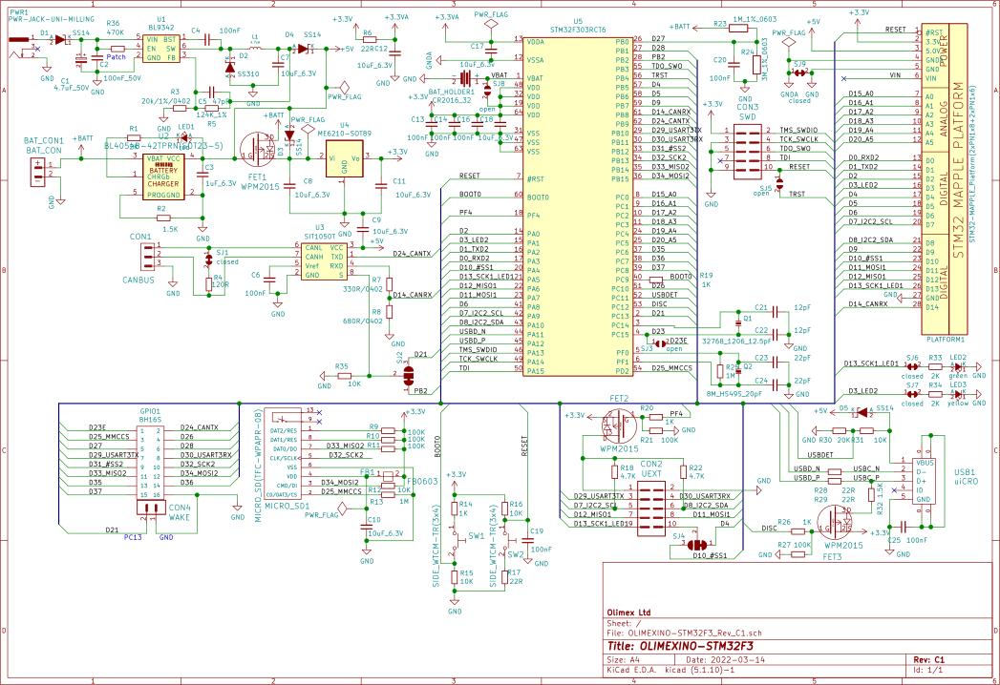

@defgroup    boards_olimexino-stm32f3 OLIMEXINO-STM32F3
@ingroup     boards
@brief       Support for the OLIMEXINO-STM32F3 board

## Overview

The OLIMEXINO-STM32F3 is a board sporting the STM32F303RCT6 (Cortex-M4 @ 72 MHz,
FPU, 40 KiB SRAM, 256 KiB Flash) that is partially compatible with
Arduino Shields in the Arduino UNO form factor and fully compatible with UEXT
extensions.

## Hardware

@image html https://www.olimex.com/Products/Duino/STM32/OLIMEXINO-STM32F3/images/OLIMEXINO-STM32F3.jpg "Picture of the OLIMEXINO-STM32F3 Board"

### MCU

| MCU                       | STM32F303RC                                       |
|:------------------------- |:------------------------------------------------- |
| Family                    | ARM Cortex-M4                                     |
| Vendor                    | ST Microelectronics                               |
| RAM                       | 40 KiB                                            |
| Flash                     | 256 KiB                                           |
| Frequency                 | up to 72 MHz, RIOT uses 72 MHz by default         |
| FPU                       | yes                                               |
| Advanced Control Timers   | 2 × 16-bit                                        |
| General Purpose Timers    | 1 × 32-bit, 5 × 16-bit                            |
| Basic Timers              | 2 × 16-bit                                        |
| Watchdog Timer            | 2 (Independent Watchdog + Window Watchdog)        |
| SysTick Timer             | Functional                                        |
| RTC/RTT                   | 1 × RTC, 0 × RTT                                  |
| RTC Memory                | 64 Bytes                                          |
| ADCs                      | 4 × 12-bit (22 channels)                          |
| DACs                      | 1 × 12-bit (2 channels)                           |
| UARTs                     | 5 (3 × USART, 2 × UART                            |
| SPIs                      | 3                                                 |
| I2Ss                      | 2 (two SPI peripherals can be used in I2S mode)   |
| I2Cs                      | 2                                                 |
| CAN                       | 1                                                 |
| USB                       | 1                                                 |
| VCC                       | 2.0V - 3.6V                                       |
| MCU Datasheet             | [Datasheet][mcu-datasheet]                        |
| MCU Reference Manual      | [Reference Manual][mcu-manual]                    |
| MCU Programming Manual    | [Programming Manual][mcu-programming-manual]      |
| Board Manual              | [Board Manual][board-manual]                      |
| Board Schematics          | [Board Schematics][board-schematics]              |

[MCU-datasheet]: https://www.st.com/resource/en/datasheet/stm32f303rc.pdf
[mcu-manual]: http://www.st.com/web/en/resource/technical/document/reference_manual/DM00043574.pdf
[mcu-programming-manual]: http://www.st.com/web/en/resource/technical/document/programming_manual/DM00046982.pdf
[board-manual]: https://github.com/OLIMEX/OLIMEXINO-STM32F3/blob/master/DOCUMENTS/OLIMEXINO-STM32F3.pdf
[board-schematics]: https://github.com/OLIMEX/OLIMEXINO-STM32F3/blob/master/HARDWARE/OLIMEXINO-STM32F3-revision-C1/OLIMEXINO-STM32F3_Rev_C1.pdf

## Schematics

