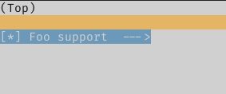
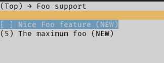

# Kconfig in RIOT                                           {#kconfig-in-riot}

[TOC]

The objective of using Kconfig in RIOT is to select and configure software
modules at compile-time. This means having a standard way of:
- Selecting modules
- Exposing configurable parameters
- Assigning application and user-specific configurations
- Verifying these parameters
    - Check possible values
    - Check valid configuration considering inter-dependencies
- Applying the selected configuration

# Overview                                                  {#kconfig-overview}

## Module selection
The user selects which functionalities to include in the application by adding
[modules](./creating-modules.html). Modules may have dependencies, so the
Kconfig only presents the user with the modules it can select given the target
hardware and already selected modules.

## Exposure
Modules in RIOT expose their configurable parameters via
Kconfig files (for more information on Kconfig syntax check
[the specification](https://www.kernel.org/doc/html/latest/kbuild/kconfig-language.html)).
In these files documentation, restrictions, default values and dependencies can
be expressed.

Kconfig files are structured through the file system mirroring the current
module distribution. In time, all modules will have Kconfig files to make
themselves configurable through this system.

## Assignment
The user can assign values to the exposed parameters, either by manually writing
'.config' files or using an interface such as Menuconfig. Parameters with no
assigned values will take the default ones. For a detailed distinction between
Kconfig and '.config' files see [this appendix](#kconfig-appendix-different-files).

## Verification and application
Using '.config' and Kconfig files the build system takes care of doing the
necessary checks on the values according to the parameter definition. After
that, the `autoconf.h` header file is generated, it contains all the
configurations in the form of (`CONFIG_` prefixed) macros.

---
# User's guide to configure with Kconfig                 {#kconfig-users-guide}

## Configure using menuconfig                     {#configure-using-menuconfig}
In order to use the graphical interface menuconfig to configure the
application, run `make menuconfig` in the application's folder. All available
configurations (based on the used modules) for the particular platform will be
presented.

Once the desired configuration is achieved save the configuration to the
default proposed path and exit. The saved configuration will be applied when
the code is compiled (`make all`).

If the current configuration will be used in the future it can be saved in the
application's folder as `user.config`, using the 'Save' option in menuconfig.
This way it will be persistent after cleaning the application directory
(`make clean`).

## Configure using '.config' files                     {#configure-using-files}
The second way to configure the application is by directly writing '.config'
files. Two files will be sources of configuration during the generation of the
final header file: `app.config` and `user.config`, which should be placed
inside the application's folder. `app.config` sets default configuration
values for the particular application, the user can override them by setting
them in `user.config`.

Let's say that the `SOCK_UTIL_SCHEME_MAXLEN` symbol in `sock_util` module needs
to be configured. The `user.config` file could look like:

```Makefile
# activate module sock_util
CONFIG_MOD_SOCK_UTIL=y
# change scheme part length
CONFIG_SOCK_UTIL_SCHEME_MAXLEN=24
```

In this case, there is no need for using menuconfig. It's enough just to call
`make all` in the application folder, as this configuration will be read and
applied. Note that if any dependency issue occurs, warnings will be generated
(e.g. trying to activate a module without activating its dependencies).

## Application configuration with Kconfig                 {#app-config-kconfig}
To expose application-specific configuration options a `Kconfig` file can
be placed in the application's folder. For an example of this you can check
the [tests/kconfig](https://github.com/RIOT-OS/RIOT/tree/master/tests/kconfig)
application.

## A note on the usage of CFLAGS
When a certain module is being configured via Kconfig the configuration macro
will not longer be overridable by means of CFLAGS (e.g. set on the
compilation command or on a Makefile). Consider this if you are getting a
'redefined warning'.

## A note on the usage of the 'clean' command
When using Kconfig as the configurator for RIOT, configuration symbols may be
used in Makefiles through the build system. For this to work properly make
sure that when cleaning an application you call `make clean && make all`,
instead of `make clean all`.

---
# Developer's guide and tips to write Kconfig files   {#developer-guide-kconfig}

## Modelling features in Kconfig                   {#modelling-features-kconfig}

Features are functionalities or characteristics that can be provided by hardware
or modules. For example, a feature could indicate that the target architecture
is a 32-bits one, that a crypto acceleration hardware is present, or that a
module that is already selected implements a certain interface.

The main use of features is to gain information about a certain characteristic
in a generic way, that is, without having to check for all the specific symbols
that could potentially provide this characteristic if present. For example,
instead of checking for all the possible drivers of IEEE 802.15.4-compatible
devices, a feature can indicate that at least one of such devices is present.

Other Kconfig symbols can then use the information provided by features, for
example to change a default value, their visibility or even depended on them.

Features are modelled in Kconfig as boolean non-visible symbols, with a help
attribute which documents what this feature indicates. The symbols names must be
prefixed with `HAS_`. Usually features will not have any dependencies.

```kconfig
config HAS_PERIPH_HWRNG
    bool
    help
        Indicates that a Hardware Random Number Generator peripheral is present.
```

When a module or another Kconfig symbol provides a certain feature, it uses the
`select` attribute to indicate so. This way, when the symbol is active, the
feature is selected. A feature can be selected by more than one symbol, and a
symbol can select as many features as it needs to.

```kconfig
config CPU_FAMILY_SAM0
    bool
    default y
    select HAS_PERIPH_GPIO
    select HAS_PERIPH_WDT
```

## Modelling modules in Kconfig                     {#modelling-modules-kconfig}

RIOT [modules](./creating-modules.html) and pseudomodules are represented in
Kconfig as boolean symbols. They can either be active or not (`y` or `n`). In
most cases these symbols will be visible (they have a prompt), this means that
the user can set their state via a configuration interface (e.g. menuconfig or
a `.config` file). The symbols names must be prefixed with `MOD_`.

```kconfig
config MOD_FOO_CORE
    bool "Foo basic support"
```

Modules may have dependencies, either on other modules, features or
configurations. This is expressed using the `depends on` attribute, which
defines a forward dependency. The attribute takes an expression. The expression
can be just a symbol or a logical operation on multiple symbols. A module can
have zero or more `depends on` attributes, each of them is connected with a
logical AND (`&&`). Only when all dependencies are met the module can be
enabled. On the example bellow, a 'Foo Extended' module depends on a core 'Foo'
module, and also on the absence of features 'Bar' and 'Baz'.

```kconfig
config MOD_FOO_EXTENDED
    bool "Extended Foo functionalities"
    depends on MOD_FOO_CORE
    depends on !FEATURE_BAR && !FEATURE_BAZ
```

Boolean symbols in Kconfig are disabled by default. There may be certain
modules that are usually enabled under certain conditions. To ease the
configuration process the `default` attribute can be used. Zero or more
`default` attributes can be present on the module. Each of them will have a
value and may have also a condition under which they are visible (meaning that
they should be applied). If more than one default is visible, the first is one
is taken.

```kconfig
config MOD_SIMPLE_BAR
    bool "Simple Bar support"
    default y if MOD_FOO_CORE || MOD_BAZ
    default n if MOD_QUX
    default y
```

### Dependencies and `select`                         {#dependencies-and-select}

Expressing module dependencies with `depends on` forces the user to have a
'bottom-up' approach in configuration. This means, that in order to activate a
module, all other modules on which it depends on should be activated first. This
keeps the configuration valid, but can be cumbersome for some simple cases.

The `select` attribute represents a reverse-dependency. As explained on the
[features section](#modelling-features-kconfig), if a symbol `select`s another
one, the selected will take the value `y` whenever the selector is active. Care
should be taken though, with the usage of `select`, as the selected symbol will
be activated even if its dependencies are not met.

Because of this characteristic of `select` its usage should be moderated. And
avoided when possible. There are two cases when `select` may be used to express
dependencies:

#### 1. Selecting peripheral drivers

When selecting a driver peripheral that do not depend on other modules, the
symbol should add a dependency to that peripheral feature:

```kconfig
config MOD_AT86RF233
    bool "AT86RF233"
    depends on HAS_PERIPH_GPIO
    depends on HAS_PERIPH_GPIO_IRQ
    depends on HAS_PERIPH_SPI
    select MOD_PERIPH_GPIO
    select MOD_PERIPH_GPIO_IRQ
    select MOD_PERIPH_SPI
```

This way we ensure that the module can only be selected if the needed hardware
is present on the platform.

#### 2. Selecting simple modules without dependencies

Many times there are simple modules which do not have dependencies. Depending on
them can be expressed with `select`:

```kconfig
config MOD_INET_CSUM
    bool "Internet checksum calculation"

config MOD_IPV6_HDR
    bool "IPv6 header functionalities"
    select MOD_INET_CSUM
```

### Module configuration options                 {#module-configuration-options}

Many modules of RIOT provide configuration options. These options can be
expressed as Kconfig symbols, so the user can access and change them. Options
can be of different types:

- int
- hex
- bool
- string
- choices (which are an special way of modelling boolean options)

Usually, configuration symbols will depend on the module they configure. This
can be expressed using `depends on` or an `if` statement. The second way is the
preferable when more than one symbol share the same dependency.

Also, to improve user experience on configuration front ends (like menuconfig)
the directive `menuconfig` can be used to define the module. This works like
`config` but gives a hint to the front end to create a submenu with the
following symbols that depend on that symbol. For example:

```kconfig
menuconfig MOD_FOO
    bool "Foo support"

if MOD_FOO

config FOO_FEATURED
    bool "Nice Foo feature"

config FOO_MAX
    int "The maximum foo"
    default 5

endif # MOD_FOO
```

That snippet will produce the following on menuconfig:

| Selection of the module | Module options |
| :---: | :---: |
|  |  |

As any other Kconfig symbol, configuration options can declare dependencies and
zero or more default values (each with an optional condition). Also, visibility
of the option can be changed according to condition. In the following example
an advanced options are only visible for configuration when the user chooses to
see advanced configuration.

```kconfig
config FOO_ADVANCE_CONFIGS
    bool "Advance configuration of Foo"

config FOO_TIMEOUT
    int
    prompt "Foo timeout" if FOO_ADVANCE_CONFIGS
    default 10

config FOO_RETRIES
    int
    prompt "Foo retries" if FOO_ADVANCE_CONFIGS
    default 3
```

Visibility is affected by the `prompt` attribute, which can take a condition.
Note that values will take their defaults when not visible.

---
# Integration into the build system    {#kconfig-integration-into-build-system}

The integration of Kconfig into the build system is mainly done in
`makefiles/kconfig.mk`.

## Steps during the build process                {#kconfig-steps-build-process}


### 1. Merging all configuration sources         {#kconfig-steps-merge-configs}
In this step configuration values are taken from multiple sources and merged
into a single `merged.config` configuration file. This file is temporary and is
removed on clean. If the user needs to save a particular configuration
set, a backup has to be saved (this can be done using the menuconfig interface)
so it can be loaded later in this step.

To accomplish merging of multiple input files, the `mergeconfig` script is
used.  Note that **the order matters**: existing configuration values are
merged in the order expressed in the input section, where the last value
assigned to a parameter has the highest priority. If no configuration files are
available all default values will be applied.

`merged.config` is the only configuration input for the `autoconf.h` in the
[generation step](#kconfig-steps-header-gen).

#### Input
- Optional:
    - `$ (APPDIR)/app.config`: Application specific default configurations.
    - `$ (APPDIR)/user.config`: Configurations saved by user.

#### Output
- `$ (GENERATED_DIR)/merged.config` file.

### 2. Menuconfig execution (optional)
Menuconfig is a graphical interface for software configuration. It is used for
the configuration of the Linux kernel. This section explains the process
that occurs when RIOT is being configured using the menuconfig interface.

The main `Kconfig` file is used in this step to show the available modules of
the system, together with their configurations. Kconfig will filter innaplicable
parameters (i.e. parameters exposed by modules that are not being used).

`merged.config` is one of the inputs for menuconfig. This means that any
configuration that the application defines in the `app.config` or a backup
configuration from the user in `user.config` are taken into account on the
first run (see [Appendix C](#kconfig-appendix-c)).

In this step the user chooses configuration values (or selects the minimal
configuration) and saves it to the `merged.config` file. Here the user can
choose to save a backup configuration file for later at a different location
(e.g. a `user.config` file in the application folder).

#### Input
- `/Kconfig` file.
- Optional:
    - `$ (APPDIR)/app.config`
    - `$ (APPDIR)/user.config`
    - `$ (GENERATED_DIR)/merged.config`

#### Output
- Updated `$ (GENERATED_DIR)/merged.config` file.
- `$ (GENERATED_DIR)/merged.config.old` backup file.

### 3. Generation of the autoconf.h header          {#kconfig-steps-header-gen}
With the addition of Kconfig a dependency has been added to the build
process: the `$ (GENERATED_DIR)/autoconf.h` header file. This header file is
the main output from the Kconfig configuration system. It holds all the macros
that should be used to configure modules in RIOT:
`CONFIG_<module>_<parameter>`.

In order to generate the `autoconf.h` file the `genconfig` script is used.
Inputs for this script are the main `Kconfig` file and `merged.config`
configuration file, which holds the selected values for the exposed parameters.

#### Input:
- `$ (GENERATED_DIR)/merged.config` file.
- Main `Kconfig` file exposing configuration of modules.

#### Output:
- `$ (GENERATED_DIR)/autoconf.h` configuration header file.
- `$ (GENERATED_DIR)/out.config` file.


### Summary of files
These files are defined in `kconfig.mk`.

| File              | Description |
| ----------------- | ----------- |
| `Kconfig`           | Defines configuration options of modules. |
| `app.config`        | Holds default application configuration values. |
| `user.config`       | Holds configuration values applied by the user. |
| `merged.config`     | Holds configuration from multiple sources. Used to generate header. |
| `autoconf.h`        | Header file containing the macros that applied the selected configuration. |
| `out.config`        | Configuration file containing all the symbols defined in `autoconf.h`. |

## Kconfig symbols in Makefiles
As '.config' files have Makefile syntax they can be included when building,
which allows to access the applied configuration from the build system and to
check for enabled modules.

Symbols will have the same name as the configuration macros (thus will always
have the `CONFIG_` prefix). As the configuration file is loaded in
`Makefile.include` care should be taken when performing checks in the
application's Makefile. The symbols will not be defined until after including
`Makefile.include`.

---
# Transition phase                                  {#kconfig-transition-phase}
## Making configuration via Kconfig optional  {#kconfig-configuration-optional}
During transition to the usage of Kconfig as the main configurator for RIOT,
the default behavior will be the traditional one: expose configuration options
in header files and use CFLAGS as inputs. To allow optional configuration via
Kconfig, a convention will be used when writing Kconfig files.

Modules should be contained in their own `menuconfig` entries, this way the user
can choose to enable the configuration via Kconfig for an specific module.
These entries should define a dependency on the module they configure (see
[Appendix A](#kconfig-appendix-a) to see how to check if a module is being
used).

The module configuration then can be enabled either via the menuconfig
interface:


or by means of a '.config' file:

```Make
CONFIG_KCONFIG_MODULE_GCOAP=y
```

## Modelling CPUs, boards and provided features  {#kconfig-cpu-boards-features}
During the current migration phase architectures, CPUs, boards and provided
features are being modelled in Kconfig. The following is a guide on how to
organize and name the symbols.

### Features
Features must be modelled as hidden boolean symbols with the prefix `HAS_`. They
must contain a `help` attribute clearly specifying what providing that feature
means. The location of the symbol declaration depends on the type of feature.
Features that are not platform-specific (e.g. `arch_32bit` or `cpp`) must be
placed in `/kconfigs/Kconfig.features`. If a feature is specific to a certain
CPU family or vendor, it should be placed in the correspondent Kconfig file
(e.g. `esp_wifi_enterprise`). Features related to modules should be placed in
the Kconfig file of that module.

#### Example
The feature `arduino` is placed in `/kconfigs/Kconfig.features` and modelled
like:

```Kconfig
config HAS_ARDUINO
    bool
    help
        Indicates that Arduino pins compatibility is supported.
```

### CPUs
The proposed hierarchy for the classification of CPUs is as follows:

```
                    +------------+
More Specific       | CPU_MODEL  |
      +             +------------+
      |
      |
      |             +------------+
      |             |  CPU_FAM   |
      |             +------------+
      |
      |
      |             +------------+
      |             |  CPU_CORE  |
      |             +------------+
      |
      |
      v             +------------+
Less Specific       |  CPU_ARCH  |
                    +------------+
```

Where each hierarchy is defined as:
- `CPU_MODEL`: The specific identifier of the used CPU, used for some CPU
               implementations to differentiate between different memory
               layouts.
- `CPU_FAM`: An intermediate identifier between CPU and CPU_MODEL that
             represents a sub-group of a Manufacturers CPU's.
- `CPU_CORE`: The specific identifier of the core present in the CPU.
- `CPU_ARCH`: The specific identifier of the architecture of the core defined
              in `CPU_CORE`.

In order to model the hierarchies, a hidden boolean symbol must be declared for
each. The name of the symbol must begin with the correspondent prefix and must
be followed by the specific value. For instance, the 'samd21' family symbol is
named `CPU_FAM_SAMD21`.

In addition, a default value to the correspondent common symbol must be defined.
The default value must be guarded by the boolean symbol correspondent to the
hierarchy.

Features may be provided by any hierarchy symbol. Usually symbols are selected
from more specific to less specific. This means that a `CPU_MODEL_<model>`
symbol usually would select the correspondent `CPU_FAM_<family>` symbol,
which would in turn select the `CPU_CORE_<core>`. This may change in some cases
where `CPU_COMMON_` symbols are defined to avoid repetition.

In addition to the symbols of the hierarchy described above, a default value
to the `CPU` symbol should be assigned, which will match the value of the `CPU`
Makefile variable in the build system.

The declaration of the symbols should be placed in a `Kconfig` file in the
folder that corresponds to the hierarchy. When the symbols are scattered into
multiple files, it is responsibility of file containing the most specific
symbols to `source` the less specific. Keep in mind that only the file located
in `/cpu/<CPU>/Kconfig` will be included by the root `/Kconfig` file.

#### Example

```Kconfig
# This is the most specific symbol (selected by the board)
# The CPU model selects the family it belongs to
config CPU_MODEL_SAMR21G18A
    bool
    select CPU_FAM_SAMD21

# In this case the family selects a common 'sam0' symbol (which provides some
# features), and the core it has (cortex-m0+)
config CPU_FAM_SAMD21
    bool
    select CPU_COMMON_SAM0
    select CPU_CORE_CORTEX_M0PLUS
    select HAS_CPU_SAMD21
    select HAS_PUF_SRAM

# The value of the common value depends on the selected model
config CPU_MODEL
    default "samd21e18a" if CPU_MODEL_SAMD21E18A
    default "samd21g18a" if CPU_MODEL_SAMD21G18A
    default "samd21j18a" if CPU_MODEL_SAMD21J18A
    default "samr21e18a" if CPU_MODEL_SAMR21E18A
    default "samr21g18a" if CPU_MODEL_SAMR21G18A

config CPU_FAM
    default "samd21" if CPU_FAM_SAMD21

```

### Boards
Boards must be modelled as hidden boolean symbols with the prefix `BOARD_` which
default to `y` and are placed in `/boards/<BOARD>/Kconfig`. This file will be
`source`d from the main `/Kconfig` file. The board symbol must select the
`CPU_MODEL_<model>` symbol that corresponds to the CPU model present on the
board. The board symbol must also select the symbols that correspond to the
features it provides.

In the same `Kconfig` file a default value must be assigned to the
common `BOARD` symbol. It must be guarded by the board's symbol, so it only
applies in that case.

There are cases when grouping common code for multiple boards helps to avoid
unnecessary repetition. In the case features are provided in a common board
folder (e.g. `/boards/common/arduino-atmega`) a symbol should be declared to
model this in Kconfig. Symbols for common boards must have the `BOARD_COMMON_`
prefix, and must select the common provided features.

#### Example
The samr21-xpro has a `samr21g18a` CPU and provides multiple features. Its
symbol is modelled as following:

```Kconfig
# /boards/samr21-xpro/Kconfig

config BOARD
    default "samr21-xpro" if BOARD_SAMR21_XPRO

config BOARD_SAMR21_XPRO
    bool
    default y
    select CPU_MODEL_SAMR21G18A
    select HAS_PERIPH_ADC
    select HAS_PERIPH_I2C
    select HAS_PERIPH_PWM
    select HAS_PERIPH_RTC
    select HAS_PERIPH_RTT
    select HAS_PERIPH_SPI
    select HAS_PERIPH_TIMER
    select HAS_PERIPH_UART
    select HAS_PERIPH_USBDEV
    select HAS_RIOTBOOT
```

## Summary of reserved Kconfig prefixes
The following symbol prefixes have been assigned particular semantics and are
reserved for the cases described bellow:

<!-- Keep the table in alphabetical order -->
| Prefix | Description |
| :----- | :---------- |
| `BOARD_` | Models a board |
| `BOARD_COMMON_` | Used for common symbols used by multiple boards |
| `CPU_ARCH_` | Models a CPU architecture |
| `CPU_COMMON_` | Used for common symbols used by multiple CPUs |
| `CPU_CORE_` | Models a CPU core |
| `CPU_FAM_` | Models a family of CPUs |
| `CPU_MODEL_` | Models a particular model of CPU |
| `HAS_` | Models a [feature](build-system-basics.html#features) |
| `KCONFIG_MODULE_` | Used during transition to enable configuration of a module via Kconfig |
| `KCONFIG_PKG_` | Used during transition to enable configuration of a package via Kconfig |
| `MODULE_` | Models a [RIOT module](creating-modules.html#creating-modules) |
| `PKG_` | Models an [external package](group__pkg.html) |

---
# Appendixes                                              {#kconfig-appendixes}

## Appendix A: Difference between 'Kconfig' and '.config' files {#kconfig-appendix-different-files}
Kconfig files describe a configuration database, which is a collection of
configuration options organized in a tree structure. Configuration options may
have dependencies (among other attributes), which are used to determine their
visibility.

Kconfig files are written in
[Kconfig language](https://www.kernel.org/doc/Documentation/kbuild/kconfig-language.txt)
defined in the Linux kernel. Configuration options have attributes such as
types, prompts and default values.

#### Kconfig file

```Kconfig
menu "Buffer Sizes"

config GCOAP_PDU_BUF_SIZE
    int "Request or response buffer size"
    default 128

endmenu
```

On the other hand configuration files contain assignment of values to
configuration options and use Makefile syntax. They can also be used to save a
set of configuration values as backup.

#### '.config' file

```makefile
# enable Kconfig configuration for gcoap
CONFIG_KCONFIG_MODULE_GCOAP=y
# set the value
CONFIG_GCOAP_PDU_BUF_SIZE=12345
```

In other words: Kconfig files describe configuration options and '.config' files
assign their values.

## Appendix B: Pitfall when using different configuration interfaces {#kconfig-appendix-pitfall-interfaces}
In the current configuration flow the user can choose to configure RIOT using
the menuconfig graphical interface or writing '.config' files by hand.

As explained in the
['Configuration sources merging step'](#kconfig-steps-merge-configs)
of the configuration process, configuration from multiple sources are loaded to
create a single `merged.config` file, and the order of merging matters: last
file has priority.

While editing values directly via '.config' files `merged.config` will be
re-built. Once the user decides to edit `merged.config` directly using
menuconfig, the file will not be re-built anymore, and any changes by manually
editing the source files will have no effect. To go back to manual edition
a `make clean` has to be issued in the application directory.

## Appendix D: A few key aspects while exposing a macro to Kconfig {#kconfig-appendix-d}
A macro that holds a 0 or 1 is modelled in Kconfig as a `bool` symbol. References to this macro
can then make use of IS_ACTIVE macro from kernel_defines.h with C conditionals
for conditional compilation.
[FXOS8700 driver exposure to Kconfig](https://github.com/RIOT-OS/RIOT/pull/13914)
can be considered as an example. If the macro is defined as `TRUE` by default,
a new symbol gets introduced to invert the semantics. The recommended
practice is to add a new symbol and expose it to Kconfig while the old one is
tagged to be deprecated. The process is documented in this
[commit](https://github.com/RIOT-OS/RIOT/pull/13129/commits/c7b6dc587cf20f3177abe0417a408b6ab90d0ff8)

There may be cases where a macro is expected to hold only specific values, e.g.
'GNRC_IPV6_MSG_QUEUE_SIZE' expressed as the power of two. These may be modelled
in such a way that a new macro is introduced to hold the restricted figures
while operators are added to arrive at the desired value. The process is
documented in this [pull request.](https://github.com/RIOT-OS/RIOT/pull/14086)

# Useful references                                {#kconfig-useful-references}
- [Kconfig language specification](https://www.kernel.org/doc/html/latest/kbuild/kconfig-language.html)
- [Kconfig macro language specification](https://www.kernel.org/doc/html/latest/kbuild/kconfig-macro-language.html)
- [Kconfig - Tips and Best Practices](https://docs.zephyrproject.org/latest/guides/kconfig/tips.html)
