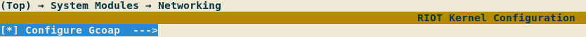

# Kconfig in RIOT                                           {#kconfig-in-riot}

[TOC]

The objective of using Kconfig in RIOT is to configure software modules at
compile-time. This means having a standard way of:
- Exposing configurable parameters
- Assigning application and user-specific configurations
- Verifying these parameters
    - Check possible values
    - Check valid configuration considering inter-dependencies
- Applying the selected configuration

# Overview                                                  {#kconfig-overview}

## Exposure
Modules in RIOT expose their configurable parameters via
Kconfig files (for more information on Kconfig syntax check
[the specification](https://www.kernel.org/doc/html/latest/kbuild/kconfig-language.html)).
In these files documentation, restrictions, default values and dependencies can
be expressed.

Kconfig files are structured through the file system mirroring the current
module distribution. In time, all modules will have Kconfig files to make
themselves configurable through this system.

## Assignment
The user can assign values to the exposed parameters, either by manually writing
'.config' files or using an interface such as Menuconfig. Parameters with no
assigned values will take the default ones. For a detailed distinction between
Kconfig and '.config' files see [Appendix B](#kconfig-appendix-b).

## Verification and application
Using '.config' and Kconfig files the build system takes care of doing the
necessary checks on the values according to the parameter definition. After
that, the `autoconf.h` header file is generated, it contains all the
configurations in the form of (`CONFIG_` prefixed) macros.

---
# User's guide to configure with Kconfig                 {#kconfig-users-guide}

## Configure using menuconfig                     {#configure-using-menuconfig}
In order to use the graphical interface menuconfig to configure the
application, run `make menuconfig` in the application's folder. All available
configurations (based on the used modules) for the particular platform will be
presented. By default, the configuration of a module via Kconfig is not enabled.
In order to activate the configuration via Kconfig the corresponding option
should be selected. That will enable the configuration of all inner options, if
available.

Once the desired configuration is achieved save the configuration to the
default proposed path and exit. The saved configuration will be applied when
the code is compiled (`make all`).

If the current configuration will be used in the future it can be saved in the
application's folder as `user.config`, using the 'Save' option in menuconfig.
This way it will be persistent after cleaning the application directory
(`make clean`).

## Configure using '.config' files                     {#configure-using-files}
The second way to configure the application is by directly writing '.config'
files. Two files will be sources of configuration during the generation of the
final header file: `app.config` and `user.config`, which should be placed
inside the application's folder. `app.config` sets default configuration
values for the particular application, the user can override them by setting
them in `user.config`.

Let's say that the `SOCK_UTIL_SCHEME_MAXLEN` symbol in `sock_util` module needs
to be configured. The `user.config` file could look like:

```Makefile
# activate configuration of sock_util using Kconfig
CONFIG_KCONFIG_MODULE_SOCK_UTIL=y
# change scheme part length
CONFIG_SOCK_UTIL_SCHEME_MAXLEN=24
```

In this case, there is no need for using menuconfig. It's enough just to call
`make all` in the application folder, as this configuration will be read and
applied. Note that if any dependency issue occurs, warnings will be generated
(e.g. not enabling the configuration of a module via Kconfig).

## Application configuration with Kconfig                 {#app-config-kconfig}
To expose application-specific configuration options a `Kconfig` file can
be placed in the application's folder. For an example of this you can check
the [tests/kconfig](https://github.com/RIOT-OS/RIOT/tree/master/tests/kconfig)
application.

## Configuration via environment variables                {#env-config-kconfig}
For easy debugging of configuration or testing new modules by compiling them
into existing applications, one can also use environment variables prefixed by
`RIOT_CONFIG_`. To achieve the same configuration exemplified in
@ref configure-using-files, e.g., you could also use

~~~~~~~~~~~~~~~~~~~~~~~~~~~~~~~~~~~~ {.sh}
RIOT_CONFIG_KCONFIG_MODULE_SOCK_UTIL=1 \
RIOT_CONFIG_SOCK_UTIL_SCHEME_MAXLEN=24 \
    make
~~~~~~~~~~~~~~~~~~~~~~~~~~~~~~~~~~~~

All the checks that apply for `.config` files also are done with this approach.

Mind that this is only meant to be used during development. In production,
please set the configuration via `.config` files.

## A note on the usage of CFLAGS
When a certain module is being configured via Kconfig the configuration macro
will not longer be overridable by means of CFLAGS (e.g. set on the
compilation command or on a Makefile). Consider this if you are getting a
'redefined warning'.

---
# Integration into the build system    {#kconfig-integration-into-build-system}

The integration of Kconfig into the build system is mainly done in
`makefiles/kconfig.mk`.

## Steps during the build process                {#kconfig-steps-build-process}


### 0. Module dependency resolution
Currently, the resolution of module dependencies is performed by the build
system where all the used modules and packages end up listed in the `USEMODULE`
make variables. In the next phases of integration we plan to resolve dependencies
using Kconfig.


#### Input
- Makefiles.

#### Output
- `USEMODULE` and `USEPKG` variables.

### 1. Module listing
The list of modules needed for the particular build is dumped into the
`$ (GENERATED_DIR)/Kconfig.dep` file, where each module is translated into a
Kconfig symbol as documented in [Appendix A](#kconfig-appendix-a).

#### Input
- `USEMODULE` and `USEPKG` variables

#### Output
- `$ (GENERATED_DIR)/Kconfig.dep` file

### 2. Merging all configuration sources         {#kconfig-steps-merge-configs}
In this step configuration values are taken from multiple sources and merged
into a single `out.config` configuration file. This file is temporary and is
removed on clean. If the user needs to save a particular configuration
set, a backup has to be saved (this can be done using the menuconfig interface)
so it can be loaded later in this step.

To accomplish merging of multiple input files, the `genconfig` script is
used.  Note that **the order matters**: existing configuration values are
merged in the order expressed in the input section, where the last value
assigned to a parameter has the highest priority. If no configuration files are
available all default values will be applied.

`out.config` is the only configuration input for the `autoconf.h` in the
[generation step](#kconfig-steps-header-gen).

Additionally this step generates a file `out.config.d` which holds the
information of all the used Kconfig files in Makefile format. This file is
included by the build system and allows to re-trigger the generation of
`out.conf` whenever a Kconfig file is modified.

#### Input
- Optional:
    - `$ (APPDIR)/app.config`: Application specific default configurations.
    - `$ (APPDIR)/user.config`: Configurations saved by user.

#### Output
- `$ (GENERATED_DIR)/out.config` file.

### 3. Menuconfig execution (optional)
Menuconfig is a graphical interface for software configuration. It is used for
the configuration of the Linux kernel. This section explains the process
that occurs when RIOT is being configured using the menuconfig interface.

The main `Kconfig` file is used in this step to show the configurable
parameters of the system. Kconfig will filter inapplicable parameters (i.e.
parameters exposed by modules that are not being used) based on the file
`$ (GENERATED_DIR)/Kconfig.dep` generated in step 1.

During the transition phase, the user needs to enable Kconfig explicitly per
module, by setting the corresponding option. If using `menuconfig` a checkbox
with a submenu has to be selected, if using `.config` files a
`CONFIG_KCONFIG_MODULE_` prefixed option has to be set to `y`. For more
information see
[Making configuration via Kconfig optional](#kconfig-configuration-optional).

Note that if Kconfig is not used to configure a module, the corresponding
header files default values will be used.

`out.config` is one of the inputs for menuconfig. This means that any
configuration that the application defines in the `app.config` or a backup
configuration from the user in `user.config` are taken into account on the
first run (see [Appendix C](#kconfig-appendix-c)).

In this step the user chooses configuration values (or selects the minimal
configuration) and saves it to the `out.config` file. Here the user can
choose to save a backup configuration file for later at a different location
(e.g. a `user.config` file in the application folder).

If any changes occur to `out.config`, the
[generation of autoconf.h](#kconfig-steps-header-gen) is executed automatically.

#### Input
- `/Kconfig` file.
- Optional:
    - `$ (APPDIR)/app.config`
    - `$ (APPDIR)/user.config`
    - `$ (GENERATED_DIR)/out.config`

#### Output
- Updated `$ (GENERATED_DIR)/out.config` file.
- `$ (GENERATED_DIR)/out.config.old` backup file.

### 4. Generation of the autoconf.h header          {#kconfig-steps-header-gen}
With the addition of Kconfig a dependency has been added to the build
process: the `$ (GENERATED_DIR)/autoconf.h` header file. This header file is
the main output from the Kconfig configuration system. It holds all the macros
that should be used to configure modules in RIOT:
`CONFIG_<module>_<parameter>`.

In order to generate the `autoconf.h` file the `genconfig` script is used.
Inputs for this script are the main `Kconfig` file and `out.config`
configuration file, which holds the selected values for the exposed parameters.

#### Input:
- `$ (GENERATED_DIR)/out.config` file.
- Main `Kconfig` file exposing configuration of modules.

#### Output:
- `$ (GENERATED_DIR)/autoconf.h` configuration header file.
- Optional:
    - `$ (GENERATED_DIR)/deps/*/*.h` header files that allow incremental builds


### Summary of files
These files are defined in `kconfig.mk`.

| File           | Description |
| ---------------| ----------- |
| `Kconfig`      | Defines configuration options of modules. |
| `Kconfig.dep`  | Holds a list of the modules that are being compiled. |
| `app.config`   | Holds default application configuration values. |
| `user.config`  | Holds configuration values applied by the user. |
| `out.config`   | Configuration file containing all the symbols defined in `autoconf.h`. |
| `out.config.d` | Dependency file of `out.config` containing the list of Kconfig files used to generate it. |
| `autoconf.h`   | Header file containing the macros that applied the selected configuration. |

## Kconfig symbols in Makefiles
As '.config' files have Makefile syntax they can be included when building,
which allows to access the applied configuration from the build system and, in
the future, to check for enabled modules.

During migration this is also useful, as it gives the ability to check if a
parameter is being configured via Kconfig or a default value via `CFLAGS` could
be injected. For example:

```Makefile
ifndef CONFIG_USB_VID
  CFLAGS += -DCONFIG_USB_VID=0x1209
endif
```

Symbols will have the same name as the configuration macros (thus will always
have the `CONFIG_` prefix). As the configuration file is loaded in
`Makefile.include` care should be taken when performing checks in the
application's Makefile. The symbols will not be defined until after including
`Makefile.include`.

---
# Transition phase                                  {#kconfig-transition-phase}
## Making configuration via Kconfig optional  {#kconfig-configuration-optional}
During transition to the usage of Kconfig as the main configuration tool for
RIOT, the default behavior will be the traditional one: expose configuration
options in header files and use CFLAGS as inputs. To allow optional
configuration via Kconfig, a convention will be used when writing Kconfig files.

Modules should be contained in their own `menuconfig` entries, this way the user
can choose to enable the configuration via Kconfig for an specific module.
These entries should define a dependency on the module they configure (see
[Appendix A](#kconfig-appendix-a) to see how to check if a module is being
used).

The module configuration then can be enabled either via the menuconfig
interface:



or by means of a '.config' file:

```Make
CONFIG_KCONFIG_MODULE_GCOAP=y
```

## Modelling CPUs, boards and provided features  {#kconfig-cpu-boards-features}
During the current migration phase architectures, CPUs, boards and provided
features are being modelled in Kconfig. The following is a guide on how to
organize and name the symbols.

### Features
Features must be modelled as hidden boolean symbols with the prefix `HAS_`. They
must contain a `help` attribute clearly specifying what providing that feature
means. The location of the symbol declaration depends on the type of feature.
Features that are not platform-specific (e.g. `arch_32bit` or `cpp`) must be
placed in `/kconfigs/Kconfig.features`. If a feature is specific to a certain
CPU family or vendor, it should be placed in the correspondent Kconfig file
(e.g. `esp_wifi_enterprise`). Features related to modules should be placed in
the Kconfig file of that module.

#### Example
The feature `arduino` is placed in `/kconfigs/Kconfig.features` and modelled
like:

```Kconfig
config HAS_ARDUINO
    bool
    help
        Indicates that Arduino pins compatibility is supported.
```

### CPUs
The proposed hierarchy for the classification of CPUs is as follows:

```
                    +------------+
More Specific       | CPU_MODEL  |
      +             +------------+
      |
      |
      |             +------------+
      |             |  CPU_FAM   |
      |             +------------+
      |
      |
      |             +------------+
      |             |  CPU_CORE  |
      |             +------------+
      |
      |
      v             +------------+
Less Specific       |  CPU_ARCH  |
                    +------------+
```

Where each hierarchy is defined as:
- `CPU_MODEL`: The specific identifier of the used CPU, used for some CPU
               implementations to differentiate between different memory
               layouts.
- `CPU_FAM`: An intermediate identifier between CPU and CPU_MODEL that
             represents a sub-group of a Manufacturers CPU's.
- `CPU_CORE`: The specific identifier of the core present in the CPU.
- `CPU_ARCH`: The specific identifier of the architecture of the core defined
              in `CPU_CORE`.

In order to model the hierarchies, a hidden boolean symbol must be declared for
each. The name of the symbol must begin with the correspondent prefix and must
be followed by the specific value. For instance, the 'samd21' family symbol is
named `CPU_FAM_SAMD21`.

In addition, a default value to the correspondent common symbol must be defined.
The default value must be guarded by the boolean symbol correspondent to the
hierarchy.

Features may be provided by any hierarchy symbol. Usually symbols are selected
from more specific to less specific. This means that a `CPU_MODEL_<model>`
symbol usually would select the correspondent `CPU_FAM_<family>` symbol,
which would in turn select the `CPU_CORE_<core>`. This may change in some cases
where `CPU_COMMON_` symbols are defined to avoid repetition. For convenience and
if it makes sense within a CPU vendor family, it's also allowed to use
intermediate grouping levels, like `CPU_LINE_<xxx>` used for STM32.

In addition to the symbols of the hierarchy described above, a default value
to the `CPU` symbol should be assigned, which will match the value of the `CPU`
Makefile variable in the build system.

The declaration of the symbols should be placed in a `Kconfig` file in the
folder that corresponds to the hierarchy. When the symbols are scattered into
multiple files, it is responsibility of file containing the most specific
symbols to `source` the less specific. Keep in mind that only the file located
in `/cpu/<CPU>/Kconfig` will be included by the root `/Kconfig` file.

#### Example

```Kconfig
# This is the most specific symbol (selected by the board)
# The CPU model selects the family it belongs to
config CPU_MODEL_SAMR21G18A
    bool
    select CPU_FAM_SAMD21

# In this case the family selects a common 'sam0' symbol (which provides some
# features), and the core it has (cortex-m0+)
config CPU_FAM_SAMD21
    bool
    select CPU_COMMON_SAM0
    select CPU_CORE_CORTEX_M0PLUS
    select HAS_CPU_SAMD21
    select HAS_PUF_SRAM

# The value of the common value depends on the selected model
config CPU_MODEL
    default "samd21e18a" if CPU_MODEL_SAMD21E18A
    default "samd21g18a" if CPU_MODEL_SAMD21G18A
    default "samd21j18a" if CPU_MODEL_SAMD21J18A
    default "samr21e18a" if CPU_MODEL_SAMR21E18A
    default "samr21g18a" if CPU_MODEL_SAMR21G18A

config CPU_FAM
    default "samd21" if CPU_FAM_SAMD21

```

### Boards
Boards must be modelled as hidden boolean symbols with the prefix `BOARD_` which
default to `y` and are placed in `/boards/<BOARD>/Kconfig`. This file will be
`source`d from the main `/Kconfig` file. The board symbol must select the
`CPU_MODEL_<model>` symbol that corresponds to the CPU model present on the
board. The board symbol must also select the symbols that correspond to the
features it provides.

In the same `Kconfig` file a default value must be assigned to the
common `BOARD` symbol. It must be guarded by the board's symbol, so it only
applies in that case.

There are cases when grouping common code for multiple boards helps to avoid
unnecessary repetition. In the case features are provided in a common board
folder (e.g. `/boards/common/arduino-atmega`) a symbol should be declared to
model this in Kconfig. Symbols for common boards must have the `BOARD_COMMON_`
prefix, and must select the common provided features.

#### Example
The samr21-xpro has a `samr21g18a` CPU and provides multiple features. Its
symbol is modelled as following:

```Kconfig
# /boards/samr21-xpro/Kconfig

config BOARD
    default "samr21-xpro" if BOARD_SAMR21_XPRO

config BOARD_SAMR21_XPRO
    bool
    default y
    select CPU_MODEL_SAMR21G18A
    select HAS_PERIPH_ADC
    select HAS_PERIPH_I2C
    select HAS_PERIPH_PWM
    select HAS_PERIPH_RTC
    select HAS_PERIPH_RTT
    select HAS_PERIPH_SPI
    select HAS_PERIPH_TIMER
    select HAS_PERIPH_UART
    select HAS_PERIPH_USBDEV
    select HAS_RIOTBOOT
```

## Summary of reserved Kconfig prefixes
The following symbol prefixes have been assigned particular semantics and are
reserved for the cases described below:

<!-- Keep the table in alphabetical order -->
| Prefix | Description |
| :----- | :---------- |
| `BOARD_` | Models a board |
| `BOARD_COMMON_` | Used for common symbols used by multiple boards |
| `CPU_ARCH_` | Models a CPU architecture |
| `CPU_COMMON_` | Used for common symbols used by multiple CPUs |
| `CPU_CORE_` | Models a CPU core |
| `CPU_FAM_` | Models a family of CPUs |
| `CPU_MODEL_` | Models a particular model of CPU |
| `HAS_` | Models a [feature](build-system-basics.html#features) |
| `KCONFIG_USEMODULE_` | Used during transition to enable configuration of a module via Kconfig |
| `KCONFIG_USEPKG_` | Used during transition to enable configuration of a package via Kconfig |
| `USEMODULE_` | Models a [RIOT module](creating-modules.html#creating-modules). Generated from `USEMODULE` variable |
| `USEPKG_` | Models an [external package](group__pkg.html). Generated from `USEPKG` variable |

---
# Appendixes                                              {#kconfig-appendixes}

## Appendix A: Check if a module or package is used       {#kconfig-appendix-a}
In order to show only the relevant configuration parameters to the user with
respect to a given application and board selection, Kconfig needs knowledge
about all modules and packages to be used for a compilation. Currently
dependency handling among modules is performed by the build system (via
`Makefile.dep` files). The interface defined to declared the used modules and
packages is the `$ (GENERATED_DIR)/Kconfig.dep` file.

`Kconfig.dep` is a Kconfig file that will define symbols of the form:
```Kconfig
config MODULE_SOCK_UTIL
    bool
    default y
```
There will be a symbol for every used module (i.e. every module in
`USEMODULE` make variable) and package. The names in the symbols will be
uppercase and separated by `_`. Based on these symbols configurability is
decided. Modules and packages symbols will have `MODULE_` and `PKG_` prefixes
respectively.

The following is an example of how to use these symbols in Kconfig files to
enable/disable a configuration menu:

```Kconfig
menuconfig KCONFIG_MODULE_SOCK_UTIL
    bool "Configure Sock Utilities"
    depends on MODULE_SOCK_UTIL
    help
        "Configure Sock Utilities using Kconfig."
```

Then, every configuration option for the previous module would be modeled like:

```Kconfig
if KCONFIG_MODULE_SOCK_UTIL

config SOCK_UTIL_SCHEME_MAXLEN
    int "Maximum length of the scheme part for sock_urlsplit"
    default 16

endif # KCONFIG_MODULE_SOCK_UTIL
```

## Appendix B: Difference between 'Kconfig' and '.config' files {#kconfig-appendix-b}
Kconfig files describe a configuration database, which is a collection of
configuration options organized in a tree structure. Configuration options may
have dependencies (among other attributes), which are used to determine their
visibility.

Kconfig files are written in
[Kconfig language](https://www.kernel.org/doc/Documentation/kbuild/kconfig-language.txt)
defined in the Linux kernel. Configuration options have attributes such as
types, prompts and default values.

#### Kconfig file

```Kconfig
menu "Buffer Sizes"

config GCOAP_PDU_BUF_SIZE
    int "Request or response buffer size"
    default 128

endmenu
```

On the other hand configuration files contain assignment of values to
configuration options and use Makefile syntax. They can also be used to save a
set of configuration values as backup.

#### '.config' file

```makefile
# enable Kconfig configuration for gcoap
CONFIG_KCONFIG_MODULE_GCOAP=y
# set the value
CONFIG_GCOAP_PDU_BUF_SIZE=12345
```

In other words: Kconfig files describe configuration options and '.config' files
assign their values.

## Appendix C: Pitfall when using different configuration interfaces {#kconfig-appendix-c}
In the current configuration flow the user can choose to configure RIOT using
the menuconfig graphical interface or writing '.config' files by hand.

As explained in the
['Configuration sources merging step'](#kconfig-steps-merge-configs)
of the configuration process, configuration from multiple sources are loaded to
create a single `out.config` file, and the order of merging matters: last
file has priority.

While editing values directly via '.config' files `out.config` will be
re-built. The user can also use menuconfig interface to modify the configuration
file (this is the recommended way, as it gives access to much more information
regarding dependencies and default values of the symbols). Menuconfig will
change `out.config` directly (a backup file `out.config.old` will be kept).

**It is recommended to save backups of the configurations, as any change on the
configuration sources would re-trigger the merging process and overwrite
`out.config`.**

## Appendix D: A few key aspects while exposing a macro to Kconfig {#kconfig-appendix-d}
A macro that holds a 0 or 1 is modelled in Kconfig as a `bool` symbol. References to this macro
can then make use of IS_ACTIVE macro from kernel_defines.h with C conditionals
for conditional compilation.
[FXOS8700 driver exposure to Kconfig](https://github.com/RIOT-OS/RIOT/pull/13914)
can be considered as an example. If the macro is defined as `TRUE` by default,
a new symbol gets introduced to invert the semantics. The recommended
practice is to add a new symbol and expose it to Kconfig while the old one is
tagged to be deprecated. The process is documented in this
[commit](https://github.com/RIOT-OS/RIOT/pull/13129/commits/c7b6dc587cf20f3177abe0417a408b6ab90d0ff8)

There may be cases where a macro is expected to hold only specific values, e.g.
'GNRC_IPV6_MSG_QUEUE_SIZE' expressed as the power of two. These may be modelled
in such a way that a new macro is introduced to hold the restricted figures
while operators are added to arrive at the desired value. The process is
documented in this [pull request.](https://github.com/RIOT-OS/RIOT/pull/14086)

# Useful references                                {#kconfig-useful-references}
- [Kconfig language specification](https://www.kernel.org/doc/html/latest/kbuild/kconfig-language.html)
- [Kconfig macro language specification](https://www.kernel.org/doc/html/latest/kbuild/kconfig-macro-language.html)
- [Kconfig - Tips and Best Practices](https://docs.zephyrproject.org/latest/guides/kconfig/tips.html)
