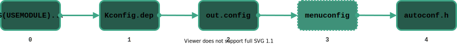

# Integration of Kconfig into the build system    {#kconfig-build-system}

[TOC]

The integration of Kconfig into the build system is mainly done in
`makefiles/kconfig.mk`.

# Steps during the build process                {#kconfig-steps-build-process}

## 1. Merging all configuration sources         {#kconfig-steps-merge-configs}
In this step configuration values are taken from multiple sources and merged
into a single `merged.config` configuration file. This file is temporary and is
removed on clean. If the user needs to save a particular configuration
set, a backup has to be saved (this can be done using the menuconfig interface)
so it can be loaded later in this step.

To accomplish merging of multiple input files, the `mergeconfig` script is
used.  Note that **the order matters**: existing configuration values are
merged in the order expressed in the input section, where the last value
assigned to a parameter has the highest priority. If no configuration files are
available all default values will be applied.

`merged.config` is the only configuration input for the `autoconf.h` in the
[generation step](#kconfig-steps-header-gen).

### Input
- Optional:
    - `$ (APPDIR)/app.config`: Application specific default configurations.
    - `$ (APPDIR)/user.config`: Configurations saved by user.

### Output
- `$ (GENERATED_DIR)/merged.config` file.

## 2. Menuconfig execution (optional)
Menuconfig is a graphical interface for software configuration. It is used for
the configuration of the Linux kernel. This section explains the process
that occurs when RIOT is being configured using the menuconfig interface.

The main `Kconfig` file is used in this step to show the available modules of
the system, together with their configurations. Kconfig will filter innaplicable
parameters (i.e. parameters exposed by modules that are not being used).

`merged.config` is one of the inputs for menuconfig. This means that any
configuration that the application defines in the `app.config` or a backup
configuration from the user in `user.config` are taken into account on the
first run (see [Appendix C](#kconfig-appendix-c)).

In this step the user chooses configuration values (or selects the minimal
configuration) and saves it to the `merged.config` file. Here the user can
choose to save a backup configuration file for later at a different location
(e.g. a `user.config` file in the application folder).

### Input
- `/Kconfig` file.
- Optional:
    - `$ (APPDIR)/app.config`
    - `$ (APPDIR)/user.config`
    - `$ (GENERATED_DIR)/merged.config`

### Output
- Updated `$ (GENERATED_DIR)/merged.config` file.
- `$ (GENERATED_DIR)/merged.config.old` backup file.

## 3. Generation of the autoconf.h header          {#kconfig-steps-header-gen}
With the addition of Kconfig a dependency has been added to the build
process: the `$ (GENERATED_DIR)/autoconf.h` header file. This header file is
the main output from the Kconfig configuration system. It holds all the macros
that should be used to configure modules in RIOT:
`CONFIG_<module>_<parameter>`.

In order to generate the `autoconf.h` file the `genconfig` script is used.
Inputs for this script are the main `Kconfig` file and `merged.config`
configuration file, which holds the selected values for the exposed parameters.

### Input:
- `$ (GENERATED_DIR)/merged.config` file.
- Main `Kconfig` file exposing configuration of modules.

### Output:
- `$ (GENERATED_DIR)/autoconf.h` configuration header file.

## Summary of files
These files are defined in `kconfig.mk`.

| File              | Description |
| ----------------- | ----------- |
| `Kconfig`           | Defines configuration options of modules. |
| `app.config`        | Holds default application configuration values. |
| `user.config`       | Holds configuration values applied by the user. |
| `merged.config`     | Holds configuration from multiple sources. Used to generate header. |
| `autoconf.h`        | Header file containing the macros that applied the selected configuration. |

# Kconfig symbols in Makefiles
As '.config' files have Makefile syntax they can be included when building,
which allows to access the applied configuration from the build system and to
check for enabled modules.

Symbols will have the same name as the configuration macros (thus will always
have the `CONFIG_` prefix). As the configuration file is loaded in
`Makefile.include` care should be taken when performing checks in the
application's Makefile. The symbols will not be defined until after including
`Makefile.include`.
