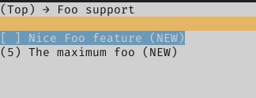

# Developer's guide and tips to write Kconfig files   {#kconfig-developer-guide}
[TOC]

# Short reference of Kconfig syntax                 {#reference-kconfig-syntax}

| Keyword(s) | Meaning |
| :--------: | :------ |
| `config`       | Indicates the beginning of the definition of a symbol |
| `bool`         | Indicates that the type of a symbol is boolean |
| `int`          | Indicates that the type of a symbol is integer |
| `hex`          | Indicates that the type of a symbol is hexadecimal |
| `string`       | Indicates that the type of a symbol is string |
| `depends on`   | Specifies a forward-dependency on a boolean expression |
| `if` / `endif` | Specifies a forward-dependency for a group of symbols |
| `select`       | Specifies a reverse-dependency on a symbol (forces the value) |
| `default`      | Specifies a default value for a symbol. Zero or more can be defined. Can take a condition |
| `prompt`       | Specifies the string displayed to the user for a given symbol. Can take a condition |
| `help`         | Specifies the help string for the user related to a symbol |

# Modelling features in Kconfig                   {#modelling-features-kconfig}

## Introduction to features                                   {#intro-features}
Features are functionalities or characteristics that can be provided by hardware
or modules. Examples of features are:
    - 32-bits architecture
    - crypto acceleration hardware is available
    - an interface is implemented by some module

The main use of features is to gain information about a certain characteristic
in a generic way, that is, without having to check for all the specific symbols
that could potentially provide this characteristic if present. For example,
instead of checking for all the possible drivers of IEEE 802.15.4-compatible
devices, a feature can indicate that at least one of such devices is present.

Other Kconfig symbols can then use the information provided by features, for
example to change a default value, their visibility or even depended on them.

## How features look in a Kconfig file?             {#features-in-kconfig-file}
Features are modelled in Kconfig as boolean non-visible symbols, with a help
attribute which documents what this feature indicates. The symbols names must be
prefixed with `HAS_`. Usually features will not have any dependencies.

```kconfig
config HAS_PERIPH_HWRNG
    bool
    help
        Indicates that a Hardware Random Number Generator peripheral is present.
```

In the example above:
- `config` is the Kconfig directive to declare a symbol
- `HAS_PERIPH_HWRNG` is the name of the symbol itself
- `bool` is the symbol type
- `help` specifies the start of a help string for the user. The string can
have multiple lines, but needs to be indented.

When a module or another Kconfig symbol provides a certain feature, it uses the
`select` attribute to indicate so. This way, when the symbol is active, the
feature is selected. A feature can be selected by more than one symbol, and a
symbol can select as many features as it needs to.

```kconfig
config CPU_FAMILY_SAM0
    bool
    default y
    select HAS_PERIPH_GPIO
    select HAS_PERIPH_WDT
```

# Modelling modules in Kconfig                     {#modelling-modules-kconfig}

RIOT [modules](./creating-modules.html) and pseudomodules are represented in
Kconfig as boolean symbols. They can either be active or not (`y` or `n`). In
most cases these symbols will be visible (they have a prompt), this means that
the user can set their state via a configuration interface (e.g. menuconfig or
a `.config` file). The symbols names must be prefixed with `MOD_`.

```kconfig
config MOD_FOO_CORE
    bool
    prompt "Foo basic support"
```

In the example above:
- `prompt <string> ["if" <expr>]` specifies the string that is displayed to the
  user. Optionally, a boolean expression can be also specified to conditionally
  display the prompt, using `if` after the string.

The previous snippet can be shortened as:

```kconfig
config MOD_FOO_CORE
    bool "Foo basic support"
```

## Specifying module dependencies             {#specifying-module-dependencies}
Modules may have dependencies, either on other modules, features or
configurations. This is expressed using the `depends on` attribute, which
defines a forward dependency. The attribute takes an expression. The expression
can be just a symbol or a logical operation on multiple symbols. A module can
have zero or more `depends on` attributes, each of them is connected with a
logical AND (`&&`). This forces the user to have a 'bottom-up' approach in
configuration, which means, that only when all dependencies are met the module
can be enabled.

On the example bellow, a 'Foo Extended' module depends on a core 'Foo'
module, and also on the absence of features 'Bar' and 'Baz'.

```kconfig
config MOD_FOO_EXTENDED
    bool "Extended Foo functionalities"
    depends on MOD_FOO_CORE
    depends on !FEATURE_BAR && !FEATURE_BAZ
```

## Module default values
Boolean symbols in Kconfig are disabled by default. There may be certain modules
that are usually enabled under certain conditions. To ease the configuration
process the `default` attribute can be used, to change the default value of the
symbol. Zero or more`default` attributes can be specified for the module. Each
of them will have a value and may have also a condition under which they are
visible (meaning that they should be applied). If more than one default is
visible, the first one is taken.

```kconfig
config MOD_SIMPLE_BAR
    bool "Simple Bar support"
    default y if MOD_FOO_CORE || MOD_BAZ
    default n if MOD_QUX
    default y
```

## Dependencies and `select`                         {#dependencies-and-select}

Using `depends on` to express dependencies may be cumbersome for some simple
cases, because the user needs to enable all the dependencies of a module, before
enabling the module itself. The `select` attribute represents a
reverse-dependency. As explained on the
[features section](#modelling-features-kconfig), if a symbol `select`s another
one, the selected will take the value `y` whenever the selector is active. Care
should be taken when using `select`, as the selected symbol will be activated
even if its dependencies are not met. Because of this characteristic, `select`
should be used with care and avoided when possible.

There are two cases when `select` may be used to express dependencies:

### 1. Selecting peripheral drivers


When a module selects a peripheral driver, the module should add a dependency to
the peripheral feature. Only peripheral drivers that do not depend on other
modules can be directly selected.

In the example bellow, the AT86RF233 radio driver checks that the target
hardware has GPIO, GPIO interrupts and SPI bus available:

```kconfig
config MOD_AT86RF233
    bool "AT86RF233"
    depends on HAS_PERIPH_GPIO
    depends on HAS_PERIPH_GPIO_IRQ
    depends on HAS_PERIPH_SPI
    select MOD_PERIPH_GPIO
    select MOD_PERIPH_GPIO_IRQ
    select MOD_PERIPH_SPI
```

This way we ensure that the module can only be selected if the needed hardware
is present on the platform.

### 2. Selecting simple modules without dependencies

Many times there are simple modules which do not have dependencies. Depending on
them can be expressed with `select`:

```kconfig
config MOD_INET_CSUM
    bool "Internet checksum calculation"

config MOD_IPV6_HDR
    bool "IPv6 header functionalities"
    select MOD_INET_CSUM
```

## Module configuration options                 {#module-configuration-options}

Many modules of RIOT provide configuration options. These options can be
expressed as Kconfig symbols, so the user can access and change them. Options
can be of different types:

- int
- hex
- bool
- string
- choices (which are an special way of modelling boolean options)

Usually, configuration symbols will depend on the module they configure. This
can be expressed using `if` or a `depends on` statement. Using `if` is the
preferred way when more than one symbol share the same dependency.

To improve user experience on configuration front ends (like menuconfig) the
directive `menuconfig` can be used to define the symbol, instead of `config`.
Both work on a similar way, but `menuconfig` gives a hint to the front end to
create a submenu with the following symbols that depend on that symbol.

For example:

```kconfig
menuconfig MOD_FOO
    bool "Foo support"

if MOD_FOO

config FOO_FEATURED
    bool "Nice Foo feature"

config FOO_MAX
    int "The maximum foo"
    default 5

endif # MOD_FOO
```

That snippet will produce the following on menuconfig:

| Selection of the module | Module options |
| :---: | :---: |
|  |  |

As any other Kconfig symbol, configuration options can declare dependencies and
zero or more default values (each with an optional condition) can be specified.
Also, visibility of the option can be changed depending on a boolean expression.
In the following example advanced options are only visible to the user for
configuration when "Advance configuration of Foo" option is selected.

```kconfig
config FOO_ADVANCE_CONFIGS
    bool "Advance configuration of Foo"

config FOO_TIMEOUT
    int
    prompt "Foo timeout" if FOO_ADVANCE_CONFIGS
    default 10
```

Visibility is affected by the `prompt` attribute, which can take a condition.
Note that values will take their defaults when not visible.

## Modelling CPUs, boards and provided features  {#kconfig-cpu-boards-features}
During the current migration phase architectures, CPUs, boards and provided
features are being modelled in Kconfig. The following is a guide on how to
organize and name the symbols.

### Features
Features must be modelled as hidden boolean symbols with the prefix `HAS_`. They
must contain a `help` attribute clearly specifying what providing that feature
means. The location of the symbol declaration depends on the type of feature.
Features that are not platform-specific (e.g. `arch_32bit` or `cpp`) must be
placed in `/kconfigs/Kconfig.features`. If a feature is specific to a certain
CPU family or vendor, it should be placed in the correspondent Kconfig file
(e.g. `esp_wifi_enterprise`). Features related to modules should be placed in
the Kconfig file of that module.

#### Example
The feature `arduino` is placed in `/kconfigs/Kconfig.features` and modelled
like:

```Kconfig
config HAS_ARDUINO
    bool
    help
        Indicates that Arduino pins compatibility is supported.
```

### CPUs
The proposed hierarchy for the classification of CPUs is as follows:

```
                    +------------+
More Specific       | CPU_MODEL  |
      +             +------------+
      |
      |
      |             +------------+
      |             |  CPU_FAM   |
      |             +------------+
      |
      |
      |             +------------+
      |             |  CPU_CORE  |
      |             +------------+
      |
      |
      v             +------------+
Less Specific       |  CPU_ARCH  |
                    +------------+
```

Where each hierarchy is defined as:
- `CPU_MODEL`: The specific identifier of the used CPU, used for some CPU
               implementations to differentiate between different memory
               layouts.
- `CPU_FAM`: An intermediate identifier between CPU and CPU_MODEL that
             represents a sub-group of a Manufacturers CPU's.
- `CPU_CORE`: The specific identifier of the core present in the CPU.
- `CPU_ARCH`: The specific identifier of the architecture of the core defined
              in `CPU_CORE`.

In order to model the hierarchies, a hidden boolean symbol must be declared for
each. The name of the symbol must begin with the correspondent prefix and must
be followed by the specific value. For instance, the 'samd21' family symbol is
named `CPU_FAM_SAMD21`.

In addition, a default value to the correspondent common symbol must be defined.
The default value must be guarded by the boolean symbol correspondent to the
hierarchy.

Features may be provided by any hierarchy symbol. Usually symbols are selected
from more specific to less specific. This means that a `CPU_MODEL_<model>`
symbol usually would select the correspondent `CPU_FAM_<family>` symbol,
which would in turn select the `CPU_CORE_<core>`. This may change in some cases
where `CPU_COMMON_` symbols are defined to avoid repetition.

In addition to the symbols of the hierarchy described above, a default value
to the `CPU` symbol should be assigned, which will match the value of the `CPU`
Makefile variable in the build system.

The declaration of the symbols should be placed in a `Kconfig` file in the
folder that corresponds to the hierarchy. When the symbols are scattered into
multiple files, it is responsibility of file containing the most specific
symbols to `source` the less specific. Keep in mind that only the file located
in `/cpu/<CPU>/Kconfig` will be included by the root `/Kconfig` file.

#### Example

```Kconfig
# This is the most specific symbol (selected by the board)
# The CPU model selects the family it belongs to
config CPU_MODEL_SAMR21G18A
    bool
    select CPU_FAM_SAMD21

# In this case the family selects a common 'sam0' symbol (which provides some
# features), and the core it has (cortex-m0+)
config CPU_FAM_SAMD21
    bool
    select CPU_COMMON_SAM0
    select CPU_CORE_CORTEX_M0PLUS
    select HAS_CPU_SAMD21
    select HAS_PUF_SRAM

# The value of the common value depends on the selected model
config CPU_MODEL
    default "samd21e18a" if CPU_MODEL_SAMD21E18A
    default "samd21g18a" if CPU_MODEL_SAMD21G18A
    default "samd21j18a" if CPU_MODEL_SAMD21J18A
    default "samr21e18a" if CPU_MODEL_SAMR21E18A
    default "samr21g18a" if CPU_MODEL_SAMR21G18A

config CPU_FAM
    default "samd21" if CPU_FAM_SAMD21

```

### Boards
Boards must be modelled as hidden boolean symbols with the prefix `BOARD_` which
default to `y` and are placed in `/boards/<BOARD>/Kconfig`. This file will be
`source`d from the main `/Kconfig` file. The board symbol must select the
`CPU_MODEL_<model>` symbol that corresponds to the CPU model present on the
board. The board symbol must also select the symbols that correspond to the
features it provides.

In the same `Kconfig` file a default value must be assigned to the
common `BOARD` symbol. It must be guarded by the board's symbol, so it only
applies in that case.

There are cases when grouping common code for multiple boards helps to avoid
unnecessary repetition. In the case features are provided in a common board
folder (e.g. `/boards/common/arduino-atmega`) a symbol should be declared to
model this in Kconfig. Symbols for common boards must have the `BOARD_COMMON_`
prefix, and must select the common provided features.

#### Example
The samr21-xpro has a `samr21g18a` CPU and provides multiple features. Its
symbol is modelled as following:

```Kconfig
# /boards/samr21-xpro/Kconfig

config BOARD
    default "samr21-xpro" if BOARD_SAMR21_XPRO

config BOARD_SAMR21_XPRO
    bool
    default y
    select CPU_MODEL_SAMR21G18A
    select HAS_PERIPH_ADC
    select HAS_PERIPH_I2C
    select HAS_PERIPH_PWM
    select HAS_PERIPH_RTC
    select HAS_PERIPH_RTT
    select HAS_PERIPH_SPI
    select HAS_PERIPH_TIMER
    select HAS_PERIPH_UART
    select HAS_PERIPH_USBDEV
    select HAS_RIOTBOOT
```

## Summary of reserved Kconfig prefixes
The following symbol prefixes have been assigned particular semantics and are
reserved for the cases described bellow:

<!-- Keep the table in alphabetical order -->
| Prefix | Description |
| :----- | :---------- |
| `BOARD_` | Models a board |
| `BOARD_COMMON_` | Used for common symbols used by multiple boards |
| `CPU_ARCH_` | Models a CPU architecture |
| `CPU_COMMON_` | Used for common symbols used by multiple CPUs |
| `CPU_CORE_` | Models a CPU core |
| `CPU_FAM_` | Models a family of CPUs |
| `CPU_MODEL_` | Models a particular model of CPU |
| `HAS_` | Models a [feature](build-system-basics.html#features) |
| `KCONFIG_MODULE_` | Used during transition to enable configuration of a module via Kconfig |
| `KCONFIG_PKG_` | Used during transition to enable configuration of a package via Kconfig |
| `MODULE_` | Models a [RIOT module](creating-modules.html#creating-modules) |
| `PKG_` | Models an [external package](group__pkg.html) |
