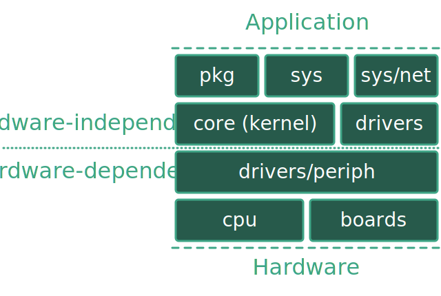

RIOT Documentation                                                  {#mainpage}
==================

[TOC]

RIOT in a nutshell                                        {#riot-in-a-nutshell}
==================
RIOT is an open-source microcontroller operating system, designed to match
the requirements of Internet of Things (IoT) devices and other embedded
devices. These requirements include a very low memory footprint (on the order
of a few kilobytes), high energy efficiency, real-time capabilities, support
for a wide range of low-power hardware, communication stacks for wireless and
communication stacks for wired networks.

RIOT provides threading, multiple network stacks, and utilities which
include cryptographic libraries, data structures (bloom filters, hash tables,
priority queues), a shell and more. RIOT supports a wide range of
microcontroller architectures, radio drivers, sensors, and configurations for
entire platforms, e.g. Atmel SAM R21 Xplained Pro, Zolertia Z1, STM32 Discovery
Boards etc. (see the list of
[supported boards](https://www.riot-os.org/boards.html).
Across all supported hardware (32-bit, 16-bit, and 8-bit platforms), RIOT
provides a consistent API and enables C and C++ application programming,
with  multithreading, IPC, system timers, mutexes etc.

A good high-level overview can be found in the article
[RIOT: An Open Source Operating System for Low-End Embedded Devices in
the IoT](https://www.riot-os.org/assets/pdfs/riot-ieeeiotjournal-2018.pdf)
(IEEE Internet of Things Journal, December 2018).

Contribute to RIOT                                        {#contribute-to-riot}
==================
RIOT is developed by an open community that anyone is welcome to join:
 - Download and contribute your code on
   [GitHub](https://github.com/RIOT-OS/RIOT). You can read about how to
   contribute [in our contributing
   document](https://github.com/RIOT-OS/RIOT/blob/master/CONTRIBUTING.md).
 - Sign-up to our [forum](https://forum.riot-os.org/) to ask for help using RIOT
   or writing an application for RIOT, discuss kernel and network stack
   development as well as hardware support, or to show-case your latest project.
 - Follow us on [Mastodon][mastodon-link] for news from the RIOT
   community.
 - Regarding critical vulnerabilities we would appreciate if you give us a
   90-days head-start by reporting to security@riot-os.org, before making your
   information publicly available
 - Contact us on Matrix for live support and discussions:
   [riot-os:matrix.org](https://matrix.to/#/#riot-os:matrix.org)

[mastodon-link]: https://floss.social/@RIOT_OS

The quickest start                                        {#the-quickest-start}
==================
You can run RIOT on most IoT devices, on open-access testbed hardware (e.g.
IoT-lab), and also directly as a process on your Linux or FreeBSD machine (we
call this the `native` port). Try it right now in your terminal window:

~~~~~~~{.sh}
git clone https://github.com/RIOT-OS/RIOT.git # assumption: git is pre-installed
cd RIOT
git checkout <LATEST_RELEASE>
sudo ./dist/tools/tapsetup/tapsetup         # create virtual Ethernet
                                            # interfaces to connect multiple
                                            # RIOT instances
cd examples/basic/default/
make all
make term
~~~~~~~

... and you are in the RIOT shell!
Type `help` to discover available commands. For further information see the
[README of the `default` example](https://github.com/RIOT-OS/RIOT/tree/master/examples/basic/default).

To use RIOT directly on your embedded platform, and for more hands-on details
with RIOT, see @ref getting-started.

Before that, skimming through the next section is recommended (but not
mandatory).

Structure                                                          {#structure}
=========

This section walks you through RIOT's structure. Once you understand this
structure, you will easily find your way around in RIOT's code base.

RIOT's code base is structured into five groups.

 - The kernel (`core`)
 - Platform specific code (`cpu`; `boards`)
 - Device drivers (`drivers`)
 - Libraries and network code (`sys`; `pkg`)
 - Applications for demonstrating features and for testing (`examples`;
   `tests`)

In addition RIOT includes a collection of scripts for various tasks (`dist`) as
well as a predefined environment for generating this documentation (`doc`).

The structural groups are projected onto the directory structure of RIOT, where
each of these groups resides in one or two directories in the main RIOT
directory.

The following list gives a more detailed description of each of RIOT's
top-level directories:

core
----
This directory contains the actual kernel. The kernel consists of the scheduler,
inter-process-communication (messaging), threading, and thread
synchronization, as well as supporting data-structures and type definitions.

See @ref core for further information and API documentations.

boards
------
The platform dependent code is split into two logic elements: CPUs and boards,
while maintaining a strict 1-to-n relationship, a board has exactly one CPU,
while a CPU can be part of n boards. The CPU part contains all generic, CPU
specific code (see below).

The board part contains the specific configuration for the CPU it contains.
This configuration mainly includes the peripheral configuration and
pin-mapping, the configuration of on-board devices, and the CPU's clock
configuration.

On top of the source and header files needed for each board, this directory
additionally may include some script and configuration files needed for
interfacing with the board. These are typically custom flash/debug scripts or
e.g. OpenOCD configuration files. For most boards, these files are located in a
`dist` sub-directory of the board.

See here @ref boards for further information.

cpu
---
For each supported CPU this directory contains a sub-directory with the name of
the CPU. These directories then contain all CPU specific configurations, such
as implementations of power management (LPM), interrupt handling and vectors,
startup code, clock initialization code and thread handling (e.g. context
switching) code. For most CPUs you will also find the linker scripts in the
`ldscripts` sub-directory.

In the `periph` sub-directory of each CPU you can find the implementations of
the CPU's peripheral drivers like SPI, UART, GPIO, etc.  See @ref drivers_periph
for their API documentation.

Many CPUs share a certain amount of their code (e.g. all ARM Cortex-M based
CPUs share the same code for task switching and interrupt handling). This
shared code is put in its own directories, following a `xxxxx_common` naming
scheme. Examples for this is code shared across architectures (e.g.
`cortexm_common`, `msp430_comon`) or code shared among vendors (e.g.
`stm32_common`).

See @ref cpu for more detailed information.

drivers
-------
This directory contains the drivers for external devices such as network
interfaces, sensors and actuators. Each device driver is put into its own
sub-directory with the name of that device.

All of RIOT's device drivers are based on the peripheral driver API (e.g. SPI,
GPIO, etc.) and other RIOT modules like the `xtimer`. This way the drivers are
completely platform agnostic and they don't have any dependencies into the CPU
and board code.

See @ref drivers for more details.

sys
---
RIOT follows a modular design paradigm where everything is supposed to
be a module. All of these modules that are not part of the hardware abstraction
nor device drivers can be found in this directory. The libraries include data
structures (e.g. bloom, color), crypto libraries (e.g. hashes, AES) ,
high-level APIs (e.g. Posix implementations), memory management (e.g. malloc),
the RIOT shell and many more.

See @ref sys for a complete list of available libraries

sys/net
-------
The `sys/net` sub-directory needs to be explicitly mentioned, as this is where
all the networking code in RIOT resides. Here you can find the network stack
implementations (e.g. the @ref net_gnrc "GNRC" stack) as well as network stack agnostic code as
header definitions or network types.

See @ref net for more details on networking code.

pkg
---
RIOT comes with support for a number of external libraries (e.g.
[ccn-lite](https://github.com/cn-uofbasel/ccn-lite),
[microcoap](https://github.com/1248/microcoap)). The way they are included is
that RIOT ships with a custom Makefile for each supported library that
downloads the library and optionally applies a number of patches to make it
work with RIOT. These Makefiles and patches can be found in the `pkg`
directory.

See @ref pkg for a detailed description on how this works.

examples
--------
Here you find a number of example applications that demonstrate certain
features of RIOT. The default example found in this directory is a good
starting point for anyone who is new to RIOT.

For more information best browse that directory and have a look at the
`README.md` files that ship with each example.

To create your own application - here or anywhere else - see @ref creating-an-application

tests
-----
Many features/modules in RIOT come with their own test application, which are
located in this directory. In contrary to the examples these tests are mostly
focusing on a single aspect than on a set of features. Despite for testing, you
might consider these tests also for insights on understanding RIOT.

dist & doc
----------
All the tooling around RIOT can be found in these two folders.

`doc` contains the doxygen configuration and also contains the compiled doxygen
output after running `make doc`.

Lastly, the `dist` directory contains tools to help you with RIOT. These
include
the serial terminal application `pyterm`, generic scripts for flashing,
debugging, resetting (e.g. support for [OpenOCD](http://openocd.org/),
[Jlink](https://www.segger.com/jlink_base.html)), as well as code enabling easy
integration to open testbeds such as the [IoT-LAB](https://www.iot-lab.info/).
Furthermore you can find here scripts to do all kind of code and style checks.

Further information                                      {#further-information}
===================
 - @ref getting-started
 - @ref creating-an-application
 - @ref porting-boards
 - @ref creating-modules
 - @ref advanced-build-system-tricks
 - @ref build-in-docker

<!--
Idea for this section: just name each of RIOT's main features/concepts and link
to an appropriate page with further information:
    - Create an application
    - Networking
    - The `main()` function
    - Make system
    - Include modules
    - Threading
    - Choose the right stack size
    - IPC
    - Auto initialization
-->
