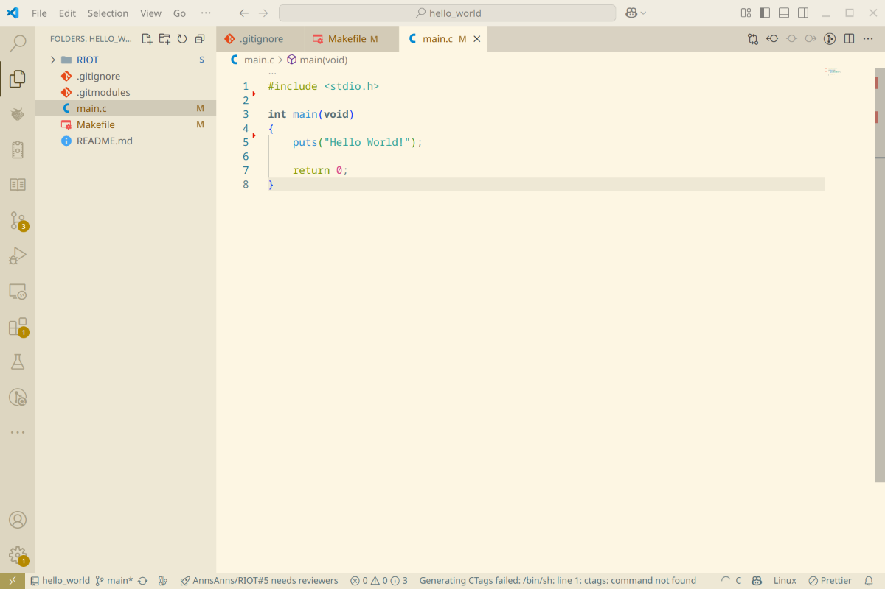
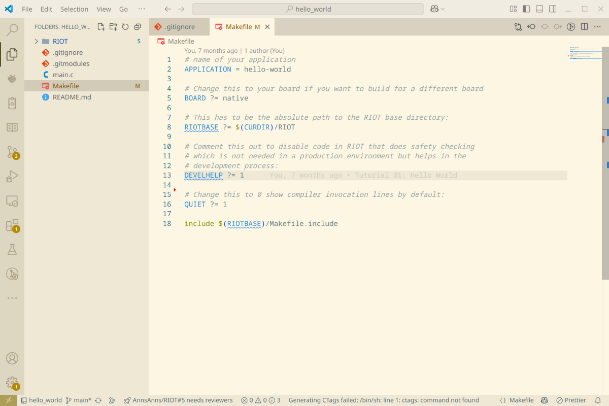
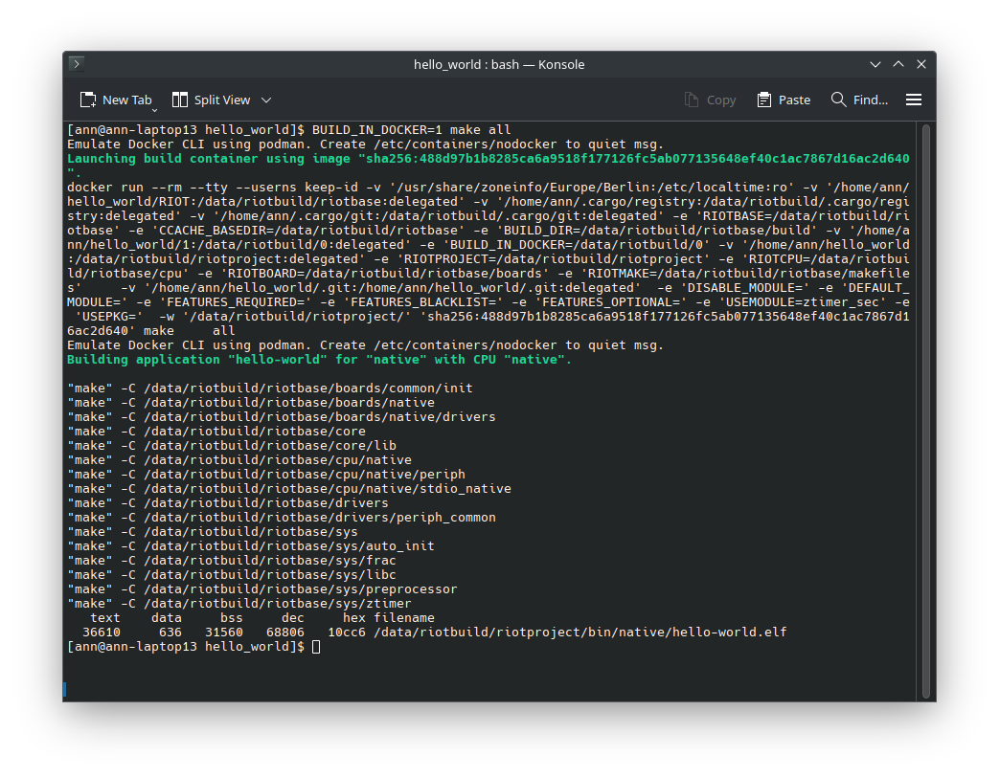

import Contact from '@components/contact.astro';
import GitSetup from '@components/gitsetup.mdx';

Now that we have played around with the examples and have a basic understanding of how to use RIOT,
let's create a new project from scratch.
We will create a simple hello world program that will print "Hello World!" to the console.

Lets start with the basic git setup,
if you already have a git repository set up,
you can skip to the next section.

## Step 1: The Basics of Git and Submodules

<GitSetup />

## Step 2: Creating our Hello World Program

Now that we have added RIOT as a submodule to our project,
we can start writing our hello world program.
To do this, we create a new file called `main.c` in the `hello_world` directory.
You can use any text editor to create this file.
We will use Visual Studio Code in this example.
To open Visual Studio Code in the directory, you can use the following command:

```bash
code .
```

Now that Visual Studio Code is open,
we create a new file called `main.c` and add the following code:

```c title="hello_world/main.c"
/*
 * For many printing related things, such as the puts function here
 * we import stdio, depending on your board, platform or form of output
 * it then includes the right definitions without the need to
 * worry about the specific details.
 */
#include <stdio.h>

/*
 * This is the main function of the program.
 * It serves as the entry point for the program and gets called once your CPU is
 * initialized.
 *
 * The function returns an integer value, which is the exit status
 * of the program. A return value of 0 indicates that the program has finished
 * successfully.
 */
int main(void)
{
    puts("Hello World!");

    return 0;
}
```



This program will print "Hello World!" to the console when it is run.
The `#include <stdio.h>` line includes the standard input/output library,
which allows us to use the `puts` function to print to the console.

## Step 3: Creating the Makefile

Now that we have created our hello world program,
we need to create a Makefile to build our program.
The Makefile is a build automation tool that allows us to define how our program should be built.
We create a new file called `Makefile` in the `hello_world` directory and add the following code:

```makefile  title="hello_world/Makefile"
# name of your application
APPLICATION = hello-world

# Change this to your board if you want to build for a different board
BOARD ?= native

# This has to be the absolute path to the RIOT base directory:
RIOTBASE ?= $(CURDIR)/RIOT

# Comment this out to disable code in RIOT that does safety checking
# which is not needed in a production environment but helps in the
# development process:
DEVELHELP ?= 1

# Change this to 0 show compiler invocation lines by default:
QUIET ?= 1

include $(RIOTBASE)/Makefile.include
```



Congratulations! You have now created a new project with a simple hello world program.
In the next step, we will build and run our program just like we did in the "Getting Started" guide.

## Step 4: Building and Running the Program

<Contact />

To build our program, we use the following command:

```bash
BUILD_IN_DOCKER=1 make all
```

:::note
The `BUILD_IN_DOCKER=1` flag tells the build system to use the docker image provided by RIOT
to build our program.
This ensures that we have all the necessary dependencies to build our program.
If you have already built RIOT on your system,
you can omit this flag and the build system will use the toolchain installed on your system.

Do note that building in Docker will take quite a bit longer on the first run,
as it needs to download a fairly large Docker image.

Alteratively, you can simply run:

```bash
make all
```
:::



After building the program,
we can run it using the following command to start the RIOT shell:

```bash
make term
```

:::note
Depending on your board, the hello world might appear before the RIOT shell starts.

If you want to see the output of the hello world program,
you can run `make flash term` instead,
which will flash the program to the board and then start the RIOT shell.

This does not guarantee that the hello world program will run before the RIOT shell starts
but should increase the chances of it appearing before the shell starts.
:::

If everything went well,
you should see our hello world program printing "Hello World!" to the console after a few seconds.


Hooraay! You have successfully created a new project with a simple hello world program.

:::tip
Before you push your project to a git hosting service such as Github,
make sure to add a `.gitignore` file to your project to exclude
unnecessary files from being tracked by git.

For this project, a `.gitignore` file could look like this:

```bash title=".gitignore"
# Ignore build artifacts
bin/
*.bin
*.elf
*.hex
*.map
*.lst
*.o
*.d
*.a
*.out
```
:::

## Conclusion

In this tutorial, we have created a new project with a simple hello world program.
We have added RIOT as a submodule to our project, created a hello world program,
and built and run the program using the RIOT build system.
You can now start building your own applications using RIOT
and explore the vast possibilities that RIOT has to offer.

:::note
The source code for this tutorial can be found
[HERE](https://github.com/RIOT-OS/RIOT/tree/master/examples/guides/creating_project).

If your project is not working as expected,
you can compare your code with the code in this repository to see if you missed anything.
:::
