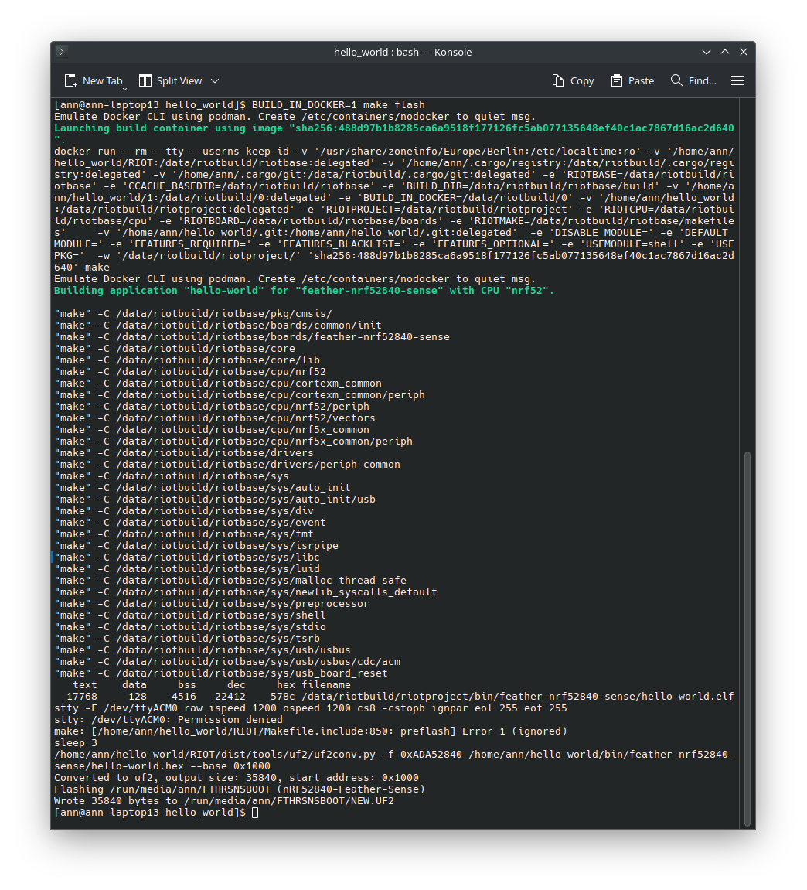

import Contact from '@components/contact.astro';
import WorkingVideo from './img/gpio/05_working_video.mp4';
import ButtonVideo from './img/gpio/08_buttons.mp4';

So far we have been running all our code using the `arduino-feather-nrf52840-sense` board.

In this tutorial, we will learn how to use the GPIO pins on a real board
to control LEDs or read button presses.

For this tutorial we will be using a the `arduino-feather-nrf52840-sense` board
with the [Teamagochi PCB](https://github.com/smartuni/teamagochi),
but you can use any board that has GPIO pins.

## Step 1: Configuring our Board

<Contact />

First, we need to inform RIOT about the board we are using.

To do this we adapt the `BOARD` variable in our `Makefile` to the board we are using.

```make
BOARD ?= arduino-feather-nrf52840-sense
```

```makefile title="Makefile" {5}
# name of your application
APPLICATION = gpio_example

# Change this to your board if you want to build for a different board
BOARD ?= arduino-feather-nrf52840-sense

# This has to be the absolute path to the RIOT base directory:
# If you are following the tutorial, your RIOT base directory will
# most likely be something like RIOTBASE ?= $(CURDIR)/RIOT
# instead of this
RIOTBASE ?= $(CURDIR)/../../..

# Comment this out to disable code in RIOT that does safety checking
# which is not needed in a production environment but helps in the
# development process:
DEVELHELP ?= 1

# Change this to 0 show compiler invocation lines by default:
QUIET ?= 1

include $(RIOTBASE)/Makefile.include
```

:::tip
If you ever want to just quickly test something
on a board without having to change the `Makefile`,
you can also set the `BOARD` variable in the terminal before running `make`.
```bash
BOARD=arduino-feather-nrf52840-sense make all
```

First we want to make sure that we can build the code for the board.
To do this we can simply run `make all` in the terminal,
this will build the code for the board and check if everything is set up correctly.

If everything is set up correctly,
we should now be able to move on to flashing the board.

:::tip
It might return something like:

```
/bin/sh: line 1: arm-none-eabi-gcc: command not found
Compiler arm-none-eabi-gcc is required but not found in PATH.  Aborting.
```

This means that you need to install the ARM toolchain,
you can do this by running `sudo apt install gcc-arm-none-eabi` on Ubuntu
or `sudo pacman -S arm-none-eabi-gcc` on Arch Linux.

If it still doesn't work,
consider running it via the Docker container using `BUILD_IN_DOCKER=1 make flash`.

Please refer to the [Flashing a RIOT Application](/getting-started/flashing)
guide for more information.
:::

Try flashing the board with `make flash` and see if it works,
it should still execute the same code as before when running RIOT natively on your
own hardware but now using the actual board.



Now if we type `make term` we should see the output of the board in the terminal.
Make sure that you have the board connected to your computer via USB and
that your user has the necessary permissions to access the serial port.

:::tip
On Arch Linux, you might need to add your user to the `uucp` group
to access the serial port.

```bash
sudo usermod -a -G uucp $USER
```
:::

## Step 2: Controlling LEDs

Now that we have the board working, let's try to control the LEDs on the board.

The exact pins that control the LEDs might vary depending on the board you are using,
but in the case of the `arduino-feather-nrf52840-sense` board,
the LED would be connected on Port 1 Pin 9.

You can often find these defines either in the board schematics or in the board
configuration headers in RIOT.

First we need to include the necessary modules in our projects `Makefile`.

```make
# Add the gpio module to the build
USEMODULE += periph_gpio
USEMODULE += periph_gpio_irq

# Enable the milliseconds timer.
USEMODULE += ztimer
USEMODULE += ztimer_msec
```

```makefile title="Makefile" {18-24}
# name of your application
APPLICATION = gpio_example

# Change this to your board if you want to build for a different board
BOARD ?= arduino-feather-nrf52840-sense

# This has to be the absolute path to the RIOT base directory:
# If you are following the tutorial, your RIOT base directory will
# most likely be something like RIOTBASE ?= $(CURDIR)/RIOT
# instead of this
RIOTBASE ?= $(CURDIR)/../../..

# Comment this out to disable code in RIOT that does safety checking
# which is not needed in a production environment but helps in the
# development process:
DEVELHELP ?= 1

# Add the gpio module to the build
USEMODULE += periph_gpio
USEMODULE += periph_gpio_irq

# Enable the milliseconds timer.
USEMODULE += ztimer
USEMODULE += ztimer_msec

# Change this to 0 show compiler invocation lines by default:
QUIET ?= 1

include $(RIOTBASE)/Makefile.include
```

This allows us to both control the GPIO pins and timers.

Specifically, we need the `periph_gpio` module to control the GPIO pins,
`periph_gpio_irq` to handle GPIO interrupts,
and `ztimer` to use the timer functionality for blinking the LED.
In this case, we also need the `ztimer_msec` module to use the millisecond timer.

Now we need to actually define the pin that we want to control in our code.
To do this include the following lines **before** the `main` function.

```c
#include "board.h"
#include "periph/gpio.h"
#include "ztimer.h"

/* Define the LED0 pin and mode */
gpio_t led0 = GPIO_PIN(1, 9);
gpio_mode_t led0_mode = GPIO_OUT;
```

Now we can control the LED. First we initialize the pin
and afterwards we turn the LED off by clearing the pin.

{/*<!--skip ci-->*/}
```c
int main(void)
{
    /* Initialize the LED0 pin */
    gpio_init(led0, led0_mode);
    /* Turn off the LED0 pin */
    gpio_clear(led0);

    /* Loop forever */
    while (1) {

    }
}
```

Turning the LED off when the board starts is quite boring,
so let's make it blink by adding a delay and toggling the LED.

```c
    /* Loop forever */
    while (1) {
        /* Toggle the LED0 pin every 500 milliseconds */
        gpio_toggle(led0);
        ztimer_sleep(ZTIMER_MSEC, 500);
    }
```

The full code should now look like this:

{/*<!--skip ci-->*/}
```c title="main.c" {16-21}
#include "board.h"
#include "periph/gpio.h"
#include "ztimer.h"

/* Define the LED0 pin and mode */
gpio_t led0 = GPIO_PIN(1, 9);
gpio_mode_t led0_mode = GPIO_OUT;

int main(void)
{
    /* Initialize the LED0 pin */
    gpio_init(led0, led0_mode);
    /* Turn off the LED0 pin */
    gpio_clear(led0);

    /* Loop forever */
    while (1) {
        /* Toggle the LED0 pin every 500 milliseconds */
        gpio_toggle(led0);
        ztimer_sleep(ZTIMER_MSEC, 500);
    }
}
```

If we now `make flash` and then `make term` we should see the LED blinking.

<video controls>
  <source src={WorkingVideo} type="video/mp4" />
  Your browser does not support the video tag.
</video>

## Step 3: Reading Button Presses

If you remember what we did in the timers tutorial,
we can use quite similar code to read button presses.

On a constrained device you usually don't want to poll the button state,
which is why we will use an interrupt to detect the button press,
that way we can drastically reduce the power consumption of the device.


First we need to define the callback function
that will be called when the button is pressed.

```c title="Define the button callback function"
/* This callback function will be called when the button state changes */
void button_callback(void *arg)
{
    /* the argument is not used */
    (void)arg;

    /* Toggle the LED1 pin based on the button state */
    if (gpio_read(button)) {
        gpio_clear(led1);
    }
    else {
        gpio_set(led1);
    }
}
```

Now we need to define the button and led1 pin and mode and initialize it.

```c title="main.c" {9-14, 38-44}
#include "board.h"
#include "periph/gpio.h"
#include "ztimer.h"

/* Define the LED0 pin and mode */
gpio_t led0 = GPIO_PIN(1, 9);
gpio_mode_t led0_mode = GPIO_OUT;

/* Define the LED1 pin and mode */
gpio_t led1 = GPIO_PIN(1, 10);
gpio_mode_t led1_mode = GPIO_OUT;

/* Define the button pin */
gpio_t button = GPIO_PIN(1, 2);

/* This callback function will be called when the button state changes */
void button_callback(void *arg)
{
    /* the argument is not used */
    (void)arg;

    /* Toggle the LED1 pin based on the button state */
    if (gpio_read(button)) {
        gpio_clear(led1);
    }
    else {
        gpio_set(led1);
    }
}

int main(void)
{
    /* Initialize the LED0 pin */
    gpio_init(led0, led0_mode);
    /* Turn off the LED0 pin */
    gpio_clear(led0);

    /* Initialize the LED1 pin */
    gpio_init(led1, led1_mode);
    /* Turn off the LED1 pin */
    gpio_clear(led1);

    /* Initialize the button pin */
    gpio_init_int(button, GPIO_IN_PU, GPIO_BOTH, button_callback, NULL);

    /* Loop forever */
    while (1) {
        /* Toggle the LED0 pin every 500 milliseconds */
        gpio_toggle(led0);
        ztimer_sleep(ZTIMER_MSEC, 500);
    }
}
```

This code will initialize the button pin and call the `button_callback`
function whenever the button is pressed.

If we now `make flash` and then `make term` we should see the LED turn on
when the button is pressed.

:::tip
If you are using the `arduino-feather-nrf52840-sense` board,
the button is on the back of the board.

Be careful to not press the reset button by mistake 😉
:::

<video controls>
  <source src={ButtonVideo} type="video/mp4" />
  Your browser does not support the video tag.
</video>

## Extra: Board Specific Defines

Most boards (if they have LEDs or buttons) will have
specific defines for the GPIO pins that are used.
For example, the `arduino-feather-nrf52840-sense` board has the `LED0_TOGGLE`
define that allows you to toggle the LED without having to define the pin yourself.

In most cases using gpio like we did in this tutorial is the best way to go,
it's more flexible, documented and standardized for all boards.
However, using these defines can often be easier at the start,
esp. when the GPIO pins are not documented well or the board support is not complete yet.

Using this define, we can simplify our code to the following:

{/*<!--skip ci-->*/}
```c title="Using the LED0_TOGGLE define"
int main(void)
{
    /* Initialize the LED0 pin */
    gpio_init(led0, led0_mode);
    /* Turn off the LED0 pin */
    gpio_clear(led0);

    /* Loop forever */
    while (1) {
        /* Toggle the LED0 pin every 500 milliseconds */
        LED0_TOGGLE;
        ztimer_sleep(ZTIMER_MSEC, 500);
    }
}
```

## Conclusion

In this tutorial we learned how to use the GPIO pins on a real board to
control LEDs and read button presses.

This is a very basic example, but it should give you a good starting point
to build more complex applications.

<Contact />

:::note
The source code for this tutorial can be found
[HERE](https://github.com/RIOT-OS/RIOT/tree/master/examples/guides/gpio).

If your project is not working as expected,
you can compare your code with the code in this repository to see if you missed anything.
:::
