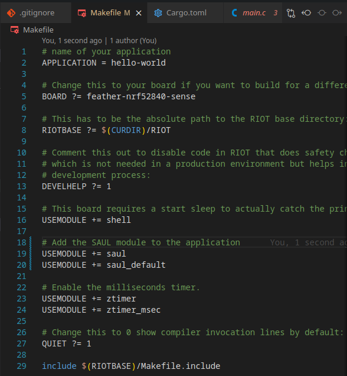
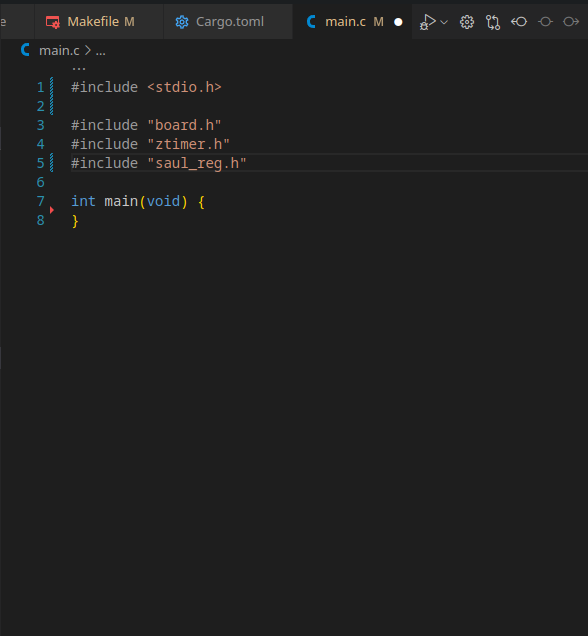
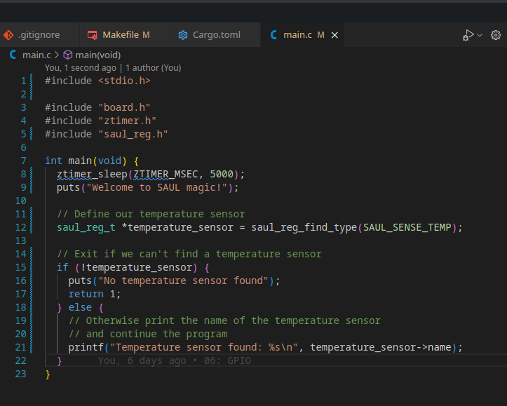
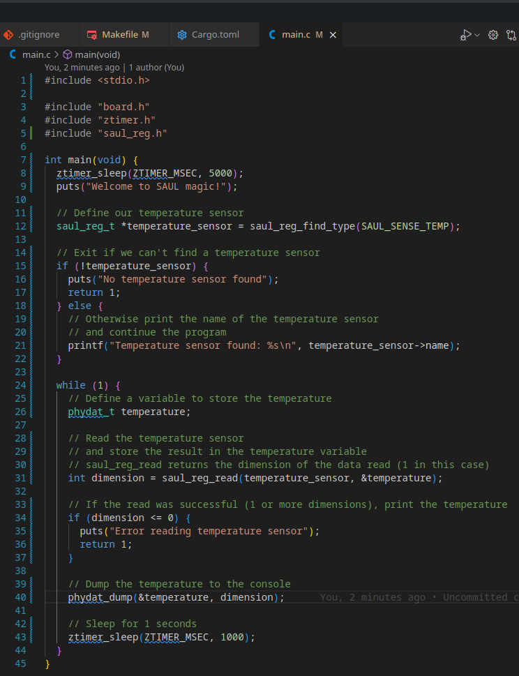

In the previous chapter we learned how to interact with the GPIOs directly,
but RIOT provides a more abstract way to interact with sensors and actuators.
RIOT calls this the SAUL (Sensors/Actuators Abstraction Layer) system.

The availability of sensors and actuators can vary greatly between different boards,
so the SAUL system provides a way to interact with them in a uniform way,
regardless of the underlying hardware.
So consulting the [documentation](https://doc.riot-os.org/group__drivers__saul.html)
is always a good idea.

## The Makefile

First we need to include the necessary module in the `Makefile`, to do this
add the following line to the `Makefile`:

```makefile
USEMODULE += saul
USEMODULE += saul_default
```



## Including the Headers

Next we need to include the necessary headers in our `main.c` file.
Add the following lines to the top of the file:

```c
#include <stdio.h>

#include "board.h"
#include "saul_reg.h"
#include "ztimer.h"
```

We need:
- `stdio.h` for the `printf` function,
- `board.h` for the board specific configuration,
- `ztimer.h` for the ztimer module so we can sleep for a while,
- and `saul_reg.h` for the SAUL registry and related functions.




## Registering a Sensor

To create a SAUL registry entry RIOT provides a function called `saul_reg_find_type`
which searches for the first device on our board that matches the description we provide.

In this example we will register a temperature sensor, as such we need to simply tell it to
search for `SAUL_SENSE_TEMP` devices.

```c
  /* Define our temperature sensor */
  saul_reg_t *temperature_sensor = saul_reg_find_type(SAUL_SENSE_TEMP);
```

This doesn't actually guarantee that the sensor is available, which is why we also need to
check if the sensor truly exists. To do this we create a simple if statement that checks
whether the result of the function was `NULL` or not.

```c
  /* Exit if we can't find a temperature sensor */
  if (!temperature_sensor) {
    puts("No temperature sensor found");
    return 1;
  } else {
    /*
     * Otherwise print the name of the temperature sensor
     * and continue the program
     */
    printf("Temperature sensor found: %s\n", temperature_sensor->name);
  }
```



Congratulations, by this point your program should be able to find
a temperature sensor on your board.

## Reading the Sensor

Here is where SAUL really shines,
to read the sensor we simply call the `saul_reg_read` function
which then stores the result in a `phydat_t` struct we provide.

```c
  /* We start an infinite loop to continuously read the temperature */
  while (1) {
    /* Define a variable to store the temperature */
    phydat_t temperature;

    /*
     * Read the temperature sensor
     * and store the result in the temperature variable
     * saul_reg_read returns the dimension of the data read (1 in this case)
     */
    int dimension = saul_reg_read(temperature_sensor, &temperature);
```

Once again, since C doesn't have exceptions,
we need to check if the sensor was read correctly.
In this case we simply need to check if the dimension is greater than 0.

```c
    /* If the read was successful (1+ Dimensions), print the temperature */
    if (dimension <= 0) {
      puts("Error reading temperature sensor");
      return 1;
    }
```

Now all that is left is to print the temperature to the console and go to sleep.

RIOT provides a simple function to solve this problem,
`phydat_dump` which prints the data in a `phydat_t` struct to the console.

```c
    /* Dump the temperature to the console */
    phydat_dump(&temperature, dimension);

    /* Sleep for 1 seconds */
    ztimer_sleep(ZTIMER_MSEC, 1000);
```



## Building and Running the Program

As always, we need to build and run our program.
To do this we use the following commands:

```bash
make flash
```

and then to see the output:

```bash
make term
```

If everything went well,
you should see the temperature being printed to the console every second like this:

```log
2024-10-14 15:31:29,610 # Data:           24.50 °C
2024-10-14 15:31:30,134 # Data:           24.50 °C
2024-10-14 15:31:31,134 # Data:           24.50 °C
2024-10-14 15:31:32,134 # Data:           24.50 °C
2024-10-14 15:31:33,135 # Data:           24.50 °C
2024-10-14 15:31:34,135 # Data:           24.50 °C
2024-10-14 15:31:35,136 # Data:           24.50 °C
```

## Conclusion

Congratulations! You have now learned how to use the SAUL system
to interact with sensors and actuators in RIOT
and how to read the temperature from a temperature sensor. 🎉

:::note
The source code for this tutorial can be found
[HERE](https://github.com/RIOT-OS/RIOT/tree/master/examples/guides/saul).

If your project is not working as expected, you can compare your code
with the code in this repository to see if you missed anything.
:::
