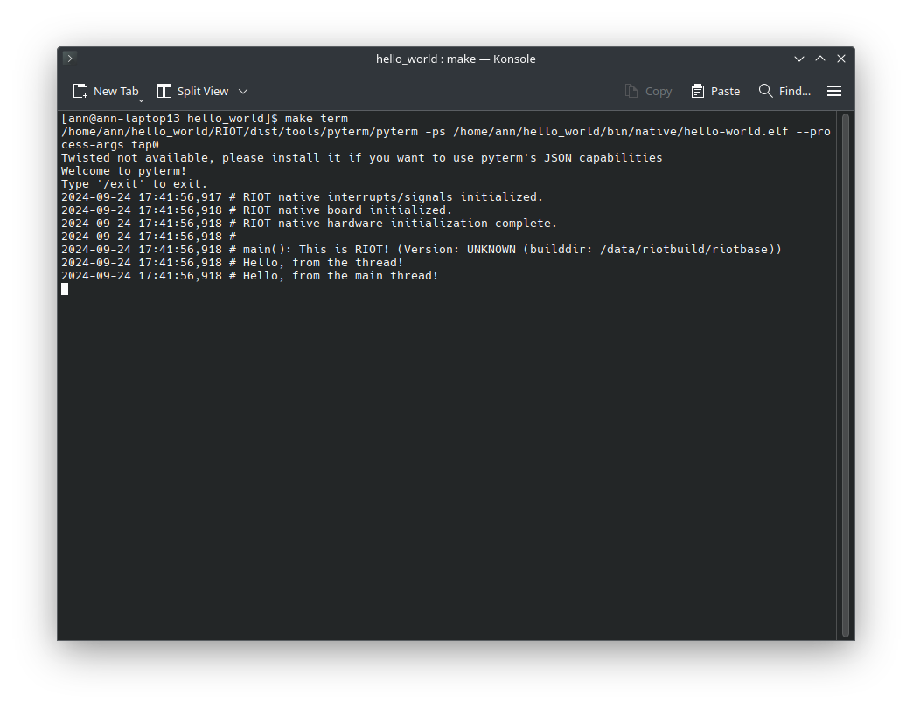

import Contact from '@components/contact.astro';

Threads allow you to run multiple tasks concurrently in your application.

## Step 1: Creating a Thread Function

To create a thread in RIOT,
you need to define a function that implements the thread and then start the thread.
The signature of the thread function should be `void *thread_function_name(void *arg)`.
The argument `arg` is a pointer to any data that you want to pass to the thread.

Let's create a simple thread that prints a message to the console.
Go into your `main.c` file and add the following code:

```c
void *my_first_thread(void *arg)
{
    /* The argument we receive will not be used */
    (void)arg;

    /* We print a simple message from the thread */
    puts("Hello, from the thread!");

    /* We return NULL to indicate that the thread has finished */
    return NULL;
}
```

This function takes a single argument,
a pointer to any data, and prints "Hello, from the thread!" to the console.
Now all that is left is to start the thread.

:::caution
You need to specify `void *arg` even if you don't use it,
otherwise the compiler will throw an error.
:::

## Step 2: Starting the Thread

To start a thread we need two things:
a stack for the thread and a call to `thread_create`.

First, we need to define a stack for the thread.
The stack size should be at least `THREAD_STACKSIZE_MAIN` bytes.
You can define the stack as a global variable
or as a local variable in your `main` function.

The stack size can vary depending on the complexity of your thread.
For example, depending of the amount of local variables you use,
the stack size might need to be larger.

Let's define the stack as a global variable:

```c
char my_thread_stack[THREAD_STACKSIZE_MAIN];
```

Lastly, we need to actually start the thread.
Go into your `main` function and include the following code:

```c
int main(void)
{
    /* Create a thread with the stack we defined above */
    thread_create(my_thread_stack, sizeof(my_thread_stack),
                  THREAD_PRIORITY_MAIN - 1, 0, my_first_thread, NULL,
                  "My first thread");

    /* The main thread can continue doing its work (e.g., printing a message) */
    puts("Hello, from the main thread!");
}
```

`thread_creates` takes the following arguments:
- `my_thread_stack`: The stack for the thread
- `sizeof(my_thread_stack)`: The size of the stack
- `THREAD_PRIORITY_MAIN - 1`: The priority of the thread
- `0`: The flags for the thread
- `my_first_thread`: The thread function
- `NULL`: The argument for the thread function
- `"My first thread"`: The name of the thread

The final code should now look like this:

```c title="main.c" {5-9, 25-31}
#include <stdio.h>

#include "thread.h"

/*
 * Define a stack for the thread.
 * The size of the stack is defined by THREAD_STACKSIZE_MAIN.
 */
char my_thread_stack[THREAD_STACKSIZE_MAIN];

void *my_first_thread(void *arg)
{
    /* The argument we receive will not be used */
    (void)arg;

    /* We print a simple message from the thread */
    puts("Hello, from the thread!");

    /* We return NULL to indicate that the thread has finished */
    return NULL;
}

int main(void)
{
    /* Create a thread with the stack we defined above */
    thread_create(my_thread_stack, sizeof(my_thread_stack),
                  THREAD_PRIORITY_MAIN - 1, 0, my_first_thread, NULL,
                  "My first thread");

    /* The main thread can continue doing its work (e.g., printing a message) */
    puts("Hello, from the main thread!");
}
```

## Step 3: Building and Running the Program

Now that we have created our thread, we can build and run our program.
Compile the program and flash it to your board using `make flash`.

If we now look into the terminal via `make term` we should see the message
"Hello, from the main thread!" printed to the console followed by
"Hello, from the thread!" printed by the thread.




## Conclusion

Congratulations! You have successfully created and started a thread in RIOT.
Threads are a powerful tool but remember that you are on a resource-constrained device,
so don't create too many threads or use too much stack space.

:::note
The source code for this tutorial can be found
[HERE](https://github.com/RIOT-OS/RIOT/tree/master/examples/guides/threads).

If your project is not working as expected,
you can compare your code with the code in this repository to see if you missed anything.
:::
