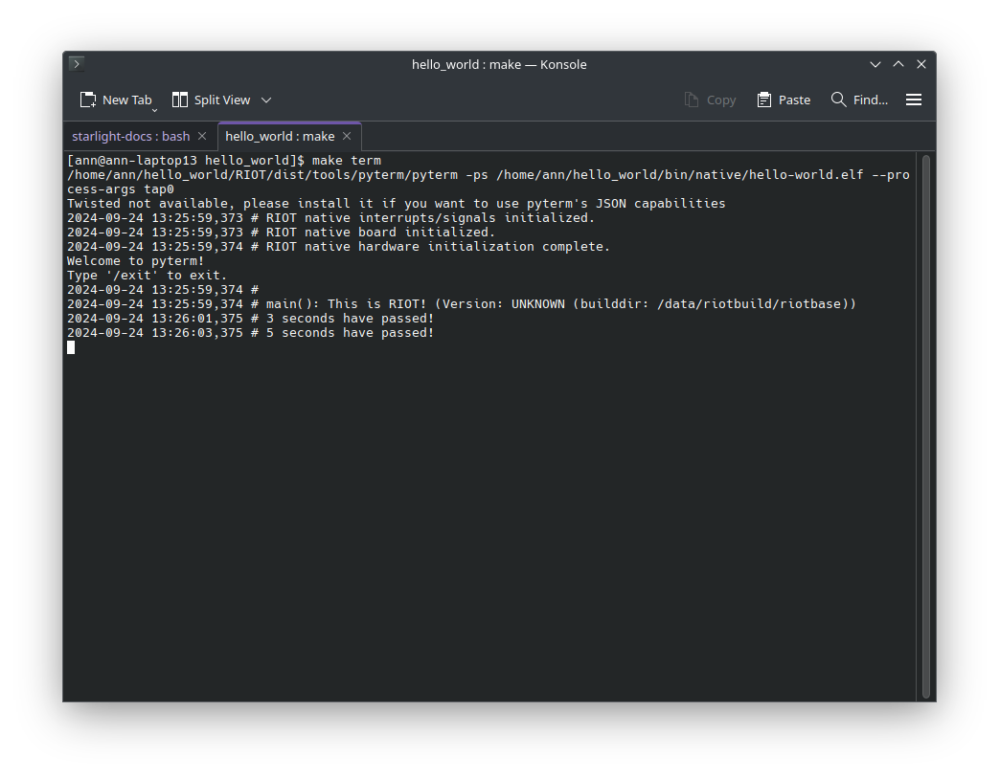

Timers and interrupts are essential concepts in embedded systems programming.
In this tutorial, we will take a look at how to use timers and interrupts in RIOT.

There are two different approaches to timers,
you can either use interrupts or polling.

Both have their advantages and disadvantages, but in general,
using interrupts is more efficient and allows you to do other things while
waiting for the timer to expire instead of constantly checking if the timer has expired.

## Step 1: Using Timers

Before we can even use timers we first need to import the module. To do that go into
your `Makefile` and add a new `USEMODULE += ztimer_sec` into it.

```make {6-7} title="Makefile"
# Comment this out to disable code in RIOT that does safety checking
# which is not needed in a production environment but helps in the
# development process:
DEVELHELP ?= 1

# Import the ztimer_sec module so we can sleep
USEMODULE += ztimer_sec

# Change this to 0 show compiler invocation lines by default:
QUIET ?= 1
```

Generally there are various levels of accuracy that ztimer offers,
such as `ztimer_usec`, `ztimer_msec` or `ztimer_sec` as we use here.
Always keep in mind that you are working on quite constrained devices so
the difference between a `ztimer_usec` accuracy versus `ztimer_sec` accuracy
can have massive performance impact on your device, possibly even preventing
your device from entering a low-power/sleep state,
thus drastically increasing energy usage.
As such it is most often not worth it unless you specifically need the precision.
For more details you can visit the
[ztimer API documentation](https://doc.riot-os.org/group__sys__ztimer.html).

This allows us to do a simple `ztimer_sleep(ZTIMER_SEC, 5);` which we will
also use soon. Using `ztimer_sleep(ZTIMER_SEC, 5);` we simply wait for around
5 seconds in this case.

But what if we want to do something else while waiting for the timer to expire?
Let's take a closer look at how we can use timers in RIOT.

### Step 1: Creating a Callback

Timers are a way to schedule tasks to be executed at a later time.
In RIOT, you have to tell the timers two things:
the time when the timer should expire and the function that should be called
when the timer expires.

Lets start by creating the callback that the timer will call when it expires.
Go into your `main.c` file and add the following code:

```c
void timer_callback(void *arg)
{
    /* Cast the received pointer "arg" to a C String type */
    char *message = (char *)arg;

    /* Print the message */
    puts(message);
}
```

This function takes a single argument, a pointer to a string,
and prints the string to the console. Congrats, you have created a callback function,
now all that is left is to create the timer and schedule it.
To do that lets restructure our `main` function to use the timer.

### Step 2: Scheduling the Timer

Go into your `main` function and include the following code:

```c
int main(void)
{
    /* Create a timer */
    ztimer_t timer = { .callback = timer_callback,
                       .arg = "3 seconds have passed!" };
```

This code creates a timer and initializes it with the callback function we
created earlier and a message that will be printed when the timer expires.
Now all that is left is to actually start the timer. To do that,
we need to simply call the `ztimer_set` function with the timer we created as an argument.

```c
    /* Set the timer to fire in 3 seconds */
    ztimer_set(ZTIMER_SEC, &timer, 3);
```

This code tells the timer to fire in 3 seconds.
The first argument specifies which type of clock we want to use,
the second argument is the timer we created, and the third argument is the time in seconds.

### Step 3: Running the Program

Now that we have created the timer and scheduled it, we can run the program.
Compile the program using `make` and flash it to your board using `make flash`.
If you look into the terminal via `make term` you should see the message
"3 seconds have passed!" printed to the console after 3 seconds.

That's all there is to it! You have successfully used a timer in RIOT.



Now you can do other things while waiting for the timer to expire,
instead of constantly checking if the timer has expired. For example,
lets use our knowledge from before to let the main thread go to sleep for 5 seconds
and then print a message.

```c
    /* Sleep for 5 seconds */
    ztimer_sleep(ZTIMER_SEC, 5);

    puts("5 seconds have passed!");

    return 0;
```

The final code should now look like this:

```c title="main.c"
#include <stdio.h>

#include "ztimer.h"

void timer_callback(void *arg)
{
    /* Cast the received pointer "arg" to a C String type */
    char *message = (char *)arg;

    /* Print the message */
    puts(message);
}

int main(void)
{
    /* Create a timer */
    ztimer_t timer = { .callback = timer_callback,
                       .arg = "3 seconds have passed!" };

    /* Set the timer to fire in 3 seconds */
    ztimer_set(ZTIMER_SEC, &timer, 3);

    /* Sleep for 5 seconds */
    ztimer_sleep(ZTIMER_SEC, 5);

    puts("5 seconds have passed!");

    return 0;
}
```

## Conclusion

In this tutorial, we learned how to use timers in RIOT.
We created a callback function that prints a message to the console
and scheduled a timer to call the callback function after 3 seconds.

:::note
The source code for this tutorial can be found
[HERE](https://github.com/RIOT-OS/RIOT/tree/master/examples/guides/timers).

If your project is not working as expected,
you can compare your code with the code in this repository to see if you missed anything.
:::
