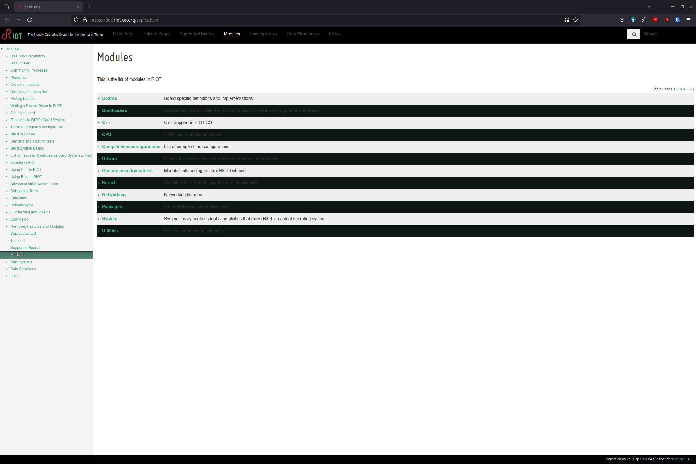
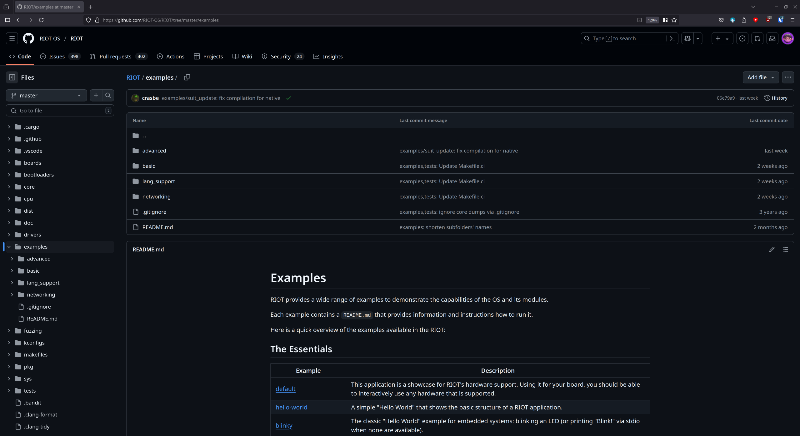
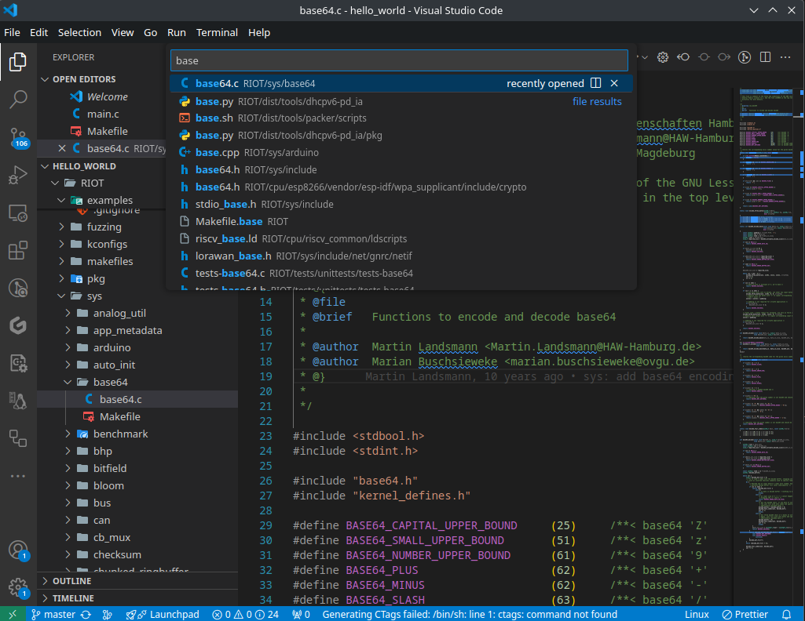

import Contact from '@components/contact.astro';

A core concept in RIOT is the use of modules.
Modules are a way to organize code and data in a way that makes it easy to reuse and share.
In the previous tutorial, we created a simple hello world program and you might have noticed that we included a module called `ztimer`.
`ztimer` is one of the core modules in RIOT and provides a way to work with timers,l both software and hardware timers are supported.

Lets take a look at how we can use modules in RIOT and where to find them.

## Step 1: Finding modules

RIOT provides a number of modules that you can use in your application, including modules for networking, sensors, and more.
Depending on the goal of your application, you might need to use different modules and sometimes even create your own. So where can you find these modules?

There are several approaches to this and none of them are wrong.

### Approach 1: The API Documentation



The first approach is to look at the API documentation. The API documentation provides a list of all modules and functions that are available in RIOT and can be found [here](https://doc.riot-os.org/topics.html).

It can be a bit overwhelming to find the right module in the API documentation, but it is a good starting point if you know what you are looking for.

### Approach 2: The Examples



Another approach is to look at the examples that are provided with RIOT. The examples are a great way to learn how to use a module and see it in action.

You can find the examples in the `examples` directory of the RIOT repository, most of them come with a `Makefile` that you can use to build the example and a ReadMe file that explains what the example does.

### Approach 3: The Source Code



The last approach is to look at the source code of RIOT. This can be a bit more challenging, but sometimes it does provide the best insight into how a module works.

Let's say I want to use base64 encoding in my application. I can search the RIOT repository for `base64` and see if there is a module that provides this functionality.

### Approach 4: Asking for Help

<Contact/>

## Step 2: Using modules

Using modules in RIOT is quite simple. You just need to list any modules that you want to use in your application in the `Makefile` of your application.

If we look back at our hello world program, we can see that we included the `ztimer` module in the `Makefile` like this:

```make
USEMODULE += ztimer_sec
```

After that we were able to simply include the `ztimer` module in our `main.c` file like this:

```c
#include "ztimer.h"
```

and then use the `ztimer_sleep` function in our program to sleep for 3 seconds.

```c
ztimer_sleep(ZTIMER_SEC, 3);
```

That's it! You have successfully used a module in RIOT with just a few lines of code.
