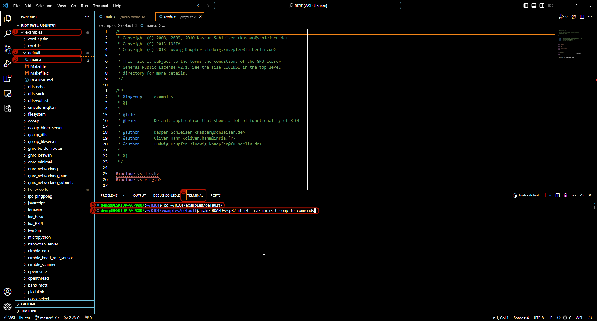
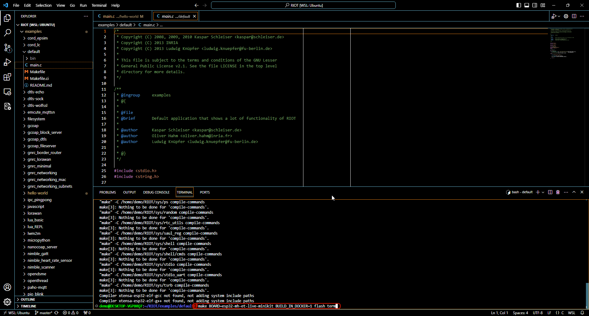
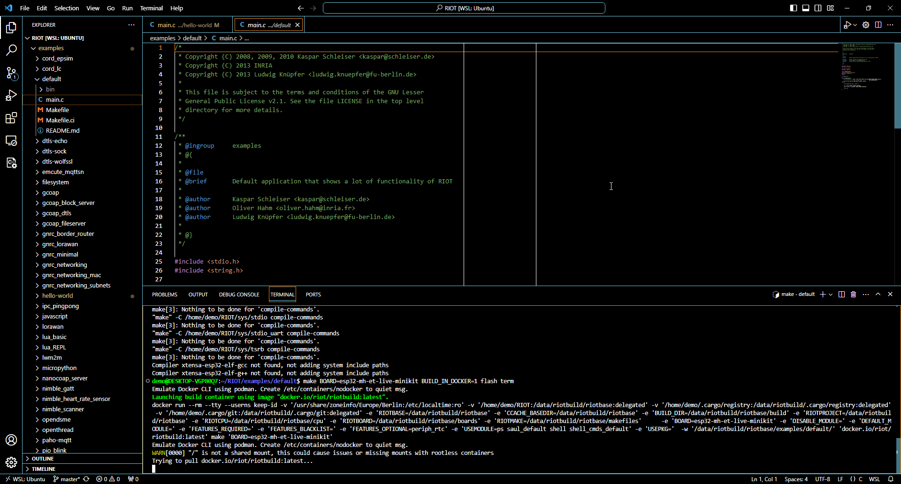
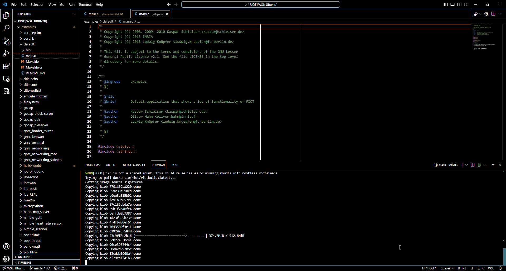
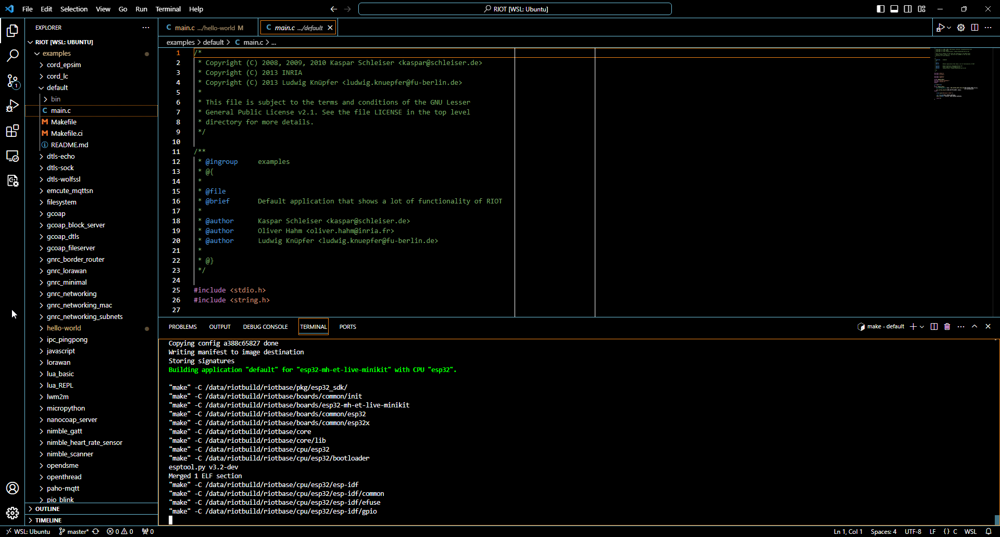
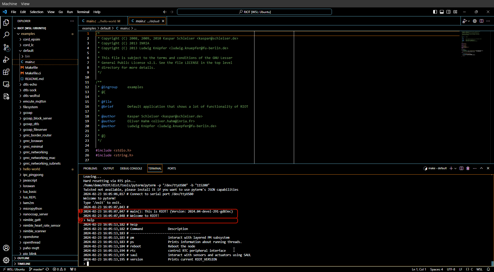

import Contact from '@components/contact.astro';

<Contact />

After all of the previous sections are completed, we can finally flash some
real hardware. In this case, we use an `esp32-mh-et-live-minikit` development
board. The guide should mostly apply to all other boards as well.

:::note
    Some boards require extra steps to be flashed, such as pressing a button
    to enter a bootloader or attaching an external programmer. Refer to the
    documentation of the board to check if extra steps are required.
:::

:::tip[Flashing under WSL]
    If you are using Windows, this assumes that the USB UART bridge of the ESP32 development board has
    been attached to WSL and VS Code has been launched from within WSL by running
    `code .` inside the RIOT repository from the Ubuntu terminal.
:::

1. Open the `examples` folder
2. Open the `basic` folder within `examples`
3. Open the `default` folder within `basic`
4. Open the `main.c` file in the `default` folder
5. Select the "Terminal" tab at the bottom
6. Enter `cd ~/RIOT/examples/basic/default` to enter the `default` folder also in the terminal
7. Run `make BOARD=esp32-mh-et-live-minikit compile-commands`
    - You can replace `esp32-mh-et-live-minikit` with the name of any other supported board

:::note
    Did you notice that IntelliSense did not find headers in `main.c` when you
    opened it? This should be fixed after the command in 6 has completed.
:::

1. Now run `make BOARD=esp32-mh-et-live-minikit BUILD_IN_DOCKER=1 flash term`

:::note
    Tired of typing `BOARD=<NAME_OF_THE_BOARD>` and `BUILD_IN_DOCKER=1`? You can
    add those to the `Makefile` of your app or run
    `export BOARD=BUILD_IN_DOCKER=1` in the shell. The `export` will not persist
    needs to be repeated for every new terminal window.
:::

:::tip
Running `BOARD=<INSERT_TARGET_BOARD_HERE> make info-programmers-supported` in your
         application folder lists the programmers supported by RIOT for the given board.
:::

When compiling with `BUILD_IN_DOCKER=1`, the toolchains distributed in the
[`riot/riotbuild`](https://hub.docker.com/r/riot/riotbuild/) docker image will
be used for compilation. This image contains toolchains for all supported RIOT
board and is extensively tested in our CI.

The first time you build with `BUILD_IN_DOCKER=1`, the image is pulled
automatically.

This may take a while ...

... until eventually the docker image is pulled and the build will start.
Subsequent builds will no longer need to download the toolchain and be a lot
quicker.

After building and flashing the firmware has succeeded, a shell will open.

1. Wait for the boot message to appear.
    - The board may boot faster than your PC is able to connect to the serial.
      If you see nothing after "Welcome to pyterm!" for 5 seconds, try hitting
      the reset button on the board to boot it again.
2. You are now connected to the RIOT shell running on the board. Try running
   the `help` command to get a list of commands supported by the board.
3. You can drop out of the RIOT serial by pressing `Ctrl` + `C` and return
   to the Linux shell.

:::tip[Flashing under Windows]
It is also possible to install a native Windows flash application and invoke that from within WSL.
However, the setup is too board specific to be covered here. Please refer to the documentation of the board you are using.
:::

:::caution[Known Issues under Windows]
    The Linux Kernel in WSL currently has
    [`CONFIG_USB_HIDDEV` disabled][wsl-hid-issue]. Hence, programmers using HID
    as transport do not work for now and fail to flash. The (non-conclusive) list of affected
    programmers is:

    - Atmel/Microchip eDBG
    - Atmel/Microchip ICE
    - Any ARM CMSIS DAP compatible programmers

    The (non-conclusive) list of programmers that work with WSL out of the box is:

    - ST-Link (any version), including [cheap clones](https://www.aliexpress.com/wholesale?SearchText=ST-Link+V2)
    - Segger J-Link, including the [J-Link EDU Mini](https://www.segger.com/products/debug-probes/j-link/models/j-link-edu-mini/)
    - Any serial based bootloader (e.g. ESP boards, Arduino Bootloaders, ...)
    - [Black Magic Probe](https://black-magic.org)
    - [Jeff Probe](https://flirc.com/more/flirc-jeff-probe-bmp-jtag-black-magic-probe)
    - Any other non HID USB programmer

    [wsl-hid-issue]: https://github.com/microsoft/WSL/issues/10581
:::
