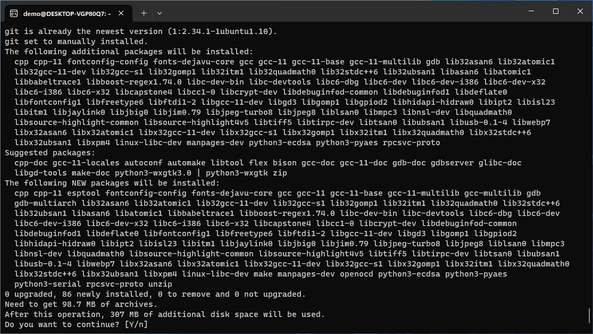
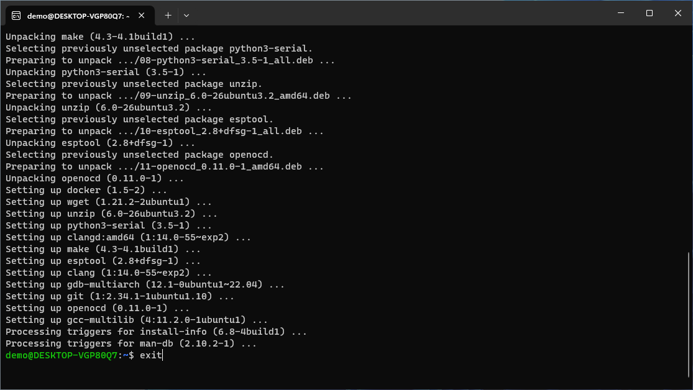
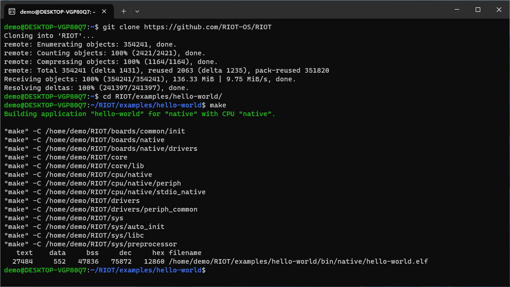
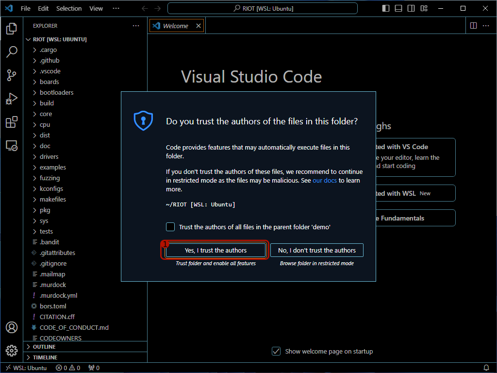
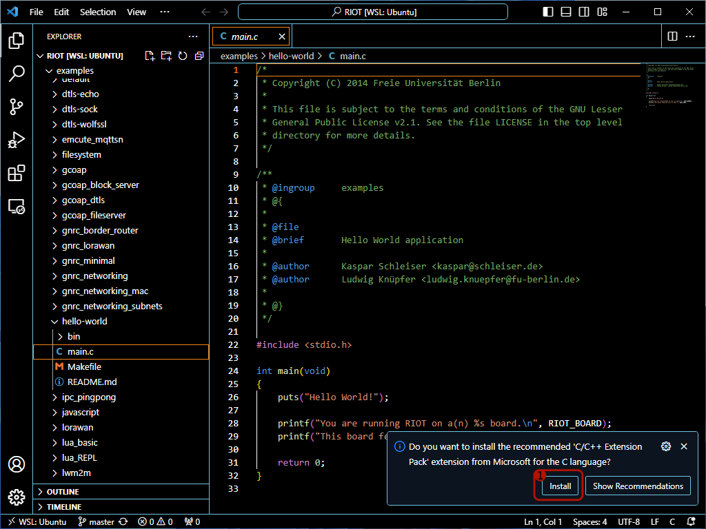
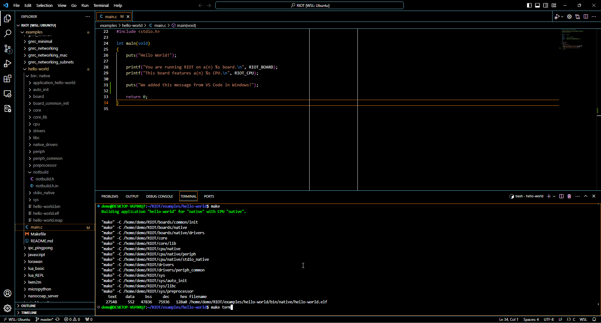
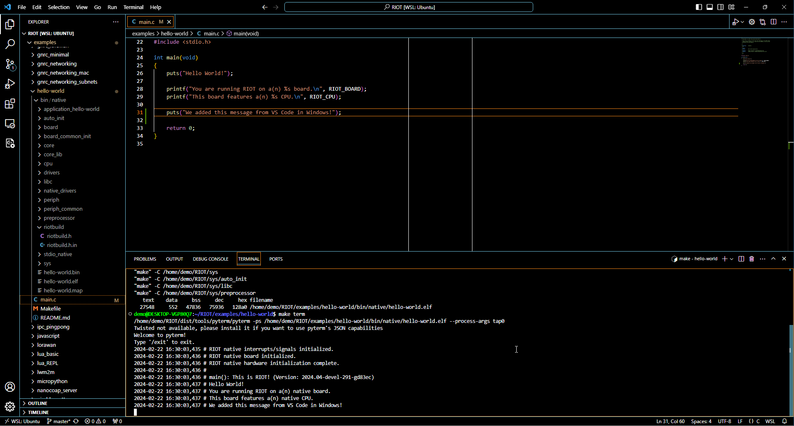

import { Tabs, TabItem } from '@components/Tabs.astro';
import Contact from '@components/contact.astro';

<Contact />

### Operating Systems

How you set up your development environment depends on the operating system you
are running. Please follow the correspond operating system guide below.

#### Linux (Recommended)
Most of the RIOT OS developers are using Linux on their development PCs, so you can expect the
most streamlined experience here. Generally, most Linux distributions are supported.

If you are new to Linux, we recommend using Ubuntu, as it is the most widely used distribution
and has the most extensive documentation and community support.

Some distributions, such as Fedora, do not provide the necessary packages for
cross compilation. In this case, it is recommended to use the
[RIOT Docker Container](/build-system/build-in-docker/).
Native development under ARM Linux is not officially supported.
However, we do offer cross-compiling to x86 64-bit for the 
[`native` board](/boards/native64/) under 64-bit ARM Linux.


Skip ahead to [Installing Required Software Packages](#installing-required-software-packages).

#### macOS (Apple Silicon)
Native development under macOS is not officially supported.
We recommend running a Linux VM or using the [RIOT Docker Container](/build-system/build-in-docker/).

:::note
Please follow the [installation guide for Linux VMs](/getting-started/installing/vm).
:::

#### Windows
Windows is supported through Windows Subsystem for Linux (WSL).
The experience is not as streamlined as on Linux, but it is still possible to develop with RIOT.

:::note
Please follow the [installation guide for Windows](/getting-started/installing/wsl).

Afterwards, please follow the [Linux installation guide](#installing-required-software-packages).
The installation of the required software packages is the same for both Ubuntu and WSL.
:::

## Installing Required Software Packages

You may may install packages using a shell script provided by us alternatively.
If so, [skip to the next section](#cloning-the-riot-repository-and-first-steps).

### Manually Installing Packages
If you prefer to install packages manually, type the following command in your terminal
to determine your CPU architecture.

```bash title="Command to check CPU architecture"
uname -m
```

Depending on the operation distribution you are using, the installation of the required software packages may vary.
Select the correct CPU architecture and operating system you are running and
install the required packages by pasting the command below into your terminal.

<Tabs syncKey="cpu">
    <TabItem label="Intel/AMD 64-bit (x86_64)">
        <Tabs syncKey="os">
            <TabItem label="Ubuntu/Debian">
            ```bash title="Command to install required packages (on x86_64 Ubuntu/Debian)"
            sudo apt install make python3-serial python3-psutil wget unzip git openocd gdb-multiarch esptool podman-docker clangd clang gcc-multilib
            ```
            </TabItem>
            <TabItem label="Arch Linux">
            ```bash title="Command to install required packages (on x86_64 Arch Linux)"
            sudo pacman -S make base-devel python-pyserial python-psutil wget unzip git openocd gdb esptool podman-docker clang gcc-multilib
            ```
            </TabItem>
        </Tabs>
    </TabItem>
    <TabItem label="Intel/AMD 32-bit (i686)">
        <Tabs syncKey="os">
            <TabItem label="Ubuntu/Debian">
            ```bash title="Command to install required packages (on x86_64 Ubuntu/Debian)"
            sudo apt install make python3-serial python3-psutil wget unzip git openocd gdb-multiarch esptool podman-docker clangd clang
            ```
            </TabItem>
        </Tabs>
    </TabItem>
    <TabItem label="ARM 64-bit (aarch64)">
        <Tabs syncKey="os">
            <TabItem label="Ubuntu/Debian">
            ```bash title="Command to install required packages (on x86_64 Ubuntu/Debian)"
            sudo apt install make python3-serial python3-psutil wget unzip git openocd gdb-multiarch esptool podman-docker clangd clang gcc-x86-64-linux-gnu g++-x86-64-linux-gnu libc6-dev-amd64-cross libc6-amd64-cross qemu-user-binfmt binfmt-support
            ```
            </TabItem>
        </Tabs>
    </TabItem>
</Tabs>

<br />
<br />

This will show something like this depending on your distribution:



- Confirm the installation by hitting the return-key
- The installation process will take some time
- Eventually the output will look like below (except for the `exit`)



## Cloning the RIOT Repository and First Steps

:::note
Even if you subsequently work only via VS Code, do **NOT** skip this step.
You will still need a "clone" of the RIOT Repository to work with.
:::



:::tip
We are cloning the RIOT repository to a folder named `RIOT` in the home directory
for this tutorial. You can choose a different location if you want,
but make sure to adjust the commands accordingly.
In particular, you will need to adjust the path to the `hello-world` example app in the next steps.

In the [Creating a Project](/c_tutorials/create_project/) tutorial, we will go into
more detail on how to set up your own project folder structure so don't worry about that for now.
:::

- Open the terminal.
- Type `git clone https://github.com/RIOT-OS/RIOT` and confirm with the return-key
- This may take some time. Eventually, it will print `done.` when it completed
- If you haven't installed the required packages above, type
  `bash dist/tools/setup/install.sh` to install them now. If you did, you can skip
  this step.
- Type `cd RIOT/examples/basic/hello-world` and confirm with the return-key to enter
  the folder `hello-world` example app in the RIOT repo
- Type `make` and confirm with the return key to build the app for the board
  `native`

:::tip
If you are having issues with missing libraries you can always also
use the docker container to build the app.
In this example you can type `BUILD_IN_DOCKER=1 make` to build the app in the docker container.
:::

:::note
The `native` board is a virtual board that will run an RIOT application as
regular Linux process. This can be useful for testing or during development.
The app should behave the same when run on real hardware.
:::


- Now run the application by executing `make term`
- The output should look similar to the screenshot above
- You can close the terminal by:
    1. Press and hold the `Ctrl`-key
    2. With the `Ctrl`-key still held, press the `C`-key
    3. Release both keys

## Generating compile_commands.json e.g. for Code Completion in IDEs

This target will honor the variables controlling the build process such as `BOARD`, `TOOLCHAIN`,
`DEVELHELP`, etc. just like the usual build process. This works without actual compilation. By
default, the `compile_commands.json` is placed in the RIOT base directory. This behavior can be
overwritten using the `COMPILE_COMMANDS_PATH` variable by specifying the full absolute path
(including file name) of the `compile_commands.json` instead.

:::note
By default, the built-in include search directories of GCC will be explicitly added
and flags incompatible with `clangd` will be dropped. This will allow using `clangd` as language
server out of the box. If this is not desired, run `export COMPILE_COMMANDS_FLAGS=""` to turn
modification of the compile commands off. For a list of available flags, run
`./dist/tools/compile_commands/compile_commands.py --help` in the RIOT base directory.
:::

## Using VS Code for Development

- If not already open, open the terminal
- Confirm that the terminal is pointed to the folder `~/RIOT/examples/basic/hello-world`
    - The blue part left of the prompt (the `$` sign in the terminal) shows
      the current working directory for the terminal
    - If the blue string is not `~/RIOT/examples/basic/hello-world`, type
      `cd ~/RIOT/examples/basic/hello-world` to enter that path
- Inside `~/RIOT/examples/basic/hello-world` run the command `make compile-commands`
- The output should look like below


- Navigate back to `~/RIOT` using the command `cd ~/RIOT`
- run `code .` to launch VS Code
    - This will take a bit longer on the first launch
- Eventually, a VS Code Window should pop up that looks like this:



1. Click on "Yes, I trust the authors"

- Now, use the tree view in the left and open the `examples` folder
- Open the `basic` folder inside the `examples` folder
- Open the `hello-world` folder inside the `basic` folder
- Open the `main.c` file in the `hello-world` folder within `examples`
- The file should open and look like this:



1. Click on the "Install" button when prompted to install the C/C++ Extension.

:::note
You can also install that extension via the extension marketplace if that pop up does not show up.
:::


- Confirm that when hovering over `RIOT_BOARD` in the source code, IntelliSense
  shows that it expands to `"native"`.

:::note
IntelliSense depends on information how to compile the source code to work
correctly, which is provided in the file `compile_commands.json`. You can
regenerate this file by running `make compile-commands` in the app you are
working on.
:::

:::caution
Re-run `make compile-commands` when:
1. You create, delete or rename source files
2. You change the set of modules or packages used
3. You have updated the RIOT repository
4. You are switching the board to compile for
:::



- Extend the message to be printed, e.g. by adding a `puts("...");` statement
  in the source code
- Save the modified source code (e.g. `Ctrl`+`S`)
- Open the integrated terminal by clicking on the terminal tab at the bottom
- Navigate to `~/RIOT/examples/basic/hello-world` using `cd ~/RIOT/examples/basic/hello-world`
- Run the `make` command to build the code
- Run make `make term` to launch the application
- The result should look like:



Congratulations! You just compiled your first RIOT application. To run RIOT
on real hardware, proceed with the next to sections.


## Architecture Specific Requirements

:::caution[Don't get lost]
If this section overwhelms you, don’t worry, you can always come back to it later.
This is only important if you want to develop for a specific architecture or board.
For now everything should work fine with the packages installed above.

You can safely skip this section if you are just getting started with RIOT
and want to try out the examples or develop for the `native` board.
:::


For each architecture a default tool for flashing and on-chip debugging is listed below - in
most cases OpenOCD. However, some boards use different tools, e.g. because a bootloader is
installed that allows flashing via the serial interface. Check the board documentation for any
details on this. If that documentation contains no info about a flashing tool, the default
tool for its architecture is used.

:::tip
    Running `BOARD=<INSERT_TARGET_BOARD_HERE> make info-programmers-supported` in your
    application folder lists the programmers supported by RIOT for the given board.
:::

#### Architecture: ARM7 and ARM Cortex M*

* GCC, binutils, and newlib for `arm-none-eabi`
    * Alternatively: Install docker and export `BUILD_IN_DOCKER=1`
* OpenOCD for debugging/flashing (most boards)
    * Some boards use UF2 based bootloaders, which require auto-mounting to work with `make flash`
    * Some boards default to using J-Link for flashing/debugging. Either install that or export
      `PROGRAMMER=openocd` to just use OpenOCD instead
    * installation instructions can be found [here](https://doc.riot-os.org/misc/openocd/)
* Optional: picolibc for `arm-none-eabi` to link against picolibc instead of newlib
* Optional: clang to build with `TOOLCHAIN=llvm`
* Optional: GDB multiarch for debugging
    * If no multiarch package is available, use GDB for `arm-none-eabi` instead

#### Architecture: Xtensa

##### ESP32

* [Toolchain for ESP32](https://api.riot-os.org/group__cpu__esp32.html#esp32_toolchain)
* [esptool](https://github.com/espressif/esptool) for flashing
* Optional: OpenOCD and GDB (multiarch version) for [debugging via JTAG](https://api.riot-os.org/group__cpu__esp32.html#esp32_jtag_debugging)

##### ESP8266

* [Toolchain for ESP8266](https://api.riot-os.org/group__cpu__esp8266.html#esp8266_toolchain)
* [esptool](https://github.com/espressif/esptool) for flashing
* Optional: GDB (multiarch version) for [debugging via the gdbstub](https://api.riot-os.org/group__cpu__esp8266.html#esp8266_esp_gdbstub)
  interface for the ESP8266

#### Architecture: AVR

* GCC and binutils for AVR and avrlibc
    * Alternatively: Install docker and export `BUILD_IN_DOCKER=1`
* avrdude for flashing
* Optional: AVaRICE and GDB (multiarch version) for debugging

#### Architecture: RISC-V

* GCC, binutils, and newlib for RISC-V (target triple should start with `riscv` and end with
  `-none-elf` or `-unknown-elf`. Note that most packages are multilib, e.g. `riscv64-unknown-elf`
  will likely work fine for 32 bit RISC-V boards)
    * Alternatively: Install docker and export `BUILD_IN_DOCKER=1`
* OpenOCD for debugging/flashing (some new boards might require a patched version of OpenOCD or a
  recent build from the git sources)
* Optional: picolibc to link against picolibc instead of newlib (recommended)
* Optional: clang to build with `TOOLCHAIN=llvm`
* Optional: GDB multiarch for debugging

#### Architecture: MSP430

* GCC, binutils, and newlib for MSP430
    * Alternatively: Install docker and export `BUILD_IN_DOCKER=1`
* [mspdebug](https://github.com/dlbeer/mspdebug) for flashing/debugging
    * Optional: [MSP Debug Stack](https://www.ti.com/tool/download/MSPDS-OPEN-SOURCE) for additional
      board support
* Optional: GDB multiarch for debugging

#### Architecture: native

* Building
    * Under Intel/AMD `x86` 64-bit Linux:
      Requires `multilib` versions for your host compilers to run binaries compiled for the
      [`native32`](/boards/native32/) board, if you wish to do that. We recommend
      the [`native64`](/boards/native64/) board to run RIOT apps on your local machine.
      This will be fast.
    * Under ARM 64-bit Linux:
      Cross-compile `x86` 64-bit binary and run using `qemu-user-static`.
      This will be rather slow.
    * For each of those two options, you can also [compile
      (or run on the `native` board) in a Docker container](/build-system/build-in-docker/).
* A C library supporting the deprecated POSIX.1-2001 ucontext library (e.g. glibc, FreeBSD's libc)
* Optional: GDB for debugging. (Prefer the multiarch version, this will also work for other boards)
