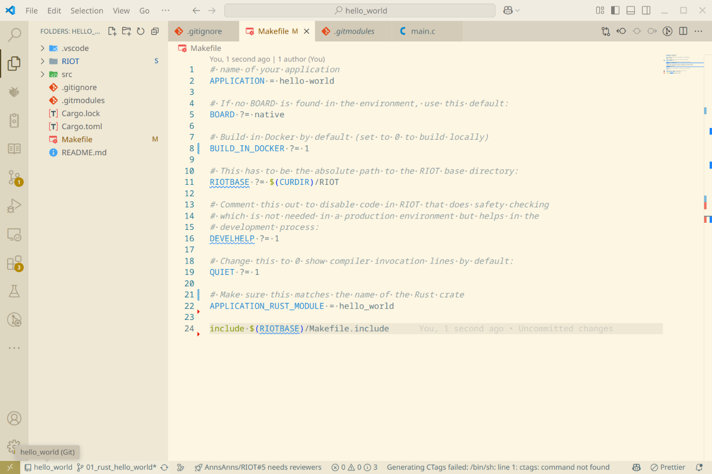

import GitSetup from '@components/gitsetup.mdx';
import Contact from '@components/contact.astro';

## Step 1: Create a new project

<GitSetup />

#### Open VS Code

Now that we have added RIOT as a submodule to our project,
we can start writing our hello world program.
You can use any text editor to create this file.
We will use Visual Studio Code in this example.
To open Visual Studio Code in the directory, you can use the following command:

```bash title="Open Visual Studio Code"
code .
```

## Step 2: Initialize Rust

Now that Visual Studio Code is open,
we need to tell Rust what kind of project we want to create.
We do this by running the following command in the terminal:

```bash title="Create a new Rust project"
cargo new hello_world --lib
```

This command creates a new project called `hello_world` with a library crate type.
The `--lib` flag tells Rust that we want to create a library crate instead of a binary crate.
A library crate is a collection of functions and types that can be used by other programs,
while a binary crate is an executable program.
RIOT then calls our `main` function when the program starts.

You should now have 3 new files within your project directory:

- `Cargo.toml`: This file contains metadata about your project and its dependencies.
- `src/lib.rs`: This file contains the source code for your library crate.
- `Cargo.lock`: This file contains information about the exact versions of your dependencies.
  - This file is automatically generated by Cargo and should not be edited manually
    so don't worry about it for now.


## Step 3: Creating the Makefile

Now that we have created our hello world program,
we need to create a Makefile to build our program.
The Makefile is a build automation tool
that allows us to define how our program should be built.
We create a new file called `Makefile` in the root directory of our project
and add the following code:

```makefile title="Makefile"
# name of your application
APPLICATION = hello-world

# The name of crate (as per Cargo.toml package name, but with '-' replaced with '_')
#
# The presence of this triggers building Rust code contained in this
# application in addition to any C code.
APPLICATION_RUST_MODULE = rust_hello_world

# If no BOARD is found in the environment, use this default:
BOARD ?= native

# If you want to build in a Docker container, set this to 1.
# This is useful if you want to build on a system that does not have the
# RIOT toolchain installed, or if you want to ensure that the build is
# reproducible.
BUILD_IN_DOCKER ?= 1

# This has to be the absolute path to the RIOT base directory:
RIOTBASE ?= $(CURDIR)/../../../..

# Comment this out to disable code in RIOT that does safety checking
# which is not needed in a production environment but helps in the
# development process:
DEVELHELP ?= 1

# Change this to 0 show compiler invocation lines by default:
QUIET ?= 1

include $(RIOTBASE)/Makefile.include
```

:::note
The `BUILD_IN_DOCKER=1` flag tells the build system to use the docker image
provided by RIOT to build our program.
This ensures that we have all the necessary dependencies to build our program.
If you have already built RIOT on your system,
you can omit this flag and the build system will use the toolchain installed on your system.
If you want to build your program on a different board,
you can change the `BOARD` variable to the name of the board you want to build for.
:::

Now RIOT knows that you want to build a Rust application
and will use the `hello_world` crate as the main module.



## Step 3: Adjusting the Cargo.toml

Next, we need to adjust the `Cargo.toml` file to tell Cargo that we want to build for RIOT.
Open the `Cargo.toml` file and replace its contents with the following:

```toml title="Cargo.toml"
[package]
name = "hello-world"
version = "0.1.0"
edition = "2021"

[lib]
crate-type = ["staticlib"]

[profile.release]
# Setting the panic mode has little effect on the built code (as Rust on RIOT
# supports no unwinding), but setting it allows builds on native without using
# the nightly-only lang_items feature.
panic = "abort"

[dependencies]
riot-wrappers = { version = "0.9.1", features = [ "set_panic_handler", "panic_handler_format" ] }

rust_riotmodules = { path = "./RIOT/sys/rust_riotmodules/" }
```

The most important part here are the dependencies.
As mentioned in [Rust in Riot](/rust_tutorials/rust_in_riot/),
`riot-wrappers` is a crate that provides a set of wrappers around
RIOT's C functions to make them usable from Rust in a safe way.

The other configuration options are not that important for now,
but you can read more about them in the
[Cargo documentation](https://doc.rust-lang.org/cargo/reference/manifest.html).

### IDE Setup

Due to the way the RIOT Rust integration works, you need to amend your
normal Rust setup in your IDE to make it work with RIOT. Luckily RIOT
provides a small makefile command that will help you with that.
Run the following command in your terminal:

```bash
make info-rust
```

The output will look something like this:

```bash title="Output of make info-rust"
[ann@ann-laptop13 rust01-hello-world]$ make info-rust
cargo version
cargo 1.81.0 (2dbb1af80 2024-08-20)
c2rust --version
C2Rust 0.19.0
To use this setup of Rust in an IDE, add these command line arguments to the `cargo check` or `rust-analyzer`:
    --profile release
and export these environment variables:
    CARGO_BUILD_TARGET="thumbv7em-none-eabihf"
    RIOT_COMPILE_COMMANDS_JSON="/home/ann/projects/exercises/rust01-hello-world/bin/feather-nrf52840-sense/cargo-compile-commands.json"
    RIOTBUILD_CONFIG_HEADER_C="/home/ann/projects/exercises/rust01-hello-world/bin/feather-nrf52840-sense/riotbuild/riotbuild.h"
You can also call cargo related commands with `make cargo-command CARGO_COMMAND="cargo check"`.
Beware that the way command line arguments are passed in is not consistent across cargo commands, so adding `--profile release` or other flags from above as part of CARGO_COMMAND may be necessary.
```

Add the environment variables to your shell configuration file for this project
or use the `make cargo-command` command to run cargo commands with the correct arguments.

In VSCode you can now go to the workspace settings `.vscode/settings.json`
and add the following settings:

```json title=".vscode/settings.json"
{
    "rust-analyzer.cargo.extraArgs": [
        "--profile",
        "release"
    ],
    "rust-analyzer.cargo.target": "thumbv7em-none-eabihf",
}
```


## Step 4: Writing the Hello World Program

We are nearly done with setting up our project. The last thing we need to do is
to write the actual hello world program.
Open the `src/lib.rs` file and replace its contents with the following code:

```rust title="src/lib.rs"
#![no_std]

use riot_wrappers::riot_main;
use riot_wrappers::println;

extern crate rust_riotmodules;
```

`#![no_std]` tells the Rust compiler that we are building a program
that does not depend on the standard library,
which is not available on the hardware we are targeting.
This does mean that we can't use some of the standard library features
like `std::io` or `std::collections`, however,
there are a lot of `no_std` compatible crates available that provide similar functionality,
including `riot-wrappers` 😉

After that we import the functions that we will soon use to print to the console.
The `riot_main` macro helps RIOT figure out what our main function is
and `println` is a macro that we can use to print to the console,
this replaces the `println!` macro from the standard library,
since, as mentioned before, we can't use it on embedded systems.

Now we need to actually write the `main` function.
Add the following code to the `src/lib.rs` file:

```rust title="src/lib.rs"
riot_main!(main);

fn main() {
    println!(
        "You are running RIOT using Rust on a(n) {} board.",
        riot_wrappers::BOARD
    );
}
```


Congratulations! You have now created your first Rust program for RIOT. 🎉

## Step 5: Building the Program

<Contact />

To build our program, we use the following command:

```bash title="Build and flash the program"
make flash
```

After building the program,
we can run it using the following command to start the RIOT shell:

```bash title="Connect to the RIOT shell"
make term
```

You should see the following output:

```txt title="Output in the terminal"
You are running RIOT using Rust on a(n) native board.
```


## Conclusion

In this tutorial,
you have learned how to create a new Rust project for RIOT and how to build and run it.
You have also learned how to write a simple hello world program in Rust
and how to use the `riot-wrappers` crate to interact with RIOT's C functions.

:::note
The source code for this tutorial can be found
[HERE](https://github.com/RIOT-OS/RIOT/tree/master/examples/lang_support/official/rust-hello-world).

If your project is not working as expected,
you can compare your code with the code in this repository to see if you missed anything.
:::
