# Getting Started on Windows

> [!NOTE]
> The documentation is quite verbose: The process is documented down to every
> click. Because of this verbosity the setup may appear complex and long, but
> in fact is rather straight forward. A novice user should be able to complete
> all steps in less than 30 minutes.

> [!NOTE]
> Do not be afraid to ask for help e.g. in [our forum][riot-forum]

[riot-forum]: https://forum.riot-os.org/

## Install Ubuntu LTS


1. Open the Windows Store
2. Type "Ubuntu LTS" in the search bar
3. Click on the most recent version (highest number) of Ubuntu LTS found.
   As of February 2024, this is version Ubuntu 22.04.3 LTS.

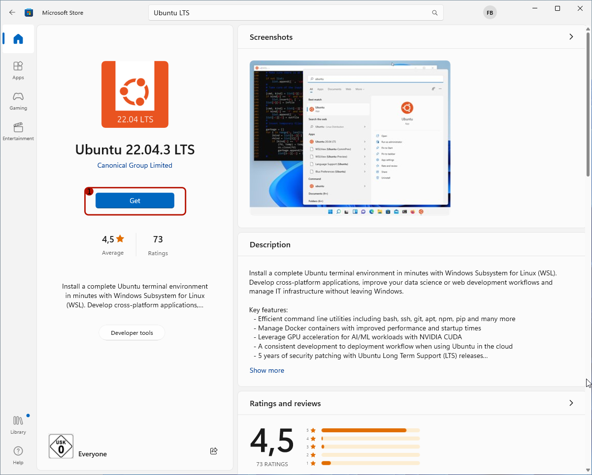

1. Click on the button labeled "Get"


It will take a while for Ubuntu LTS to be installed.


Eventually, the installation completes.

1. Click on the button labeled "Open"

> [!WARNING]
> If the Windows Subsystem for Linux (WSL) has not yet been enabled, an error
> such as below will show. Not to worry, the next section got you covered.


## Enabling WSL

> [!NOTE]
> If an Ubuntu terminal opened just fine, proceed directly to the next section.
> This section will show how to enable WSL for those who hit the error.

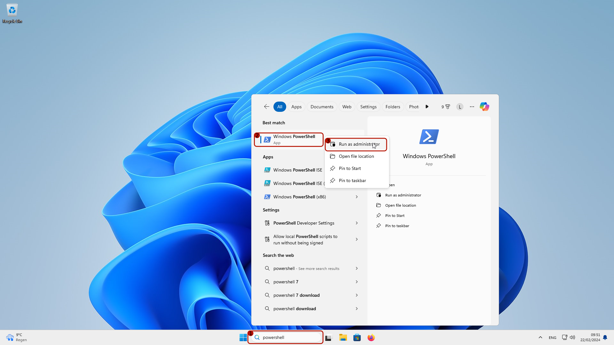

1. Search for "powershell" in the search field of the task bar
2. ***Right***-click on the hit "Windows PowerShell"
3. Click "Run as administrator"

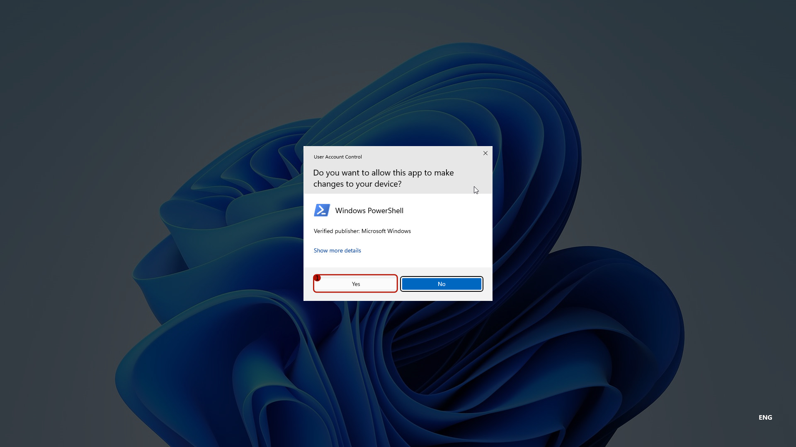

1. Click "Yes" to confirm running the PowerShell as administrator


- Type `wsl --install` and confirm with the return-key.
- After a while, the following message should appear:

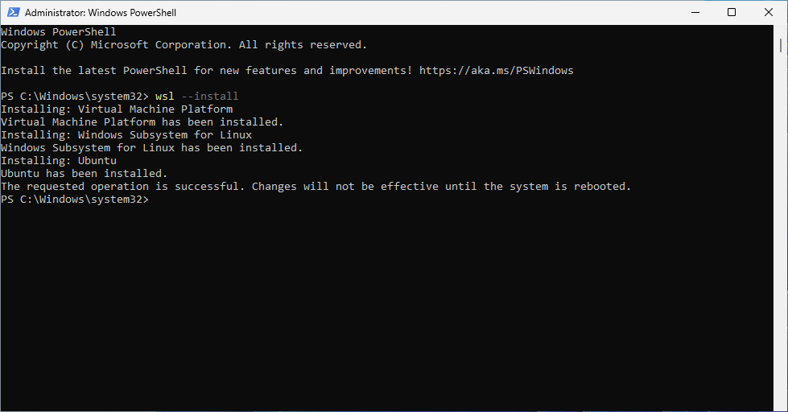

- Now reboot Windows to complete the installation


The reboot will take longer than usual due to the installation of WSL. You
may see a screen like above for some time. Once the reboot is completed,
an Ubuntu terminal should open automatically.

## Setup Ubuntu LTS

You should now see an Ubuntu terminal such as:

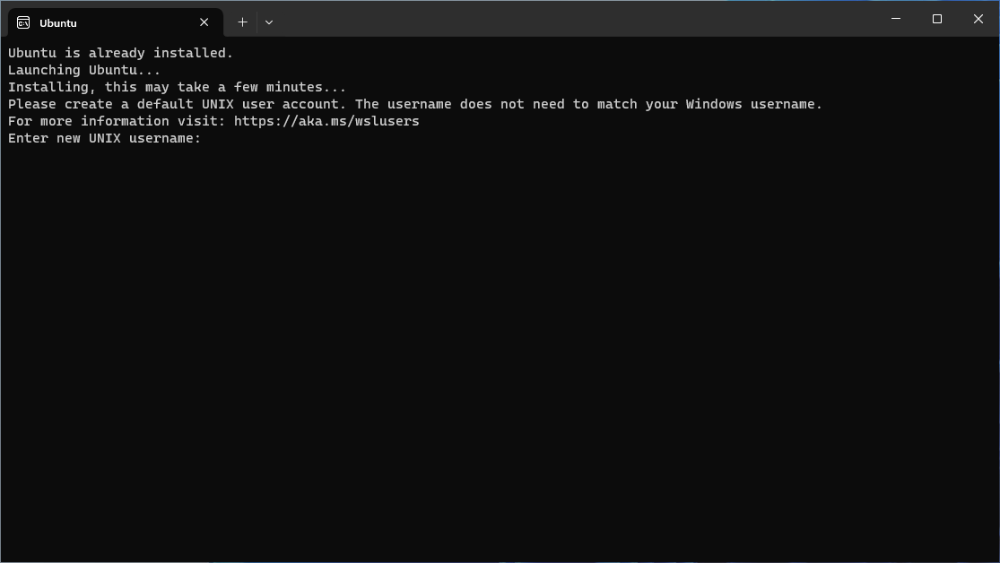

<details><summary>If no Ubuntu terminal has opened, click here to see how to open it</summary>


1. Click on the Start / Windows button in the task bar
2. Click on the "Ubuntu" entry

</details>

- Enter a user name of your choice, memorize it, and confirm with the return-key
- Enter a password of your choice, memorize it, and confirm with the return-key
- Repeat the password and confirm with the return-key

> [!WARNING]
> When typing passwords in the Ubuntu terminal, the chars entered will not
> appear on the screen and neither will appear `*`. You will have to type
> "blindly". This is an intentional security feature.

> [!NOTE]
> If you fail to repeat the password correctly, the setup will just again. So
> no need to worry.

- Once you successfully have entered user name and password, you should see
  something like this:

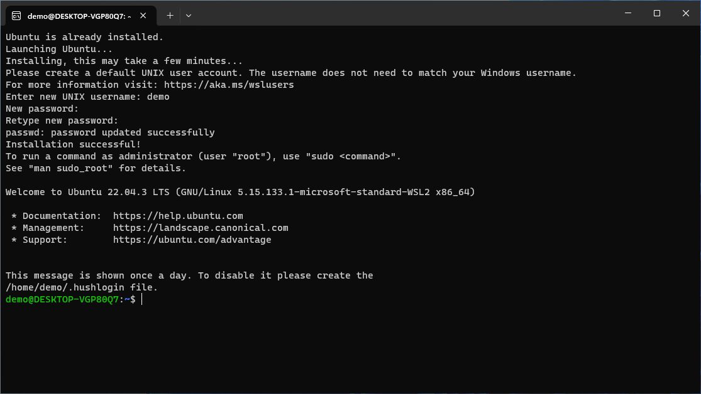

- now type (without quotation signs) "sudo apt update" and confirm with the return-key
- you will be asked for you password. Enter it and confirm with the return key

> [!WARNING]
> When typing the password, you will no get any visible feedback such as the
> typed password or `*` chars. This is an intentional security feature.

- Once you successfully entered the password, something like this will show up:


> [!NOTE]
> The command `sudo apt update` only updates the list of available software
> packages in Ubuntu. Updating the installed software requires to additionally
> run `sudo apt upgrade`

- Now type `sudo apt upgrade` and confirm with the return-key

> [!NOTE]
> This time you likely will not need to confirm with your password again. The
> `sudo` command that allows you to run administrative commands such as
> `apt update` will skip the password entry, when heuristics indicate that
> you have not left your machine since you last confirmed a command with your
> password.

- This command will list which packages are about to be updated. Confirm with
  with the return-key
- Eventually after all software packages in Ubuntu have been updated, you will
  see something like this:


> [!NOTE]
> It is recommended to regularly update the installed software in Ubuntu
> using `sudo apt update` followed by `sudo apt upgrade`

## Installation of the required software packages in Ubuntu

- Now, install the required software by typing the following and confirming it
  with a return-key

```
sudo apt install make gcc-multilib python3-serial wget unzip git openocd gdb-multiarch esptool podman-docker clangd clang
```

- This will show something like this:


- Confirm the installation by hitting the return-key
- The installation process will take some time
- Eventually the output will look like below (except for the `exit`)


- Type `exit` and confirm with the return-key to close the Ubuntu terminal
- The window should close

## Installing VS Code


1. Click on the Windows Store icon to open the Windows store
2. Type `vs code` in the search bar
3. Click on the "Visual Studio Code by Microsoft Corporation" search result
   (not shown in the screenshot above)
4. In the Windows Store page of VS Code (as shown in the screenshot above),
   click on the button labeled "Install"

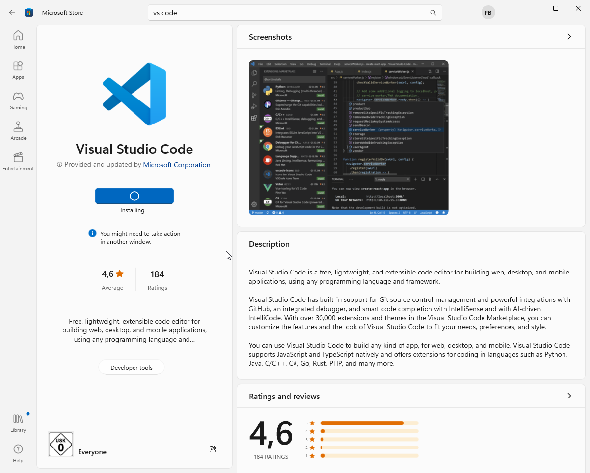

- Downloading and installing VS Code by the Store App may take some time
- Eventually, it should show something like this:


- Now, launch VS Code via the start menu
- On the first launch, VS code will look similar to this:


- You can select a theme of you liking
- You might want to dial back the data collection by Microsoft by clicking on "opt out"


1. Open the extension marketplace by clicking on the extensions icon in the
   left menu bar
2. Search for `wsl` in the search field
3. Click on the "Install" button for the "WSL" extension by "Microsoft"

> [!NOTE]
> The installation of the WSL extension will complete the next time you open
> Ubuntu terminal. If the Ubuntu terminal was still open, close it using the
> `exit` comment and launch it again.

## Cloning the RIOT Repository and First Steps in the Terminal

> [!NOTE]
> Even if you subsequently work only via VS Code, do **NOT** skip this step.
> You will still need a "clone" of the RIOT Repository to work with.


- Open the Ubuntu terminal.
- (It may show some output regarding the VS Code WSL extension being installed.
  Just wait for this to complete.)
- Type `git clone https://github.com/RIOT-OS/RIOT` and confirm with the return-key
- This may take some time. Eventually, it will print `done.` when it completed
- Type `cd RIOT/examples/basic/hello-world` and confirm with the return-key to enter
  the folder `hello-world` example app in the RIOT repo
- Type `make` and confirm with the return key to build the app for the board
  `native`

> [!NOTE]
> The `native` board is a virtual board that will run an RIOT application as
> regular Linux process. This can be useful for testing or during development.
> The app should behave the same when run on real hardware.


- Now run the application by executing `make term`
- The output should look similar to the screenshot above
- You can close the terminal by:
    1. Press and hold the `Ctrl`-key
    2. With the `Ctrl`-key still held, press the `C`-key
    3. Release both keys

## Using VS Code for Development


- If not already open, open the Ubuntu terminal
- Confirm that the terminal is pointed to the folder `~/RIOT/examples/basic/hello-world`
    - The blue part left of the prompt (the `$` sign in the terminal) shows
      the current working directory for the terminal
    - If the blue string is not `~/RIOT/examples/basic/hello-world`, type
      `cd ~/RIOT/examples/basic/hello-world` to enter that path
- Inside `~/RIOT/examples/basic/hello-world` run the command `make compile-commands`
- The output should look like above


- Navigate back to `~/RIOT` using the command `cd ~/RIOT`
- run `code .` to launch VS Code
    - This will take a bit longer on the first launch
- Eventually, a VS Code Window should pop up that looks like this:


1. Click on "Yes, I trust the authors"

- Now, use the tree view in the left and open the `examples` folder
- Open the `hello-world` folder inside the `examples` folder
- Open the `main.c` file in the `hello-world` folder within `examples`
- The file should open and look like this:


1. Click on the "Install" button when prompted to install the C/C++ Extension.

> [!NOTE]
> You can also install that extension via the extension marketplace just like
> the WSL extension was installed, if that pop up does not show up.

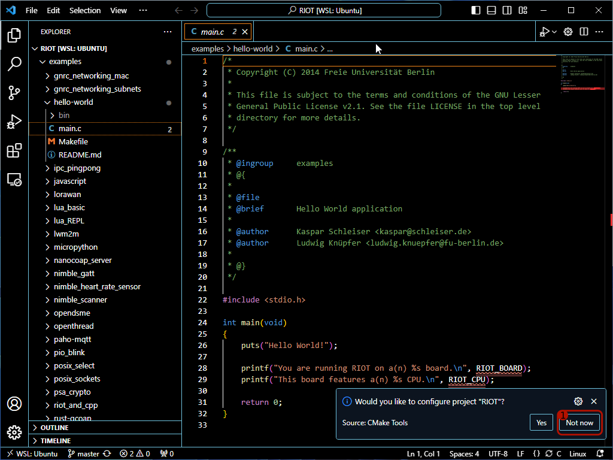

> [!WARNING]
> Do **NOT** configure RIOT as CMake project. VS Code will incorrectly detect
> RIOT as CMake project, because it contains external packages that indeed are
> using CMake.

1. Click on "Not now" to not configure RIOT as CMake project
2. Click on "Never" to never ask again whether RIOT should be configured as
   CMake project (not shown in screenshot)


- Confirm that when hovering over `RIOT_BOARD` in the source code, IntelliSense
  shows that it expands to `"native"`.

> [!NOTE]
> IntelliSense depends on information how to compile the source code to work
> correctly, which is provided in the file `compile_commands.json`. You can
> regenerate this file by running `make compile-commands` in the app you are
> working on.

> [!WARNING]
> Re-run `make compile-commands` when:
> 1. You create, delete or rename source files
> 2. You change the set of modules or packages used
> 3. You have updated the RIOT repository
> 4. You are switching the board to compile for


- Extend the message to be printed, e.g. by adding a `puts("...");` statement
  in the source code
- Save the modified source code (e.g. `Ctrl`+`S`)
- Open the integrated terminal by clicking on the terminal tab at the bottom
- Navigate to `~/RIOT/examples/basic/hello-world` using `cd ~/RIOT/examples/basic/hello-world`
- Run the `make` command to build the code
- Run make `make term` to launch the application
- The result should look like:


Congratulations! You just compiled your first RIOT application. To run RIOT
on real hardware, proceed with the next to sections.

## Installing `usbipd-win`


0. Open the [release page of `usbipd-win`][usbipd-win-releases]
1. Download the installer (file extension `.msi`) of the most recent release

[usbipd-win-releases]: https://github.com/dorssel/usbipd-win/releases

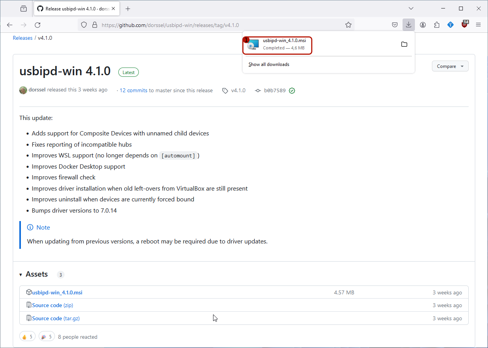

Once the download is completed:

1. Open the downloaded installer

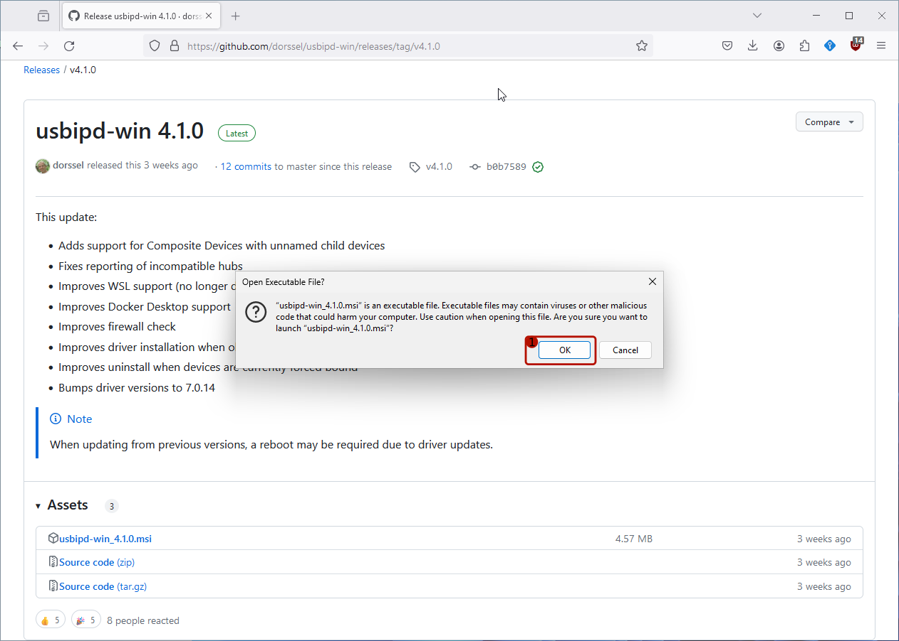

1. Confirm that you indeed want to execute the installer by clicking "OK".


The setup of `usbipd-win` opens.

1. Click on the "Install" button to proceed with the installation.

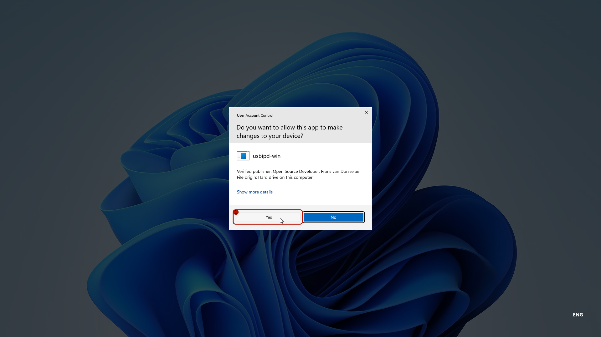

1. Confirm the installation by clicking on "Yes".


Eventually, the setup will inform you of the completion of the installation.

1. Click the "Close" button to acknowledge.

## Attach a USB device to WSL

> [!NOTE]
> Attaching a USB device to WSL needs to be repeated after any of the following
> happens:
>
> 1. Windows has been restarted (or hibernated)
> 2. WSL (the Ubuntu terminal window) has been restarted
> 3. The USB device has been lost (e.g. unplugging and plugging back in)

> [!NOTE]
> You do not need to install the Windows USB drivers, Linux will use its own
> anyway. All supported board run on Linux out of the box without the need of
> drivers to be installed.


1. Search for `powershell` in search field in the task bar
2. ***Right***-click on the search result "Windows PowerShell"
3. Select "Run as administrator"


1. Click on "Yes" to confirm running the PowerShell as admin


1. Type the command `usbipd list` and confirm with the return-key
2. Identify the USB device to share. In this guide we use an ESP32 development
   board, which almost all use an USB to UART bridge (here the CP2104).
3. Run `usbipd bin --busid <BUSID>`, but replace `<BUSID>` with the correct
   BUSID. E.g. `2-5` for the CP2104 identified in step 2.
4. Run `usbipd attach --wsl --busid <BUSID>`
    - If an error (such as above in red) is shown that WSL is not running, just
      start the Ubuntu terminal now and repeat (step 5.). If it worked the first
      time, no need to run it again.

> [!NOTE]
> If you have trouble identifying the USB device to attach, unplug before
> running `usbipd list`. Run it again with the USB device plugged in. The new
> entry in the list is the device you want to attach to WSL.

## Flash an ESP32 Development Board

After all of the previous sections are completed, we can finally flash some
real hardware. In this case, we use an `esp32-mh-et-live-minikit` development
board. The guide should mostly apply to all other boards as well.

> [!NOTE]
> Some boards require extra steps to be flashed, such as pressing a button
> to enter a bootloader or attaching an external programmer. Refer to the
> documentation of the board to check if extra steps are required.

This assumes that the USB UART bridge of the ESP32 development board has
been attached to WSL and VS Code has been launched from within WSL by running
`code .` inside the RIOT repository from the Ubuntu terminal.


1. Open the `examples` folder
2. Open the `default` folder within `examples`
3. Open the `main.c` file in the `default` folder
4. Select the "Terminal" tab at the bottom
5. Enter `cd ~/RIOT/examples/basic/default` to enter the `default` folder also in the terminal
6. Run `make BOARD=esp32-mh-et-live-minikit compile-commands`
    - You can replace `esp32-mh-et-live-minikit` with the name of any other supported board

> [!NOTE]
> Did you notice that IntelliSense did not find headers in `main.c` when you
> opened it? This should be fixed after the command in 6 has completed.


1. Now run `make BOARD=esp32-mh-et-live-minikit BUILD_IN_DOCKER=1 flash term`

> [!NOTE]
> Tired of typing `BOARD=<NAME_OF_THE_BOARD>` and `BUILD_IN_DOCKER=1`? You can
> add those to the `Makefile` of your app or run
> `export BOARD=BUILD_IN_DOCKER=1` in the shell. The `export` will not persist
> needs to be repeated for every new terminal window.


When compiling with `BUILD_IN_DOCKER=1`, the toolchains distributed in the
[`riot/riotbuild`](https://hub.docker.com/r/riot/riotbuild/) docker image will
be used for compilation. This image contains toolchains for all supported RIOT
board and is extensively tested in our CI.

The first time you build with `BUILD_IN_DOCKER=1`, the image is pulled
automatically.


This may take a while ...


... until eventually the docker image is pulled and the build will start.
Subsequent builds will no longer need to download the toolchain and be a lot
quicker.


After building and flashing the firmware has succeeded, a shell will open.

1. Wait for the boot message to appear.
    - The board may boot faster than your PC is able to connect to the serial.
      If you see nothing after "Welcome to pyterm!" for 5 seconds, try hitting
      the reset button on the board to boot it again.
2. You are now connected to the RIOT shell running on the board. Try running
   the `help` command to get a list of commands supported by the board.
3. You can drop out of the RIOT serial by pressing `Ctrl` + `C` and return
   to the Linux shell.

## Known Issues

### Flashing Fails with Programmers using HID

The Linux Kernel in WSL currently has
[`CONFIG_USB_HIDDEV` disabled][wsl-hid-issue]. Hence, programmers using HID
as transport do not work for now. The (non-conclusive) list of affected
programmers is:

- Atmel/Microchip eDBG
- Atmel/Microchip ICE
- Any ARM CMSIS DAP compatible programmers

> [!NOTE]
> It is possible to install a native Windows flash application and invoke that
> from within WSL.

The (non-conclusive) list of programmers that work with WSL out of the box is:

- ST-Link (any version), including [cheap clones](https://www.aliexpress.com/wholesale?SearchText=ST-Link+V2)
- Segger J-Link, including the [J-Link EDU Mini](https://www.segger.com/products/debug-probes/j-link/models/j-link-edu-mini/)
- Any serial based bootloader (e.g. ESP boards, Arduino Bootloaders, ...)
- [Black Magic Probe](https://black-magic.org)
- [Jeff Probe](https://flirc.com/more/flirc-jeff-probe-bmp-jtag-black-magic-probe)
- Any other non HID USB programmer


[wsl-hid-issue]: https://github.com/microsoft/WSL/issues/10581
