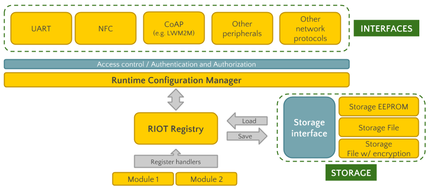

- RDM: rdm-draft-alamos-lanzieri-runtime-configuration-architecture.md
- Title: Runtime configuration architecture
- Authors: José Álamos, Leandro Lanzieri
- Status: draft
- Type: Design
- Created: December 2018

## Abstract
This memo describes the proposed high-level architecture and
mechanisms to implement a runtime configuration system on a RIOT node.

A runtime configuration system is in charge of providing a mechanism to set and
get the values of configuration parameters that are used during the execution of the firmware,
as well as a way to persist these values. Most of times these values are
per-node specific.

Examples of runtime configurations are:
- Transmission duty cycles
- Sensor thresholds
- Private-public keys
- System state variables

These parameters might have constraints, like an specific order to be applied
(due to interdependencies) or value boundaries.

The main advantages of having such a system are:
- Easy to apply per-node configuration during deployment
- No need to implement a special mechanism for per-node configurations during
  firmware updates (only in the case of migration)
- Common interface for modules to expose their runtime configuration parameters and handle
  them
- Transparent interface for storing configuration parameters in non-volatile
  storage devices

## Status
This document is currently under open discussion. This document is a product of
[Configuration Task
Force](https://github.com/RIOT-OS/RIOT/wiki/Configuration-Task-Force-(CTF)), and
aims to describe the architecture of a runtime configuration system. The content
of this document is licensed with a Creative Commons CC-BY-SA license.

## Terminology
This memo uses the [RFC2119](https://www.ietf.org/rfc/rfc2119.txt) terminology
and the following acronyms:

- RDM: RIOT Developer Memo
- CTF: RIOT's Configuration Task Force
- RCS: Runtime Configuration System

# 1. Introduction
This document specifies the proposed architecture by the
Configuration Task Force (CFT) to implement a secure and reliable Runtime
Configuration System (RCS), focusing in modularity, reusing of existing
technologies in RIOT (network stack, storage interface) and adhering to
standards.

# 2. Architecture
The RCS is formed by [the RIOT Registry](3-the-riot-registry), one or more [Registry Handlers](4-registry-handlers), one or more
[storage facilities](5-storage-facilities) and a [configuration manager](6-configuration-manager) with one or more interfaces. The
runtime configuration manager could in the future be replaced by a generic
manager.  

# 3. The RIOT Registry
The RIOT Registry exposes an API for handling 
**persistent module configurations**. The RIOT registry
allows, among others, to:
- Get or set configuration parameters via registry handlers
- Commit a configuration group via the given registry handler
- Load and set configuration parameters from a persistent storage device
- Export configuration parameters (e.g copy to a buffer, print, etc)

The RIOT registry consists of:
- A list of Registry Handlers
- A list of one or more Storage Facilities sources
- One Storage destination

# 4. Registry handlers
A Registry Handler represents a configuration group in the RIOT Registry.
Examples of configuration groups could be _Application_, _LoRaWAN keys_, etc.

A Registry Handler is defined at least by a name and a series of handlers for interacting with the configuration parameters of the group. These handlers are:
- `set`: Sets a value to a configuration parameter. This handler MUST take care
of any logic to apply the value (e.g. data validation) or cache it until the commit handler is called
- `get`: Gets the current value of a configuration parameter
- `commit`: To be called when configuration parameters have been loaded from storage. It could be use for special needed logic on applying configuration parameters (e.g dependencies)
- `export`: Calls an `export function` for each configuration parameter, with
its name and value. Depending on the behavior of `export function`, this can be used for printing out all configurations, saving them in a persistent storage,
etc.

# 5. Storage facilities
Storage facilities MUST implement the **storage
interface** to allow the RIOT Registry to load, search and save configuration
parameters. From the point of view of the RIOT Registry all parameters are
key/value strings, it is responsibility of the storage facility to transform
that to the proper format for storage (e.g. lines separated by `\n` character in
a file).

If a storage implements any kind of encryption mechanism it MUST be
transparent to the RIOT Registry, and all that logic should be handled withing
the facility.

# 6. Configuration manager and interfaces
The configuration manager is a pseudo-module that allows a RIOT node to be
configured from one or more communication interfaces. Examples of these
communication interfaces could be UART, SPI or higher layers like PPP, IPv6,
UDP, CoAP, LWM2M, etc.

The configuration manager MAY provide an access control mechanism for
restricting access to the configurations. However, it can relay on security
implemented on the layers mentioned above (e.g CoAP and DTLS, CHAP on PPP, etc)

# 7. RCS Usage Flow
1. Modules declare and register **registry handlers** for configuration groups
in the RIOT Registry.

2. **Storage facilities are registered** as sources and/or destinations of configurations in the RIOT Registry.

3. The RIOT Registry is initiated. All configuration parameters are loaded from the sources with the Storage interface.

4. For each loaded parameter, a configuration group that contains that parameter is searched for. If found, the corresponding `set` handler is called with the current parameter and value.

5. The `commit` handler is called once all configurations have been loaded from the registered sources.

6. At any time, the application or the configuration manager can:
   - **Save** a particular parameter or all, if a storage facility is already registered as a destination. 
   - **Set**, **get** or **export** a particular parameter. To do this the RIOT Registry uses the `set`,  `get` or `export` handler of the corresponding configuration group respectively.

## Acknowledgements

## References
- [Mynewt OS config module
  documentation](https://mynewt.apache.org/latest/os/modules/config/config.html)

## Revisions
- Rev0: initial document

## Contact
The authors of this memo can be contacted via email at
jose.alamos@haw-hamburg.de and leandro.lanzieri@haw-hamburg.de
