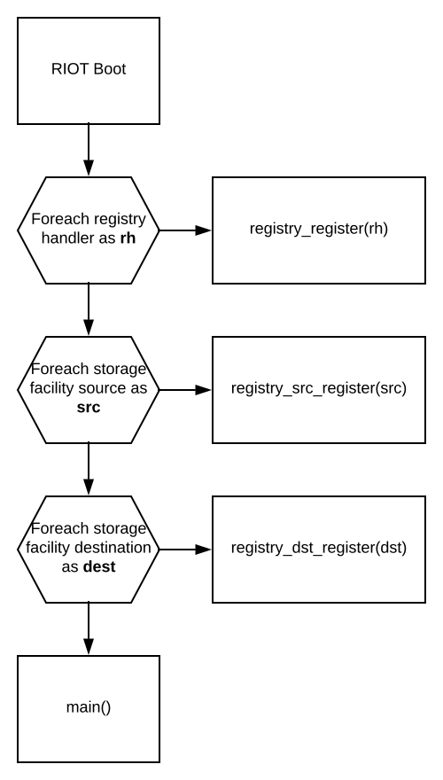

- RDM: rdm-draft-alamos-lanzieri-runtime-configuration-architecture.md
- Title: Runtime configuration architecture
- Authors: José Álamos, Leandro Lanzieri
- Status: draft
- Type: Design
- Created: December 2018

## Abstract
This memo describes the proposed high-level architecture and
mechanisms to implement a runtime configuration system on a RIOT node.

A runtime configuration system is in charge of providing a mechanism to set and
get the values of configuration parameters that are used during the execution
of the firmware, as well as a way to persist these values. Runtime
configurations are deployment-specific and can be changed on a per node basis.
Appropriate management tools could also enable the configuration of node
groups.

Examples of runtime configurations are:
- Transmission duty cycles
- Sensor thresholds
- Security credentials
- System state variables

These parameters might have constraints, like a specific order to be applied
(due to interdependencies) or value boundaries.

The main advantages of having such a system are:
- Easy to apply per-node configuration during deployment
- No need to implement a special mechanism for per-node configurations during
  firmware updates (only in the case of migration), as the parameters persist.
- Common interface for modules to expose their runtime configuration parameters
  and handle them
- Common interface for storing configuration parameters in non-volatile
  storage devices

## Status
This document is currently under open discussion. This document is a product of
[Configuration Task
Force](https://github.com/RIOT-OS/RIOT/wiki/Configuration-Task-Force-(CTF)), and
aims to describe the architecture of a runtime configuration system. The content
of this document is licensed with a Creative Commons CC-BY-SA license.

## Terminology
This memo uses the [RFC2119](https://www.ietf.org/rfc/rfc2119.txt) terminology
and the following acronyms and definitions:

### Acronyms
- RDM: RIOT Developer Memo
- CTF: RIOT Configuration Task Force
- RCS: Runtime Configuration System
- RH: Registry Handler
- SF: Storage Facility

### Definitions
- Configuration group: A set of key-value configurations with the same naming
 scheme and under the same scope. E.g `LIGHT_SENSOR_THRESHOLD` and
`TRANSMISSION_PERIOD` configuration parameters can be contained in an
_Application_ configuration group, as well as `IEEE802154_CHANNEL` and
`IEEE802154_TX_POWER` in a _IEEE802.15.4 Radio_ configuration group.
Within RIOT, each Configuration Group is represented by a Registry Handler.

- Registry Handler: A descriptor that acts as an interface between the RIOT
Registry and a module that exposes configurations. It provides a common
interface to `get`, `set`, `commit` and `export` configurations.

- Storage Facility: A descriptor that acts as an interface between the RIOT
Registry and a non-volatile storage device. It provides a common interface to
`load` and `store` key-value data from storage devices that might have different
data representations.

# 1. Introduction
This document specifies the proposed architecture by the
Configuration Task Force (CFT) to implement a secure and reliable Runtime
Configuration System (RCS) focusing on modularity, reuse of existing
technologies in RIOT (network stack, storage interface) and standard compliance.

# 2. Architecture
The proposed RCS architecture is formed by a
[configuration manager](4-configuration-manager) and the
[RIOT Registry](3-the-riot-registry) and its sub-components:
one or more [Registry Handlers](4-registry-handlers) and one or more
[storage facilities](5-storage-facilities). 

A RIOT Application may interact with the Configuration Manager in order to
modify access control rules or enable different communication interfaces.
Also, it may interact with the RIOT Registry directly if it needs to load or
store a persistent configuration.


# 3. The RIOT Registry
The RIOT Registry is a module for interacting with 
**persistent key-value configurations**. It's heavily inspired by the
[Mynewt Config subsystem](https://mynewt.apache.org/latest/os/modules/config/config.html)

The Registry interacts with RIOT components via Registry Handlers, and with
non-volatile storage devices via Storage Facilities. This way the functionality
if the Registry is independent of the functionality of the module or storage
device.


The API of the RIOT Registry allows to:
- Register a RH to expose a configuration group in the RIOT Registry.
- Register source and destination SF.
- Get or set configuration parameters for a given configuration group.
- Commit changes (transactionally apply configurations)
- Export configuration parameters (e.g copy to a buffer, print, etc)
- Load and store configuration parameters from and to a persistent storage
  device

Any mechanism of security (access control, encryption of configurations) is NOT
directly in the scope of the Registry but in the Configuration Manager and the
specific implementation of the RH and SF.

See [3.3 RIOT Registry Usage Flow](#3.3. RIOT Registry Usage Flow) for more
information.

## 3.1. Registry handlers
A RH represents a configuration group in the RIOT Registry. A RIOT
module requires to implement and register a Registry Handler in order to expose
its configurations to the Registry API.

A RH is defined by a name and a series of handlers for
interacting with the configuration parameters of the configuration group.
These handlers are:
- `set`: Sets a value to a configuration parameter. This handler MUST take care
  of any logic to apply the value (e.g. data validation) or cache it until the
  commit handler is called, if needed.
- `get`: Gets the current value of a configuration parameter.
- `commit`: To be called once configuration parameters have been `set`, in order
  to apply any further logic required to make them effective (e.g. handling
  dependencies).
- `export`: Calls an `export function` for each configuration parameter, with
  its name and value. Depending on the behavior of `export function`, this can
be used for printing out all configurations, saving them in a persistent
storage, etc.

A conceptual example of a RH implementation can be found in the
Appendix.

## 3.2. Storage facilities
Storage facilities MUST implement the **storage
interface** to allow the RIOT Registry to load, search and store configuration
parameters. From the point of view of the RIOT Registry all parameters are
key/value strings, it is responsibility of the SF to transform
that to the proper format for storage (e.g. lines separated by `\n` character in
a file).

The interface of a SF is defined with a descriptor with the
following attributes:
- `load` Executes a callback function for every configuration parameter stored
  in the storage.
- `store`: Stores one configuration parameter in the storage.

Any kind of storage encryption mechanism is not in the scope of this document,
and up to the implementation of `load` and `store` or intrinsic encryption
functionalities in the storage.

A minimal RIOT Registry setup requires at least one source SF from which
configurations are loaded and exactly one SF destination to which
configurations are stored. Having multiple SF sources can be useful when it's
required to migrate the data between storage facilities (e.g to migrate all
configurations from SF A to B, register B as source and destination and add
A as a source).

A conceptual example of a SF can be found in the Appendix.

## 3.3. RIOT Registry Usage Flow

### Registry Initialization
Modules declare and register **RH** for configuration groups
in the RIOT Registry. **Storage facilities** are registered as sources and/or
 destinations of configurations in the RIOT Registry.



### Get, set, apply and export configurations
At any time, the application or the configuration manager can _retrieve_ a
configuration value (`registry_get_value`), _set_ a configuration value
(`registry_set_value`), _apply_ configuration changes (`registry_commit`) or
_export_ configurations using a user-defined callback function
(`registry_export`).

Note these functions don't interact with SF, so
configuration changes are not reflected in the non-volatile storage devices
unless `registry_store` is called (see [Load and store configurations][#5.3 Load and store configurations])

The following diagram shows the process of each function. It's assumed there
are 2 RH registered in the RIOT Registry: a _cord_ configuration
group with a Resource Directory Server IP Address (`rd_ip_addr`) and an
_Application_ configuration group with a `foo` configuration parameter.


### Load and store configurations
At any time, the application or the configuration manager can _load_ all
configurations from all SF sources (`registry_load` function) or
_store_ them in the SF destination (`registry_store` function).

As one could expect, `registry_load` will call the SF `load`
handler with `registry_set_value` as callback. In the a similar way,
`registry_store` will navigate through all RH and call their
_export_ function with the SF _store_ handler as callback.  

The following diagram shows these processes:


# 4. Configuration manager
The configuration manager is a pseudo-module that allows a RIOT node to be
configured from one or more communication interfaces. Examples of these
communication interfaces could be UART, SPI or higher layers like PPP, IPv6,
UDP, CoAP, etc. 

These are some examples of configuration mechanisms that could be provided by 
the Configuration Manager
- A UART shell with special commands for interacting with configurations
- CoAP configuration resources
- An NFC entrypoint for configuring RIOT from a master NFC device.

The Configuration Manager may interact with the RIOT
Registry for interacting with persistent configurations.

The Configuration Manager MAY be replaced by any existing Device Management
system like [Newt Manager](https://mynewt.apache.org/master/os/modules/devmgmt/newtmgr.html)
 or [OMA LWM2M](https://www.omaspecworks.org/what-is-oma-specworks/iot/lightweight-m2m-lwm2m/)

The configuration manager SHOULD provide an access control mechanism for
restricting access to configurations or restricting configuration interfaces.
Extra security can be implemented in lower layers like the ones mentioned above
(e.g CoAP and DTLS, CHAP on PPP, etc)

The Configuration Manager API MUST provide helpers to modify access control
settings as well as enabling/disabling communication interfaces.

## Acknowledgements

## References
- [Configuration Task
Force](https://github.com/RIOT-OS/RIOT/wiki/Configuration-Task-Force-(CTF))
- [Mynewt OS config module
  documentation](https://mynewt.apache.org/latest/os/modules/config/config.html)
- [Newt Manager](https://mynewt.apache.org/master/os/modules/devmgmt/newtmgr.html)
- [OMA LWM2M](https://www.omaspecworks.org/what-is-oma-specworks/iot/lightweight-m2m-lwm2m/)

## Revisions
- Rev0: initial document

## Contact
The authors of this memo can be contacted via email at
jose.alamos@haw-hamburg.de and leandro.lanzieri@haw-hamburg.de

## Appendix
### Conceptual example of Registry Handler

```c
/*
This is a conceptual example of a "my_handler" Registry Handler that exposes `threshold` and `is_enabled` parameters.
For education purposes, it will be assumed the application crashes if a `set_threshold` function is called
when `is_enabled==false`.

Note the Registry Handler is not aware of any storage mechanism.
*/

/* Define a registry handler for the current RIOT module.
   To be registered in the RIOT Registry */
registry_handler_t my_handler = {
    .name = "my_handler",
    .get = my_get_handler,
    .set = my_set_handler,
    .commit = my_commit_handler,
    .export = my_export_handler
};

/* These are the state variables and parameters defined for this module */
static int is_enabled = false;
static int threshold = 0;

/* ... */

/* Dummy implementation of `get` handler.
   For both configuration parameters, it copies the value to a `val` variable.
*/
int my_get_handler(int argc, char **argv, char *val, int val_len_max)
{
    if (argc) {
        if (!strcmp("is_enabled", argv[0])) {
            /* Copy the value of `is_enabled` to `val` so the user can read it */
            memcpy(val, &is_enabled, sizeof(is_enabled));
        }
        else if (!strcmp("threshold", argv[0])) {
            /* Copy the value of `is_enabled` to `val` so the user can read it */
            memcpy(val, &threshold, sizeof(threshold));
        }
    }
    /* ... */
    return NULL;
}
/* Dummy implementation of `set` handler.
   For both configuration parameters, it sets the value from `val`.
*/
int my_set_handler(int argc, char **argv, char *val)
{
    if (argc) {
        if (!strcmp("is_enabled", argv[0])) {
            /* Set the value of `is_enabled` from `val` */
            memcpy(&is_enabled, val, sizeof(is_enabled));
        }
        else if (!strcmp("threshold", argv[0])) {
            /* Validate threshold */
            if(atoi(val) > MAX_THRESHOLD)
                return -EINVAL;

            /* Set the value of `theshold` from `val` */
            memcpy(&threshold, val, sizeof(threshold));
        }
    }
    /* ... */
    return 0;
}

/* Dummy implementation of `commit` handler.
   This is intended to be called by the Registry when all configurations have
   to be applied. Because of this, it's possible to implement transactions or
   protect against faulty combinations of configs, race conditions, etc.
*/
int my_commit_handler(int argc, char **argv, char *val)
{
    /* Do something if the module is enable */
    if(is_enabled) {
        trigger_something();
    }
    
    /* As stated before, the application crashes if `set_threshold` is called when is_enabled is false.
    We protect it here */
    if(is_enabled) {
        /* We can safely set the threshold without crashing the app */
        set_threshold(threshold);
    }
}

/* Dummy implementation of `export` handler.
   This handler has to call `export_func` for one or all parameters.
   There can be different behaviors depending on the export function (e.g printing all configs
   to STDOUT, save them in a non-volatile storage device, etc)
*/
void my_export_handler(int (*export_func)(const char *name, char *val), int argc,
                   char **argv)
{
    /* argc  and argv can be used to export only one parameter */
    (void)argv;
    (void)argc;
    char buf[INT_STRING_SIZE];

    /* We export every parameter with the export function */
    
    /* Prepare `buf` to contain is_enabled in a string representation */
    /* ... */

    export_func("my_handler/is_enabled", buf);

    /* Prepare `buf` to contain threshold in a string representation */
    /* ... */

    export_func("my_handler/threshold", buf);
}
```

### Conceptual example of Storage Facility
```c
/*
This conceptual example shows the implementation of a dummy Storage Facility.
The storage device is a dummy_storage array (represented by the 
`dummy_store_storage_t` struct).
*/
typedef struct {
    char name[DUMMY_MAX_NAME_LEN];
    char val[DUMMY_MAX_VAL_LEN];
} dummy_store_storage_t;


/* This will be our "storage device" */
dummy_store_storage_t dummy_store[DUMMY_STORE_CAPACITY];

static int registry_dummy_load(registry_store_t *store, load_cb_t cb,
                               void *cb_arg);
static int registry_dummy_store(registry_store_t *store, const char *name,
const char *value);

/* Storage Facility descriptor to be registered in the RIOT Registry */
static registry_store_itf_t interface = {
    .load = registry_dummy_load,
    .store = registry_dummy_store
};

/* Implementation of `load`. Execute a `cb` callback for each configuration
found in the dummy storage array */
static int registry_dummy_load(registry_store_t *store, load_cb_t cb,
                               void *cb_arg)
{
    (void)store;
    char name[REGISTRY_MAX_NAME_LEN];
    char val[REGISTRY_MAX_NAME_LEN];

    puts("[registry_store_dummy] Loading...");
    for (int i = 0; i < DUMMY_STORE_CAPACITY; i++) {
        if (strlen(dummy_store[i].name)) {
            strcpy(name, dummy_store[i].name);
            strcpy(val, dummy_store[i].val);
            cb(name, val, cb_arg);
        }
    }
    return 0;
}

/* Implementation of `store`. Save parameter with given name and value in
the dummy storage array */
static int registry_dummy_store(registry_store_t *store, const char *name,
                               const char *value)
{
    int free_slot = -1;
    (void)store;

    printf("[registry_store_dummy] Saving: %s = %s\n", name, value);
    for (int i = 0; i < DUMMY_STORE_CAPACITY; i++) {
        if (strlen(dummy_store[i].name)) {
            printf("[registr_store_dummy]: Checking slot with name %s\n",dummy_store[i].name);
            if (!strcmp(name, dummy_store[i].name)) {
                printf("[registry_store_dummy] Saved in slot: %d\n", i);
                strcpy(dummy_store[i].val, value);
                return 0;
            }
        }
        else {
            if (free_slot == -1) {
                printf("[registry_store_dummy]: Free slot in: %d\n", i);
                free_slot = i;
            }
        }
    }

    if (free_slot == -1) {
        return -1;
    }

    strcpy(dummy_store[free_slot].name, name);
    strcpy(dummy_store[free_slot].val, value);
    return 0;
}
```
