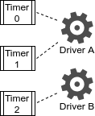
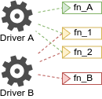
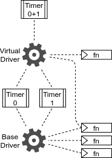

- RDM: **TODO**
- Title: RIOT's Low-level Timer API
- Author: Niels Gandraß (GitHub: [ngandrass](https://github.com/ngandrass))
- Status: Active
- Type: Consensus
- Created: August 2020

## Abstract

This memo describes basic demands and requirements for a unified low-level timer
API in RIOT-OS and proposes a potential design approach for implementing such.

## Status

This document is a product of the community of RIOT maintainers, and aims to
represent the consensus within this community. The content of this document is
licensed with a Creative Commons 4.0 CC-BY-SA license.

## Terminology

This memo uses the [RFC2119](https://www.ietf.org/rfc/rfc2119.txt) terminology
and the following acronyms and definitions:

### Acronyms

- API: Application programming interface
- hAPI: Hardware-facing API
- INT: Interrupt
- IRQ: Interrupt request
- ISR: Interrupt service routine
- MCU: Microcontroller unit
- RDM: RIOT Developer Memo
- RF: Requirement (Functional)
- RL: Requirement (Low-power)
- RP: Requirement (Performance)
- RTC: Real-time clock
- RTT: Real-time timer
- RU: Requirement (Usability)
- uAPI: User-facing API

### Terms

**TODO**

- MCU platform: A family of MCU devices produced by one manufacturer, often
  sharing identical timer hardware.
- Timer feature: A function or capability a hardware timer can offer. This
  ranges from basic features like interrupt generation up to advanced features
  such as hardware timer chaining.
- Timer instance: Software representation of a single hardware timer module.
- Timer type: One specific class of timer peripherals (e.g. general-purpose,
  low-power, RTC, RTT, ...). Timers within a timer type do not differ in their
  set of provided timer features.

# 1. Introduction

Hardware timers are an integral part of nearly every embedded application. A
carefully designed and implemented timer subsystem therefore is of utmost
importance for an embedded operating system like RIOT.

The purpose of this RDM is to gather demands upon a robust unified low-level
timer-API for RIOT-OS. Based on these, requirements are derived and a potential
implementation design is proposed.

## 1.x Timer Applications

Hardware timer usage is frequently required by embedded applications. Common tasks
include but are not limited to the following:

  * Delay code execution by a given amount of ticks or time.
      - E.g. to meet timing requirements in a protocol.
  * Periodically execute tasks.
      - E.g. to periodically sample a signal.
  * Measure relative time intervals.
      - E.g. to measure the offset between two signals or events.
  * Count event occurrences.
      - E.g. to count pulses of an externally applied signal.
  * Obtain a relative / internal time reference.
      - E.g. to log occurence of events as they happen.
  * Obtain a time reference of the current wall-clock time.
      - E.g. to provide time and date information to the user or application.
  * Compare different points in either internal time or wall-clock time.
      - E.g. to calculate the wall-clock time offset between two data packets.
  * Generate signals with periodical waveforms.
      - E.g. to output a pulse-width modulation (PWM) signal.

## 1.x Motivation

Currently a bunch of different low-level timer abstractions exist in RIOT, each
aimed at a specific class of hardware timers. The question we asked ourselves
is: Are we able to address the diverse range of timer types through a unified
low-level timer-API? Or do timers differ so greatly, that functionality provided
by each module is very distinct from the others? If, however, there is common
functionality among the modules it must be possible to bundle it in a common and
unified way.

The goal with this effort is not to fully replace existing modules but to offer
a possibility to access timer hardware in a uniform and platform-independent
way, whenever desired. Hardware presentation is the key objective of the aspired
timer-API, exposing also more advanced timer features that might not be found on
every single MCU but are still frequently required by applications. Access to
such features, however, shall be kept lightweight and straightforward. In the
remainder of this section we outline our motivation and thoughts on this topic.

Our hypothesis to begin with is that a lot of functionality actually is common
to all modules and therefore low-level timers could be exposed through a single
unified low-level timer-API. In order to validate our hypothesis we looked at
low-level timer modules in RIOT and their properties. Currently five such
modules exist, out of which the first three handle common applications, while
the latter two are designed for designated tasks:

  * `periph_timer`: General-purpose timer module
      - Primarily used as a generic interface for short timeouts with a high
        resolution. Capable of driving multiple general-purpose timers with
        multiple compare channels.
  * `periph_rtc`: Real-time clock module
      - Drives RTCs, providing both wall-clock timestamps and long running
        timeouts with a low resolution.
  * `periph_rtt`: Real-time timer module
      - Mixture between `periph_timer` and `periph_rtc`. Functionality-wise like
        a `periph_timer`, but with a different API. Clock-property-wise like an
        `periph_rtc`.
  * `periph_pwm`: Pulse Width Modulation (PWM) module
      - Specialized module to generate PWM signals. Used timer periherals
        intersect with the ones used by above modules.
  * `periph_wdt`: Watchdog timer module
      - Exclusively used to interface watchdog timers. Independent of all above
        modules.

The following table compares the different low-level timer modules:

|                |   Timer types   |              Time unit              |            Timeouts            | Multiple timers usable(1) | Multiple channels / alarms usable(2) |                                  INTs / Callbacks                                 | Low-power operation(3) | Power up/down support(4) | Timer capabilities indicated(5) | Peripheral allocation conflicts(6) | Timer types heterogeneous(7) |
|:--------------:|:---------------:|:-----------------------------------:|:------------------------------:|:------------------------------------:|:-----------------------------------------------:|:---------------------------------------------------------------------------------:|:---------------------------------:|:-----------------------------------:|:------------------------------------------:|:---------------------------------------------:|:---------------------------------------:|
| `periph_timer` | General-purpose | Counter ticks                       | short running, high resolution | yes                                  | yes                                             | One combined callback per timer for all compare match INTs. No overflow callback. | no                                | no                                  | no                                         | yes                                           | no                                      |
|   `periph_rtc` | RTC, (RTT)      | Wall-clock time struct              | long running, low resolution   | no                                   | no                                              | One alarm, additional left unusable. No overflow callback.                        | yes                               | yes                                 | no                                         | yes                                           | yes                                     |
|   `periph_rtt` | RTT, low-power  | Counter ticks, relative time struct | long running, low resolution   | no                                   | no                                              | One alarm, additional left unusable. Overflow callback attachable.                | yes                               | yes                                 | no                                         | yes                                           | yes                                     |
|   `periph_pwm` | Various         | N/A                                 | N/A                            | yes                                  | yes                                             | no                                                                                | no                                | yes                                 | no                                         | yes                                           | no                                      |
|   `periph_wdt` | Watchdog timers | Counter ticks                       | short running, high resolution | no                                   | no                                              | WDT warning INT callback attachable if supported.                                 | yes                               | no                                  | yes                                        | no                                            | no                                      |

(1) Module is able to interface multiple timer instances,
distinguished by an appropriate timer instance identifier. 
(2)  Module is able to interface multiple compare channels or RTC
alarms per timer instance, distinguished by an appropriate channel
identifier. 
(3) Module is primarily used to drive timer types that offer
low-power operation modes and features. 
(4) Explicitly powering up or down a timer instance is supported by
the module. This is different from initialization and start or stop
operations. 
(5) Static properties and capabilities of the timer hardware (e.g.
feature support, number of compare channels, ...) are made available via the
module. 
(6) Driven timer types are also used by other low-level modules,
hereby creating a resource allocation conflict between involved modules. For
example: Using TIM1 for PWM generation via `periph_pwm` must result in removal
of TIM1 from the set of timers driven by `periph_timer`. 
(7) Module is used to drive other timer types than initially intended
(e.g. on STM32: using a "Low-power Timer" instead of an "Real-time Timer" with
`periph_rtt`).

Built on top of the first three modules, as listed above, `xtimer` and `ztimer`
both provide high-level timer abstractions to the application. `xtimer` by
default uses only `periph_timer`, but support for alternative timer backends,
namely being a SysTick backend-option (See
[#14553](https://github.com/RIOT-OS/RIOT/pull/14553)) and an RTT backend-option
(See [#14912](https://github.com/RIOT-OS/RIOT/pull/14912)), is on its way.
`ztimer` already does allow usage of `periph_timer`, `periph_rtc`, and
`periph_rtt` as low-level timer drivers. The found interchangeability of current
low-level timer modules indicates that these actually do have a lot of common
functionality, what supports our initial hypothesis.

We also found that on some platforms the `periph_rtc` and `periph_rtt` module
use the same hardware peripheral, effectively blocking one API when using the
other. On MCU platforms that do not offer a designated RTC, the functionality of
such can furthermore be emulated on top of an RTT (See
[#14496](https://github.com/RIOT-OS/RIOT/pull/14912)). Both findings show that
`periph_rtc` and `periph_rtt` are, at least to some extend, functionality
equivalent, again supporting the initial hypothesis.

Lastly it is noteworthy, that on some MCU platforms timer types exist, that are
currently left unusable due to the lack of support by any of the existing
modules.  Even though their set of features does not differ greatly from the
supported timer peripherals, they are not made available to the application. A
unified timer-API would be capable of exposing these timer types.

Even though `periph_timer`, `periph_rtc`, and `periph_rtt` seem to share a lot
of common functionality, their interfaces do differ greatly. Looking back at our
initial claim it can be said, that common functionality found in these separate
modules might also be combined. In what follows, this RDM therefore pictures a
low-level timer-API that combines these modules behind a unified interface.

# 2. Demands on a Low-level Timer Subsystem

RIOT-OS positions itself as a general purpose IoT operating system that features
a wide-ranging hardware support while maintaining program portability whenever
possible. Use cases and application scenarios are vast and often bring their
individual set of requirements. When it comes to timekeeping on resource
restricted devices however, ease of use, a small ROM and RAM footprint, as well
as optimized low-power operation are essential for most of the various use case
scenarios.

A low-level timer-API should target the above described aspects and hereby
support the application developer. In order to later derive requirements for
such a timer subsystem from, demands on a low-level timer-API are compiled in
this section. This, for the moment, includes any demands, regardless of their
feasibility, implications or compatibility to each other.

## 2.x Scope and Usability

With respect to scope and usability a low-level timer-API should …

  * be intuitively and straightforwardly usable by the application developer.
  * support the application developer by providing well-designed driver code for
    most timer features, hereby releaving the application developer from the
    errorprone task of writing low-level driver code.
  * encourage the OS developer to follow a common pattern for platform dependent
    code in order to obtain maintainability and guide integration of future
    MCUs.
  * provide access to multiple hardware timer instances in order to:
      - allow application developers or applications themself to (dynamically)
        choose from the full set of timer peripherals a MCU board offers.
      - allow using them to be used by other drivers and modules (MAC layers,
        external peripherals, signal generation, …)
      - allow (optional) handling of them by some form of resource allocator,
        allowing mutually exclusive usage or defining more complex application
        requirements like "requiring at least n low-level timers".
  * allow various different timer types (e.g. general-purpose, low-power, RTT,
    RTC, ...) to be used transparently interchangeable via the same unified API.
  * should expose a feature that is provided by multiple timer types in a
    uniform way for all timers that offer it. This allows using different timers
    interchangeably and independent of their exact type, as long as they provide
    the required functionality.
  * expose basic timer features to be easily usable by the application developer
    or high-level modules.
  * expose special timer features to meet advanced requirements, such as
    optimized low-power operation.
  * give the application developer flexibility by providing access to
    additionally available advanced timer features whenever possible with
    reasonable implementation effort.
  * allow representation of multiple hardware timers as a single timer instance.
    Specifically allowing the representation of chained smaller timers as a
    single large timer that is usable as any other timer instance.
  * integrate well with high-level RIOT-OS modules (e.g. `xtimer`/`ztimer`).

## 2.x Information

With respect to the information provided by a low-level timer-API it should …

  * clearly differentiate between the following information/property types:
      - **static properties** of the underlying timer hardware (e.g. counter
        register width, available channels, …)
      - **compile-time static properties** that only changable prior compilation
        and therefore fixed during run-time (e.g. available timer drivers,
        available modules, …)
      - **dynamic run-time properties** (e.g. counting mode, pending interrupts,
        …)
  * provide static information about the capabilities of the available hardware
    timers, hereby allowing high-level modules to make platform independent use
    of advanced timer features.
  * expose dynamic timer status information, such as current operation mode and
    pending interrupts, during run-time. This eases handling timer operation in
    different contexts like an ISR, a normal thread or any other context where
    interrupts are disabled. High-level modules that depend on this information
    are therefore not forced to use workarounds.
  * provide the ability to attach a callback function to both compare match and
    overflow interrupts, whenever available. The exact interrupt cause should be
    easily identifiable.

## 2.x Portability

With respect to cross-platform application portability a low-level timer-API
should …

  * be platform independent whenever possible and platform specific whenever
    required. It should try to maintain cross-platform portability as long as
    the required timer features allow it (i.e. are available on all targetted
    MCU platforms).
  * give the application developer the ability to consciously sacrifice
    cross-platform portability whenever highly platform dependent features are
    required for the application.
  * address timer peripherals in a uniform way across different platforms (i.e.
    a common type for timer instances is defined). A timer instance on one
    platform shall therefore be presented the same way as a timer instance on
    another platform.

## 2.x Configuration

With respect to peripheral configuration management a low-level timer-API should
…

  * encourage a common pattern for peripheral configuration management. It
    should guide developers on where to store information and what should be
    configured on which layer.
  * allow dynamic run-time re-configuration of hardware timers whenever
    feasible. In particular run-time clock configuration to complement the usage
    of advanced low-power MCU operation modes is desirable.
  * support parameter configuration with a cross-platform scope, like with other
    OS/driver parameters. If timer hardware comes with a parameter that is not
    completely unique to it (i.e., also applies to a _relevant_ amount of other
    platforms) it should be possible to apply configuration on multiple MCU
    platforms this way.
  * allow to compile-time select the timer instances that later are available to
    the application during run-time.

## 2.x System Impact and Resources

With respect to system impact and system resources a low-level timer-API should
…

  * be modular in a way that functions / code, not required for the current
    application, can be excluded from the built binary, thereby benefiting the
    memory overall footprint.
  * use system resources efficiently, neither overly wasting cpu cycles nor
    memory (ROM and RAM). Maintenance overhead should be kept as small as
    possible.
  * not interfere with other system modules and introduce no side effects
    whenever avoidable.

# 3. Requirements

This section defines requirements that a low-level timer-API for RIOT-OS is
expected to fulfill. They are grouped into categories, depending on their
primary focus.

Proposed requirements are derived from:
  * Current low-level timer implementations in RIOT-OS, how they are used in
    practice and problems people are facing with it.
  * In-depth analysis of timer hardware peripherals, found across all currently
    RIOT-supported MCU platforms. See Appendix for detailed results.
  * On-going discussions within the RIOT-OS community.

## 3.1 Functional Requirements

Requirements in this category define features that must be provided by the timer
API.

* [**RF-01**] Basic timer functions must always be available.
  These include at least the following:
    - Initializing a hardware timer module.
    - Starting the timer. The internal timer counter register starts to
      increment with the configured frequency.
    - Stopping the timer. The internal timer counter register freezes.
    - Returning the current internal timer counter register value.
    - Writing the internal timer counter register value.
    - Arming a timer channel to generate an event after a relative timeout.
    - Arming a timer channel to generate an event after an absolute timeout.
    - Disarming a timer channel regardless of its current state.
* [**RF-XX**] Features beyond [**RF-01**](#RF-01) must be exposable to the user.
    - These features might also be only available on a subset of timers.
    - It must be determinable whether a specific feature is available on a given
      timer during run-time.
        - Especially high-level modules must be able to determine if a timer
          supports a specific feature.
    - The interface through which features are exposed must allow to read and
      write exposed features.
        - Whether a specific feature is actually read- or writable is dictated
          by the respective timer and can be decided by the developer.
        - Whether a specific feature is actually implemented can be decided by
          the developer.
* [**RF-XX**] Dynamic status information of a timer (e.g. pending compare match,
  unhandled overflow, ...) must be made available to the application at
  run-time.
* [**RF-XX**] Static information about a timers capabilities (e.g. number of
  compare channels, counter width, ...) must be made available to the
  application. It is recommended to do so by attaching the static properties to
  the datatype that represents one timer peripheral.
* [**RF-XX**] Different timer types (e.g. general-purpose, low-power, RTT, RTC,
  ...) must be usable through the same low-level timer-API in an uniform way.
  Feature availability depends on the actual timer type.
* [**RF-XX**] It must be possible to modify the set of timer peripherals that is
  exposed to the application at run-time.
    - The selection shall be done at compile time.
    - It must be possible to expose all timers a board provides if an
      appropriate driver is available.
    - No memory shall be allocated if a respective hardware timer module is
      unused.
* [**RF-XX**] It must be possible to combine multiple timer peripherals directly
  using the hardware-based timer chaining feature, if available for the
  respective timer type.
* [**RF-XX**] If the timer provides a compare match INT, a user-defined ISR,
  that is executed after a compare match IRQ is received, must be attachable to
  a single timer instance. The channel that triggered the compare match must be
  passed to the callback during invocation.
* [**RF-XX**] If the timer provides an overflow INT, a user-defined ISR, that is
  executed after an overflow IRQ is received, must be attachable to a single
  timer instance.
* [**RF-XX**] The user-defined ISRs must never be executed earlier than the
  occurrence of the corresponding event (e.g. set timeout period elapsed).
* [**RF-XX**] The data type used for counter values must be compile-time
  adjustable, depending on the maximum counter width provided by any of the
  exposed/used timers.
* [**RF-XX**] It shall be possible to arm a timer channel in either one-shot or
  periodic mode.
* [**RF-XX**]

[comment]: # (- Watchdog timers are explicitly defined as out of scope for the low-level
      timer-API and therefore shall not be exposed through it.)

## 3.2 Low-power Requirements

Requirements in this category define the behavior of the timer API with special
respect to the low-power operation of timer hardware peripherals.

* [**RL-XX**] It shall be possible to provide timer type specific driver code.
  This allows proper utilization of timer type specific features, hereby aiding
  low-power operation.
* [**RL-XX**] It must be supported to change a timers clock source during
  run-time.
    - This is required for the case that a specific CLK is halted after a
      transition to a lower power mode and a timer should be kept running
      through operating it from another CLK.
    - Configuration of the clock source may be handled directly by the low-level
      timer-API, though it is prefered to integrate the timer-API with a
      system-wide clock configuration module.
    - It must only be possible to select clocks that either do not need to be
      reconfigured or can be reconfigured without introducing any side-effects
      on other peripherals. If e.g. changing the CLK of timer A also influences
      the CLK of timer B this operation must be prohibited. If e.g. a timer is
      directly connected to an exclusive CLK-mux all clocks that are available
      at the mux may be selected.
    - Platform-independent clock source selection must be possible. This can be
      achieved by providing abstract clock classes (e.g. CLK_INT_FAST,
      CLK_INT_SLOW, CLK_EXT, ...) that are mapped once to actual
      platform-dependent clocks by the driver developer at the time of module
      implementation for the specific MCU.
    - Platform-dependent clock source selection must be possible. Optional usage
      of this feature can sacrafice application portability.
* [**RL-XX**] Timer maintenance should be kept as low as possible. Especially
  slow frequency timers with long running timeouts should only require
  maintenance during compare match or overflow events.
* [**RL-XX**]

## 3.3 Usability Requirements

Requirements in this category define how the user application or high-level RIOT
modules interact with the timer API.

* [**RU-XX**] Single hardware timers shall be represented in a uniform way
  across different MCU platforms. Providing a common datatype for timer
  peripherals is recommended.
* [**RU-XX**] Basic timer functions (see [**RF-01**](#RF-01)) must be usable
  fully independent of the actual MCU platform used. Appropriate well-known
  functions must be provided.
* [**RU-XX**] Consistent configuration management across the various MCU
  platforms should be encouraged by the timer-API in the following way:
    - Data structures/types should be provided to help separation of different
      configuration layers. These configuration layers include the following:
        - generic config
        - cpu-specific config
        - board-specific config
        - timer-specific config
    - Places where timer related configuration is done shall be as uniform as
      possible across different MCU platforms.
    - Both compile-time static and run-time timer configuration must be
      supported and should be separated.
* [**RU-XX**] It shall be possible to represent chained hardware timers as a
  single timer peripheral to the application.
    - The counter value must be atomic and accessible via a single function call
      to the API. The chained timer instance therefore is responsible for
      performing all required read operations and must combine the multiple
      counter values into a single counter value (e.g. chaining two 16-bit
      timers results in exposing a single 32-bit counter value).
* [**RU-XX**]

## 3.4 Performance Requirements

Requirements in this category define the performance that must be achieved by
the timer API.

* [**RP-XX**] Memory footprint (RAM and ROM) should be kept low.
    - Bit fields should therefore be used to compress data when appropriate.
      They must be well documented with respect to both their layout and their
      allowed usage (e.g. casting to/from integer representations).
* [**RP-XX**] Functions must not contain redundant code but re-use generic
  implementations instead.
* [**RP-XX**] It must be possible to group certain functionalities (e.g. timer
  chaining, PWM, ...) into compile-time optional modules. It shall be possible
  to select which of these functionality groups, apart from basic timer
  functions (see [**RF-01**](#RF-01)), get compiled into the resulting binary.
* [**RP-XX**] When disabling of IRQ handling is required, this period must be
  kept as short as possible.
* [**RP-XX**] Registered callbacks should be executed as soon as possible after
  the corresponding IRQ was generated by the timer channel.
* [**RP-XX**]

# 4. Low-level Timer API Design

This section describes the design of a low-level timer API for RIOT-OS, that
fulfills the above defined requirements. At first the general software
architecture is described before various aspects of if are depict in further
detail.

## 4.1 Architecture

While timer types do differ in their specific set of provided features, many MCU
platforms offer timer types that are similar with respect to the common basic
timer operations they can perform.  These are often being implemented slightly
differently, but their overall logic and semantics are the same.  One of the
goals of this unified timer API is to allow "all" timers to be used
transparently interchangeable - at least regarding these common operations.

The proposed low-level timer API therefore is split into two: The
hardware-facing API (hAPI) and the user-facing API (uAPI). The hAPI is made up
of minimal function sets (i.e. drivers) for each timer type, that are used to
interact with the actual hardware peripherals. The hAPI is used by the uAPI,
which provides convenient timer access to user applications and high-level
modules. It consists of convenience and compound functions that are independent
of the underlying timer type.

The described separation of hardware-specific driver code and
hardware-independent user functions is depict in the diagram below. The hAPI and
uAPI are furthermore described in detail in the following sections.

Each individual timer is represented by an associated struct. It identifies the
exact hardware peripheral, specifies the timer type and provides static
information about the timer (e.g. width and channel count). A detailed
description can be found in the following sections.

## 4.x Timer types and instances

A single hardware timer is represented by an instance of the `tim_periph_t`
struct. For every exposed timer, as configured during compile-time, an instance
of this struct has to be created. A `tim_periph_t` struct consists of the
following data:
  * Hardware peripheral identifier `tim_t`
  * Associated timer type driver `tim_driver_t`
  * Static timer properties (e.g. counter width and number of available
    channels)

Timer type specific sets of functions `tim_driver_t` are assigned to each
`tim_periph_t`, depending on the respective timer type (e.g.  general-purpose,
RTC, low-power, …). Contents of the `tim_driver_t` struct are described in the
hAPI section.

This flexible design allows to use different timer types, each may requiring
(partly) individual driver code, through a unified user-facing API.

## 4.x Hardware-facing API (hAPI)

The hardware-facing API (hAPI) is responsible for directly interacting with the
registers of a hardware timer. It consists of minimal sets of functions, each
represented as a group of function pointers inside a `tim_driver_t` struct. For
every exposed timer type exactly one such driver is available and later mapped
onto `tim_periph_t` instances of that respective timer type. Different driver
code can be provided for different timer types.

### 4.x.x Driver code reusability

An example of driver granular reusability is shown in the diagram below. Here,
_Timer 0_ and _Timer 1_ are interfaced using _Driver A_ while _Timer 2_ uses a
different _Driver B_. This behavior can be achieved by simply referencing the
desired driver `tim_driver_t` inside each timer instance `tim_periph_t`.

When two timer types only differ slightly, it can be desirable to reuse
functions from one driver within another driver in order to prevent code
duplication. The diagram below depicts such a situation: _Driver A_ and _Driver
B_ each bring exclusive functions (_fn\_A_ and _fn\_B_) while also sharing
common functions (_fn\_1_ and _fn\_2_). To efficiently handle such scenarios
function granular reusability of driver code is possible. It can easily be
achieved by assigning the same function pointer in both driver instances.

### 4.x.x Timer feature and property access

Each timer offers a distinct set of properties that can be put into either of
the following groups:
  * Static attributes such as the counter register width and the number of
    available channels.
  * Dynamic properties such as the current counting mode or information on
    pending events (e.g. compare match and overflow).

These properties are made available to the user application or high-level
modules. Common static attributes, which apply to all timer types, are encoded
into appropriate bit fields inside the `tim_periph_t` timer instance structs.
This allows easy determination of e.g. the number of available channels.
Properties that either are timer type specific or dynamic, i.e. ones that can
change during run-time, are exposed via a simple "getter-setter-based"
interface. Available properties are encoded within the `tim_prop_t` enum. They
can be read using a `get_property(tim_prop_t)` and written using a
`set_property(tim_prop_t, tim_propval_t)` function.

Advanced timer type specific features, which cannot commonly be found on all
timers, are made accessible through the same flexible interface. These features
can likewise be reconfigured using the `set_property()` function and their
current configuration can be determined using the `get_property()` function.
Examples are special counting modes, low-power features and hardware timer
chaining. Such again are represented as entities inside the `tim_prop_t` enum.
If a given hardware timer does not support a specific feature it is left
unimplemented in the respective driver.  Absence of the specific feature is
indicated via the access functions return values.

### 4.x.x Memory footprint

Every available driver requires memory for storing the function pointers to each
of its provided functions. The fewer individual functions are provided, the less
memory is consumed for associated function pointers. In order to keep the memory
footprint low, the hAPI interface is kept as reduced and compact as possible.

This is accomplished by...
  1. ... merging strongly coupled functionality into a single function. For
     example:
      * `start()` and `stop()` are combined into a single `enable(bool)`
        function.
      * `set()`, `set_periodic()` and `clear()` are combined into a single
        `set_channel(mode)` function.
  2. ... moving all functions to the uAPI, that can be implemented as a sole
  combination of other hAPI functions (i.e. compound functions). For example:
      * Relative timer channel arming can be implemented by calling the hAPI
        functions `read()` and `set()` and is therefore implemented solely in
        the uAPI as `timer_set_relative()`.
  3. ... exposing dynamic run-time properties and advanced timer functions
  through an getter-setter-based interface. A large amount of potentially unused
  function pointers is hereby eliminated.
  4. ... grouping functions for specific features, such as PWM or timer
  chaining, into compile-time optional modules.

A further reduction of memory consumption is achieved by strictly combining data
into bit fields whenever appropriate, as for example done with static timer
properties attached to `tim_periph_t` structs.

### 4.x.x Virtual drivers

In some use-cases it can be desirable to additionally provide _virtual timer
drivers_. These drivers may not interact with a single hardware timer directly
but instead can use other _base drivers_ to interact with the required timers.
They both can solely rely on base driver calls but also are able to provide
additional implementations for specific functions. If required, base driver
functions can further be overwritten by the virtual driver.

A common use-case is with hardware-supported timer chaining, as depict in the
diagram below. Here, _Timer 0_ and _Timer 1_ can be configured to operate as a
combined timer module with an extended counter register.

Both timers can be initialized and controlled using their base driver. But when
chaining them into a combined module, additional configuration and a special
behavior during reads and writes is mandatory. The virtual driver handles both
requirements by selectively extending the base driver functionality. It exposes
the two small timers as a single `tim_periph_t` instance, featuring the enlarged
counter value. User applications or high-level modules can now interact with the
larger chained timer through the same uAPI as with any other `tim_periph_t`
instance. It should, however, be noted that when exposing multiple hardware
timers as a single timer instance it might be required to remove the base timers
from the set of timer peripherals that is made available to the application.

## 4.x User-facing API (uAPI)

The user-facing API (uAPI) provides a timer type independent interface to the
user application and high-level RIOT-OS modules. It automatically delegates
requested function calls to the respective hAPI driver, based on the given
`tim_periph_t`, and furthermore provides additional functions such as relative
timeouts. In contrast to the hAPI, where multiple sets of functions exist
depending on the timer type, the uAPI only provides one single set of functions
for all timers due to its timer type independence.

### 4.x.x Basic common timer functions

Basic functions that are commonly found on all timer types are exposed by the
uAPI, as required by [**RF-01**](#RF-01). Feature access is provided by
unraveling compressed hAPI functions into an user-friendly interface. An example
is the hAPI `enable(bool)` function that is unraveled into the `timer_start()`
and `timer_stop()` uAPI functions.

In contrast to hAPI drivers, the uAPI is not required to minimize the amount of
provided functions, as no memory for function pointers needs to be allocated.
Unused functions are removed by the compiler during optimization and therefore
do not negatively affect the final binary size.

Besides fully delegatable function calls, other basic convenience functions,
such as relative timer arming, are provided to the user. As these can entirely
be fulfilled by combining multiple hAPI function calls, they are implemented
solely inside the uAPI.

### 4.x.x Advanced timer functions and status information

Advanced timer functions, which are not broadly available and therefore timer
type dependent, are accessible via the hAPI through a "getter-setter-based"
function interface. They are exposed in the same way by the uAPI through the
`timer_get_property(tim_prop_t)` and `timer_set_property(tim_prop_t,
tim_propval_t)` functions. All timer features and properties that are listed in
the `tim_prop_t` enum can be addressed. This includes both advanced timer
functions as well as run-time dynamic timer properties.

To aid usability however, the uAPI can provide additional wrapper functions for
conveniently accessing specific features and properties. Examples include:
  * `timer_is_enabled()`: Determines if a timer is running / counting
  * `timer_has_pending_ovf()`: Determines if a timer has an unhandled overflow
    pending
  * `timer_set_count_dir(tim_propval_t)`: Changes a timers counting direction
  * `timer_irq_ovf_enable()`: Enables overflow interrupt generation

All of this convenience functions again do not end up in the final binary if
unused, due to the applied compile-time optimization.

## 4.x Counter value

Values of the internal counter register that each timer offers are represented
by the `tim_cnt_t` type throughout both the hAPI and the uAPI. The exact size of
the underlying datatype can be selected during compile-time. On MCU platforms
that only offer small timers (e.g. 16-bit) the counter type width can hereby be
adjusted accordingly to benefit performance and save memory. It must however be
noted, that the selected counter width must be at least the size of the largest
used timer.

## 4.x Interrupt handling

Two separate callback functions can be attached to every timer instance during
initialization: One that is executed after a compare match IRQ was generated
(`tim_cmp_cb_t`) and the other one to be executed after a counter register
overflow IRQ occurred (`tim_ovf_cb_t`). If one of both is provided, it is
executed by the low-level timer module once the corresponding IRQ was generated
and after all required interrupt maintenance tasks, such as updating the
interrupt status registers, were performed. During invocation, the interrupt
cause `tim_int_t` is determined by the executed callback and, if applicable, the
triggered timer channel is passed as an function argument. An optional context
can furthermore be bound to each of the callback functions via a void pointer.
Interrupt generation / masking can be run-time configured via the timer property
interface.

The separation of compare match and overflow callbacks was done due to the
disjoint use-cases of both events. Counter overflows are most often used solely
for timer maintenance tasks whereas compare match events indicate elapsed
timeouts, the user application wants to be informed of. By removing the need to
determine the interrupt cause within the attached callback function shorter
maintenance periods can be achieved, hereby decreasing the overall resource
consumption as well as reducing the latency of elapsed timeouts.

Further separation into channel specific callback functions however was not
done. Only a small number of MCU platforms do provide distinct INTs for every
compare channel and it is inapplicable to store a large number of callback
function pointers, that will remain unused on many platforms. Even though a few
may experience a slightly lower timeout latency, the majority of all MCU
platforms only suffers the larger memory footprint, due to the additional
function pointers that need to be stored, without gaining any benefits.
Nonetheless, individual functions can still be dispatched within the attached
compare match callback function, based on the provided channel argument.

## 4.x Run-time clock configuration

The low-level timer API supports changing timer clock sources during run-time.
If not handled by a designated system-wide clock configuration module, it can be
implemented within the timer-API itself. With this however, two crucial
restrictions apply:
  1. Selecting a platform specific clock source comes at the cost of loosing
     application portability.
  2. A clock source is only allowed to be changed during run-time, if altering
     it does not affect other timers or hardware peripherals in any way.

A clock source is identified by the `tim_clk_t` type. Its default definition
might be used, but it is highly encouraged to redefine it for every MCU platform
in order to reflect the actually available clocks. To cope with restriction
(1.), both platform specific clocks as well as platform independent abstract
clock classes can be provided. The first allow for fine-grained platform
specific optimizations while the latter provides a trade-off between
optimization potential and application portability.

Restriction (2.) entails, that a closer look at the MCU platforms clock tree is
mandatory during implementation. The driver developer must determine the impact
domain and possible side-effects of a clock change. Given a timer clock
_TIMx\_CLK_ can be selected among the three different clock sources _CLK\_A_,
_CLK\_B_, and _CLK\_C_. If _TIMx\_CLK_ can be selected among all clock sources
individually for each timer module, available CLKs are: _CLK\_A_,_CLK\_B_,
_CLK\_C_. If however, using e.g. _CLK\_A_ as a clock for _TIMx\_CLK_ implies
this choice for multiple peripherals, only _TIMx\_CLK_ is an allowed selection.
In other words: When traversing the hierarchical clock tree, only clocks on the
path originating from the timer peripheral up to the first branch that leads to
other peripherals, are applicable.

# 5. Evaluation

**TODO**

Demands on a timer subsystem vary based on the respective use-case and
application scenario. Where, for example, timeouts with a millisecond resolution
are more than sufficient in most cases, sometimes a higher precision might be
required. To be able to pick the appropriate timer subsystem for an application,
characteristics of such shall be evaluated in a comparable way.

## 5.x Benchmarking / Performance Metrics

**TODO**

The performance of the aspired low-level timer module shall be evaluated via
appropriate benchmarks. These must be conducted on different MCU platforms, need
to include different timer types, and should incorporate at least the following
aspects:

 * Duration of a timer read operation
     - Note: Impacts both manual timer reads and relative timer channel arming
 * Interrupt callback execution latency
 * Shortest possible timeout (i.e. maximum timeout resolution) 
 * CPU-time consumed by the timer module vs. amount of time required by the
   hardware to perform requested timer operations (e.g. bus speed limitations)
     - Note: Especially interesting when assessing the overhead introduced by driver
     calls.
 * RAM usage
 * ROM usage
 * **TODO**: Extend this list

In order to enable comparability, conducted benchmarks shall be able to run on
all available low-level timer modules. This allows to produce results upon which
an application developer is able to decide which timer-API is the most
appropriate for the respective use-case.

## Acknowledgements

Thanks to Michel Rottleuthner for his comments and suggestions.

## References

**TODO**

## See Also

 * [[WIP, RFC] doc/memos: Added RDM on high level timer API #12970](https://github.com/RIOT-OS/RIOT/pull/12970)
 * [RDM1 : RIOT Design Goals](./rdm0001.md)

## Revision

- Rev0: initial document

## Contact

The author of this memo can be contacted via email at **TODO**.

Additionally, the RIOT developer community be reached via email at
devel@riot-os.org.

## Appendix

**TODO**

### Timer hardware analysis

A broad range analysis of timer hardware, which is available on MCU platforms
supported by RIOT-OS, was conducted. Gathered insights shall be used to base
requirements and design decisions for the outlined low-level timer-API upon.
Results, both specific to device families and also across all analyzed
platforms, are listed below.

For each MCU platform a Timer Comparison Matrix (TCM) was created. A TCM lists
all of the available types of timer peripherals including their respective
properties. It allows to quickly determine various characteristics and features
of each of the available timers and enables the comparison of peripherals across
different MCU families and manufacturers.

To obtain general insights we evaluated various properties across all platforms
and timer types, either available directly in the TCMs or being derivable from
them. If one timer type is available in multiple versions (e.g. 16-bit and
32-bit general-purpose timers) each of them was evaluated and counted
separately.  Platforms were counted as matching, if any of their available timer
types matched the respective property and criterion. Unresolved or unclear timer
properties were excluded from the respective results.

#### Scope

The conducted timer hardware analysis covers the following MCU platforms:

* STMicroelectronics (ST)
    * STM32F0 / F1 / F2 / F3 / F4 / F7
    * STM32L0 / L1 / L2
* Microchip / Atmel
    * ATmega AVR
    * PIC32MX / PIC32MZ
    * SAMD21
    * SAM3A / N / S / U / X
* Espressif
    * ESP8266
    * ESP32
* Silicon Labs
    * EFM32 / EFR32
    * EZR32
* Texas Instruments (TI)
    * CC13x2 / CC26x2
    * CC2538
    * CC430
    * LM4F120
    * MSP430x1xx / MSP430x2xx
* NXP Semiconductors
    * Kinetis E / EA / K / L / M / V / W
    * LPC176x / LPC175x
    * LPC2387
* Nordic Semiconductor
    * nRF51x / nRF52x
* SiFive
    * FE310-Gx

#### Overall results

Cross-platform findings from the conducted MCU timer hardware analysis are
listed in the following table. It should be noted that the total number of
platforms and timer types can vary between properties due to the respectively
applied selection criterion. To cope with this exact matched amounts as well as
percentages are given for each depict result.

<!--- Style is ignored and rendered as text by GitHub.

-->

<table class="hpa_results">
<thead>
  <tr>
    <th>ID</th>
    <th>Title</th>
    <th>Description</th>
    <th>Criterion</th>
    <th>Platforms [#]</th>
    <th>Timer Types [#]</th>
    <th>Platforms [%]</th>
    <th>Timer Types [%]</th>
  </tr>
</thead>
<tbody>
  <tr>
    <td rowspan="3">R-01</td>
    <td rowspan="3">Counter width</td>
    <td rowspan="3">Usable size of the counter register in bits <small>(Excluding watchdog timers)</small></td>
    <td>&ge; 16</td>
    <td>19</td>
    <td>83</td>
    <td>100 %</td>
    <td>87 %</td>
  </tr>
  <tr>
    <td>&ge; 32</td>
    <td>17</td>
    <td>32</td>
    <td>90 %</td>
    <td>34 %</td>
  </tr>
  <tr>
    <td>&ge; 64</td>
    <td>4</td>
    <td>4</td>
    <td>21 %</td>
    <td>4 %</td>
  </tr>
  <tr>
    <td rowspan="3">R-02</td>
    <td rowspan="3">Compare channels</td>
    <td rowspan="3">Number of available compare channels <small>(Excluding timers w/o compare channels)</small></td>
    <td>&ge; 1</td>
    <td>19</td>
    <td>80</td>
    <td>100 %</td>
    <td>100 %</td>
  </tr>
  <tr>
    <td>&ge; 2</td>
    <td>14</td>
    <td>51</td>
    <td>74 %</td>
    <td>64 %</td>
  </tr>
  <tr>
    <td>&ge; 4</td>
    <td>10</td>
    <td>19</td>
    <td>53 %</td>
    <td>24 %</td>
  </tr>
  <tr>
    <td>R-03</td>
    <td>Prescaler</td>
    <td>Support for prescaling the timer clock</td>
    <td><i>yes</i></td>
    <td>19</td>
    <td>87</td>
    <td>100 %</td>
    <td>74 %</td>
  </tr>
  <tr>
    <td rowspan="2">R-04</td>
    <td rowspan="2">Timer chaining</td>
    <td rowspan="2">Support for timer module combination <small>(Excluding watchdogs and RTCs)</small></td>
    <td>R-01 &le; 16<small>(2)</small></td>
    <td>10</td>
    <td>15</td>
    <td>71 %</td>
    <td>38 %</td>
  </tr>
  <tr>
    <td>R-01 &gt; 16<small>(3)</small></td>
    <td>4</td>
    <td>5</td>
    <td>27 %</td>
    <td>16 %</td>
  </tr>
  <tr>
    <td>R-05</td>
    <td>Compare interrupts</td>
    <td>Unique INTs for each compare channel</td>
    <td><i>yes</i></td>
    <td>11</td>
    <td>28</td>
    <td>58 %</td>
    <td>31 %</td>
  </tr>
  <tr>
    <td>R-06</td>
    <td>Overflow interrupts</td>
    <td>Unique INTs for counter over-/underflow <small>(Excluding watchdogs)</small></td>
    <td><i>yes</i></td>
    <td>8</td>
    <td>13</td>
    <td>42 %</td>
    <td>19 %</td>
  </tr>
  <tr>
    <td>R-07</td>
    <td>Event flags</td>
    <td>Availability of status bits for timer events</td>
    <td><i>yes</i></td>
    <td>16<small>(1)</small></td>
    <td>100</td>
    <td>100 %</td>
    <td>100 %</td>
  </tr>
  <tr>
    <td rowspan="4">R-08</td>
    <td rowspan="4">Auto-reload</td>
    <td rowspan="4">Auto-reload at over/-underflow (OVF), at compare-channel match (CCM), or via auto-reload register (ARR) <small>(Excluding watchdogs and RTCs)</small></td>
    <td>OVF</td>
    <td>3</td>
    <td>14</td>
    <td>16 %</td>
    <td>17 %</td>
  </tr>
  <tr>
    <td>CCM</td>
    <td>6</td>
    <td>25</td>
    <td>32 %</td>
    <td>32 %</td>
  </tr>
  <tr>
    <td>ARR</td>
    <td>10</td>
    <td>40</td>
    <td>53 %</td>
    <td>51 %</td>
  </tr>
  <tr>
    <td><i>any</i></td>
    <td>19</td>
    <td>79</td>
    <td>100 %</td>
    <td>100 %</td>
  </tr>
  <tr>
    <td rowspan="3">R-09</td>
    <td rowspan="3">Clock sources</td>
    <td rowspan="3">Number of available clock sources <small>(Distinct external and internal clocks)</small></td>
    <td>&ge; 1</td>
    <td>19</td>
    <td>117</td>
    <td>100 %</td>
    <td>100 %</td>
  </tr>
  <tr>
    <td>&ge; 2</td>
    <td>16</td>
    <td>59</td>
    <td>84 %</td>
    <td>50 %</td>
  </tr>
  <tr>
    <td>&ge; 4</td>
    <td>6</td>
    <td>20</td>
    <td>32 %</td>
    <td>17 %</td>
  </tr>
  <tr>
    <td rowspan="3">R-10</td>
    <td rowspan="3">Internal clock sources</td>
    <td rowspan="3">Number of available internal clock sources</td>
    <td>&ge; 1</td>
    <td>18</td>
    <td>110</td>
    <td>95 %</td>
    <td>92 %</td>
  </tr>
  <tr>
    <td>&ge; 2</td>
    <td>15</td>
    <td>40</td>
    <td>79 %</td>
    <td>33 %</td>
  </tr>
  <tr>
    <td>&ge; 4</td>
    <td>1</td>
    <td>2</td>
    <td>5 %</td>
    <td>2 %</td>
  </tr>
  <tr>
    <td rowspan="3">R-11</td>
    <td rowspan="3">External clock sources</td>
    <td rowspan="3">Number of available external clock sources</td>
    <td>&ge; 1</td>
    <td>19</td>
    <td>114</td>
    <td>100 %</td>
    <td>95 %</td>
  </tr>
  <tr>
    <td>&ge; 2</td>
    <td>13</td>
    <td>46</td>
    <td>68 %</td>
    <td>38 %</td>
  </tr>
  <tr>
    <td>&ge; 4</td>
    <td>3</td>
    <td>7</td>
    <td>16 %</td>
    <td>6 %</td>
  </tr>
  <tr>
    <td>R-12</td>
    <td>Low-power clock</td>
    <td>Low-power oscillator can be used by timer</td>
    <td><i>yes</i></td>
    <td>19</td>
    <td>84</td>
    <td>100 %</td>
    <td>71 %</td>
  </tr>
  <tr>
    <td>R-13</td>
    <td>Deep-sleep active</td>
    <td>Timer operational in lowest MCU power states</td>
    <td><i>yes</i></td>
    <td>19</td>
    <td>68</td>
    <td>100 %</td>
    <td>57 %</td>
  </tr>
  <tr>
    <td rowspan="2">R-14</td>
    <td rowspan="2">GP-timers</td>
    <td rowspan="2">Number of available general-purpose timers</td>
    <td>= 1</td>
    <td>1</td>
    <td>-</td>
    <td>5 %</td>
    <td>-</td>
  </tr>
  <tr>
    <td>&ge; 1</td>
    <td>18</td>
    <td>-</td>
    <td>95 %</td>
    <td>-</td>
  </tr>
  <tr>
    <td>R-15</td>
    <td>WDT interrupts</td>
    <td>Watchdog generates interrupt prior to reset</td>
    <td><i>yes</i></td>
    <td>13</td>
    <td>14</td>
    <td>68 %</td>
    <td>67 %</td>
  </tr>
  <tr>
    <td>R-16</td>
    <td>Unknown items</td>
    <td>Timer has unresolved/unknown properties</td>
    <td><i>yes</i></td>
    <td>6</td>
    <td>17</td>
    <td>32 %</td>
    <td>14 %</td>
  </tr>
</tbody>
</table>

<small>(1)</small> Three platforms excluded due to unknown
properties. 
<small>(2)</small> i.e.: Only counting timers that are chainable and have a maximum width of 16 bit. 
<small>(3)</small> i.e.: Only counting timers that are chainable and have a width greater than 16 bit.

#### Platform results

Detailed results from the conducted timer hardware analysis are found in the
following tables, the so called Timer Comparison Matrices (TCMs). Each table
contains the analyzed timer module types and their respective properties for a
set of MCUs as indicated by the table captions.

##### Column Key / Explanation of Criteria

###### Timer Type

Name of the respective timer type. Generic timer modules across various
platforms are united under the type name "General-purpose" in order to be easily
identifiable throughout the results. Names of special purpose timers are adopted
from naming conventions in the corresponding datasheets.

###### Counter Width

Width of the internal counter register in bits. If multiple counter widths are
available for a single timer type, these are listed below each other inside a
single cell. Can be omitted if timer does not contain plain counter register
(e.g. real-time-clocks).

###### Compare Channels

Number of compare channels available in a single timer module of the given type.
Can be a single number, a range or multiple fixed values.

###### Prescaler Type

Availability of a prescaler that divides the timer clock. Can be one of the
following:

- &times; No prescaler is available.
- E Prescaler can be continuously selected as exponentials of 2 (e.g. 1, 2, 4,
  8, …, 2n).
- F Prescaler can be selected from fixed values with varying intervals (e.g. 1,
  16, 64, 512).
- R Prescaler can be continuously selected as discrete integer values (e.g. 1,
  2, 3, 4, …, 65536).

###### Max Prescaler

Maximum value that can be selected as a prescaler (i.e. greatest clock divider
resulting in longest time to over-/underflow) with respect to _Prescaler Type_.
Can be omitted when _Prescaler Type_ is &times;.

###### Chaining Support

Indicates if chaining timers of the given type is possible. This feature can be
used to combine small counters into a larger one (e.g. combining two 16-bit
timers into a 32-bit timer). Can be one of the following:

- &times; No support for timer chaining available. Chaining by routing signals
  through additional peripherals is counted as not available.
- &check; Combination of multiple timer modules is possible (e.g. configured in
  timer control registers).

###### Compare INT

Type of interrupts generated on a compare channel match event. Can be omitted if
_Compare Channels_ is 0. Can be one of the following:

- &times; Non-existing. Compare matches cannot generate any kind of interrupt.
- &#9702; Available but shared with other timer events. Applies if only a single
  interrupt per timer module is available.
- &#9633; Available but shared with other compare channels. Applies if a single
  timer module has one interrupt that exclusively services all its compare
  matches.
- &check; Available and offering unique interrupts for each compare channel
  (i.e. no status bit / event flag read is necessary to identify the compare
  channel that produced the match event).

###### Overflow INT

Type of the interrupt generated on a counter register over-/underflow. Can be
one of the following:

- &times; Non-existing. A counter over-/underflow cannot generate any kind of
  interrupt.
- &#9702; Available but shared with other timer events. Applies if only a single
  interrupt per timer module is available.
- &check; Available and offering a unique interrupt (i.e. no status bit / event
  flag read is necessary to distinguish from compare matches).

###### Event Flags

Determines the availability of status bits that indicate if an event (e.g.
compare match or over-/underflow) was observed by the timer hardware. These
flags need to be updated independently of the generated interrupts and must be
available even if the corresponding interrupt is currently masked. Can be one of
the following:

- &times; No event status bits / flags available.
- &check; Event status bits / flags are available and updated even if the
  corresponding interrupt is masked.

###### Auto-reload

Availability and type of the auto-reload function. Can be one of the following:

- &times; Not available (i.e. one-shot mode).
- &#9702; Timer auto-reloads / warps only at counter over-/underflow (i.e. full
  width free-running mode).
- &#9633; Auto-reload at arbitrary value is available but sacrifices one compare
  channel (i.e. limited width free-running mode).
- &check; Auto-reload at arbitrary value is available. No compare channel is
  required, exclusive auto-reload match register available (i.e. limited width
  free-running mode).

###### PWM Generation

Indicates if a timer module can directly generate and output
pulse-width-modulation (PWM) waveforms. Can be one of the following:

- &times; Not available. PWM generation through additional peripherals (e.g.
  exclusive PWM peripheral) counts as not available.
- &check; PWM generation available.

###### Internal CLKs

Number of internal clocks the timer is able to run of.

A single clock is categorized as internal, if it can in at least one case be
configured to be driven from an internal oscillator. If it is able to run from
either an internal or external oscillator, it is categorized as both internal
and external clock.

Listed clocks are based on their scope and potential side effects on other
peripherals. Given a timer clock (e.g. TIMx\_CLK) can be selected among three
different clock sources (e.g. CLK\_A,CLK\_B, CLK\_C). If TIMx\_CLK can be
selected among all clock sources individually for each timer module, available
_Internal CLKs_ are: CLK\_A,CLK\_B, CLK\_C. If however, using e.g. CLK\_A as a
source clock for TIMx\_CLK implies this choice for multiple peripherals, only
TIMx\_CLK is counted as _Internal CLK_. In other words: Within the hierarchical
clock tree, only clocks starting from the timer peripheral up to the first
branch that leads to other peripherals, are listed here.

###### External CLKs

Number of external clocks the timer is able to run of.

A single clock is categorized as external, if it can in at least one case be
configured to be driven from an external oscillator. If it is able to run from
either an external or internal oscillator, it is categorized as both external
and internal clock.

Listed clocks are based on their scope and potential side effects on other
peripherals. See column key for _Internal CLKs_ for details.

###### Low-power CLK

Indicates if the timer module can be operated with a low-power clock source
(internal or external). A low-power clock is defined as one that allows the CPU
and high-frequency peripheral base clock to be turned off while the low-power
clock is still operational (i.e. the timer can be operated in lower
power-states). Can be one of the following:

- &times; No low-power clock source available.
- &check; Timer can be operated using a low-power clock source. Timer is
  operational in lower power states.

###### Deep-sleep Active

Indicates whether the timer is operational in the lowest power states of the
MCU, as typically found with real-time-clocks. Very low power modes are
characterized by the power-down of the CPU, nearly all peripherals, and
oscillators. Modules of this category are often among the only wakeup-sources
that can wake the device from deep sleep states. Can be one of the following:

- &times; Timer is never active in the lowest power states.
- &check; Timer can be operated in the lowest power states.

###### Unresolved or Not-applicable Items

In some cases one of the above described attributes does not apply to the timer
module (e.g. counter width for some real-time-clocks), it is currently unknown
or it is unclear and needs confirmation. In such cases one of the following
values can be used for any of the above properties:

- \- Not applicable
- ? Unknown / Documentation unclear / Needs confirmation

##### Timer Comparison Matrices

[comment]: # (TCMs are included as svg files for now since automatic conversion
breaks the table layout. Will be replaced with proper markdown tables at a later
point!)

<small>a</small> When enabled  
<small>b</small> System Tick Interrupt  
<small>c</small> RTC Alarm(s)  
<small>d</small> From periodic wakeup timer  
<small>e</small> Independent oscillator  
<small>f</small> For internal calibration only  
<small>g</small> Requires two hardware timer modules  
<small>h</small> Incremented on every RTC count pulse  
<small>i</small> Additional 8-bit repeat register  
<small>j</small> Reference manual does not provide details  
<small>k</small> Possible via events and another TCC utilized as event counter  
<small>l</small> Possible via events and another TCC utilized as event counter  
<small>m</small> Only available in RTC-mode with external clock  
<small>n</small> Supports masking of individual bits  
<small>o</small> Module contains multiple timer peripherals. Values shown refer to a single counter  
<small>p</small> Only pre-defined intervals are selectable  
