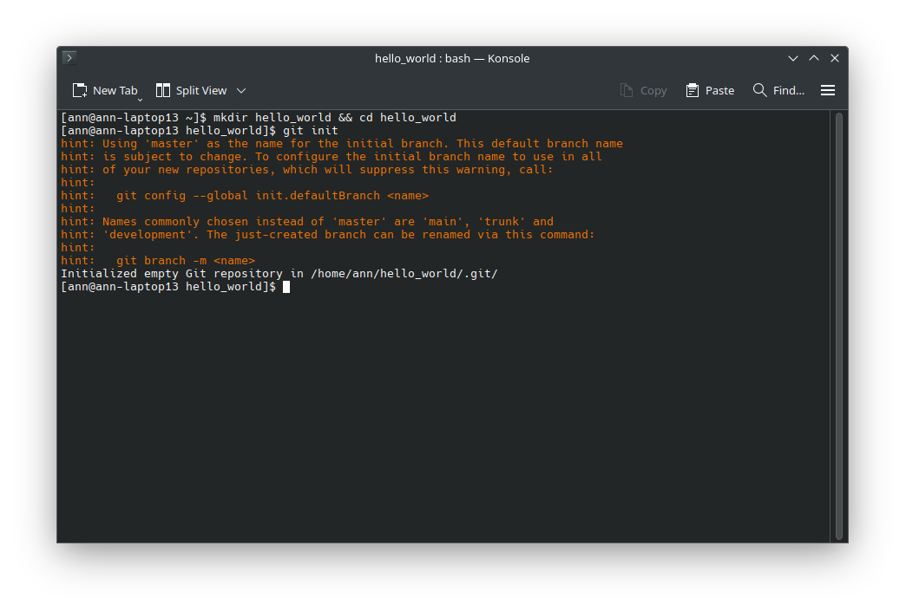
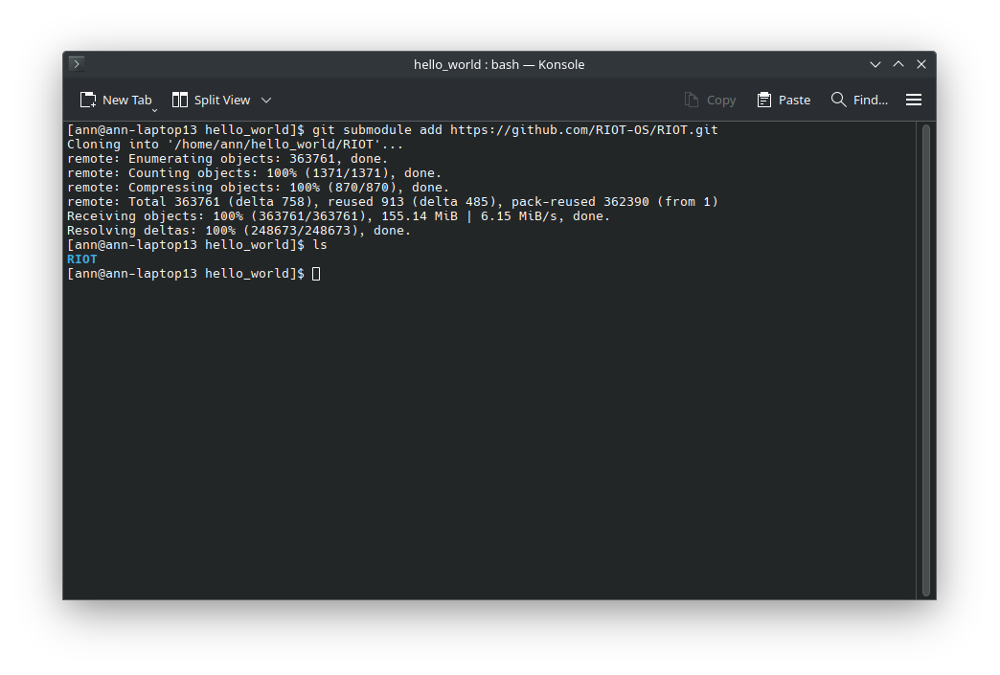

:::note
This tutorial assumes that you have already set up your development environment
as described in the [Getting Started](/getting-started/installing/) guide.
:::

Now that we have played around with the examples and have a basic understanding of how to use RIOT, let's create a new project from scratch. We will create a simple hello world program that will print "Hello World!" to the console.

#### Step 1: Create a new git repository

We start by creating a new git repository for our project. If you have never worked with git before, you can find a good introduction [here](https://git-scm.com/book/en/v2/Getting-Started-About-Version-Control) or [here](https://docs.github.com/en/get-started/getting-started-with-git/set-up-git).

Let's create a new directory for our project in which we will store our code. We will call this directory `hello_world`.

```bash
mkdir hello_world && cd hello_world
```

Next, we initialize a new git repository in this directory. This will allow us to track changes to our code and collaborate with others and also allows us to easily get RIOT as a submodule.

```bash
git init
```



Congratulations! You have now created a new empty git repository. In the next step, we will add RIOT as a submodule to our project.

#### Step 2: Add RIOT as a submodule

We want to import RIOT as a submodule to our project. This will allow us to easily update to newer versions of RIOT and also allows us to easily share our project with others on GitHub, Gitlab, or any other git hosting service.

To add RIOT as a submodule, we use the following command:

```bash
git submodule add https://github.com/RIOT-OS/RIOT.git
```



When looking into our directory via `ls`, we can see that a new directory called `RIOT` has been created. This directory contains the RIOT source code. If you were to push your project to a git hosting service, the `RIOT` directory would not be included in the repository. Instead, the repository would contain a reference to the commit of the RIOT repository that you have added as a submodule. This way, the repository stays small and only contains the code that you have written and not the entire RIOT source code.
