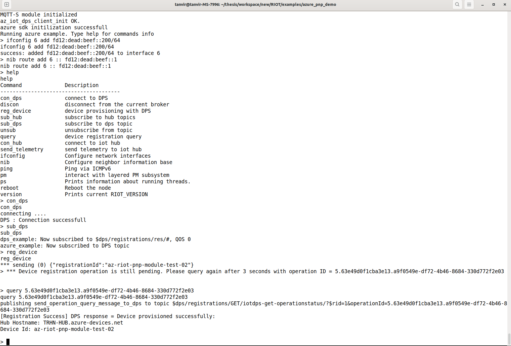
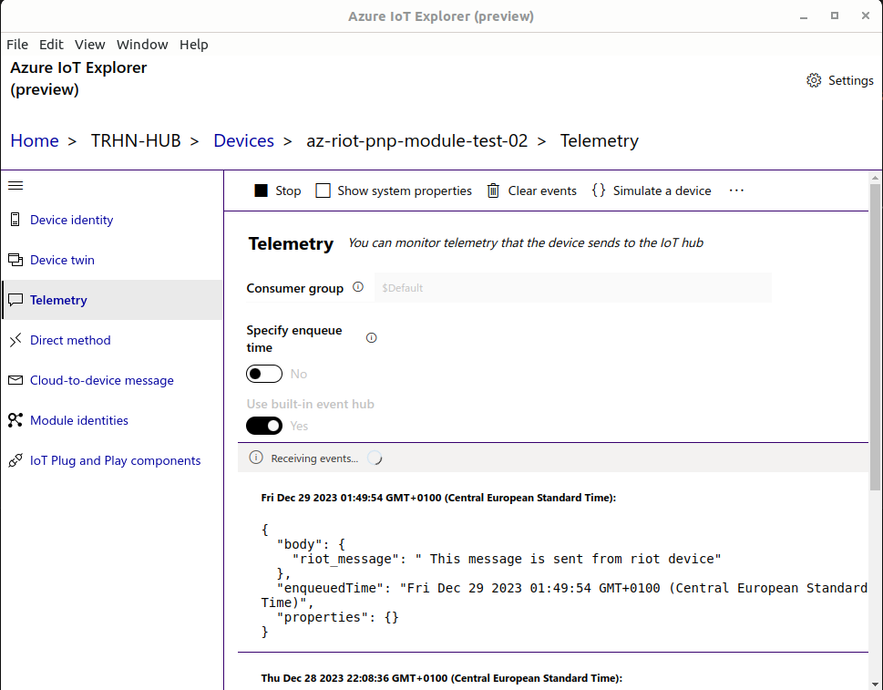
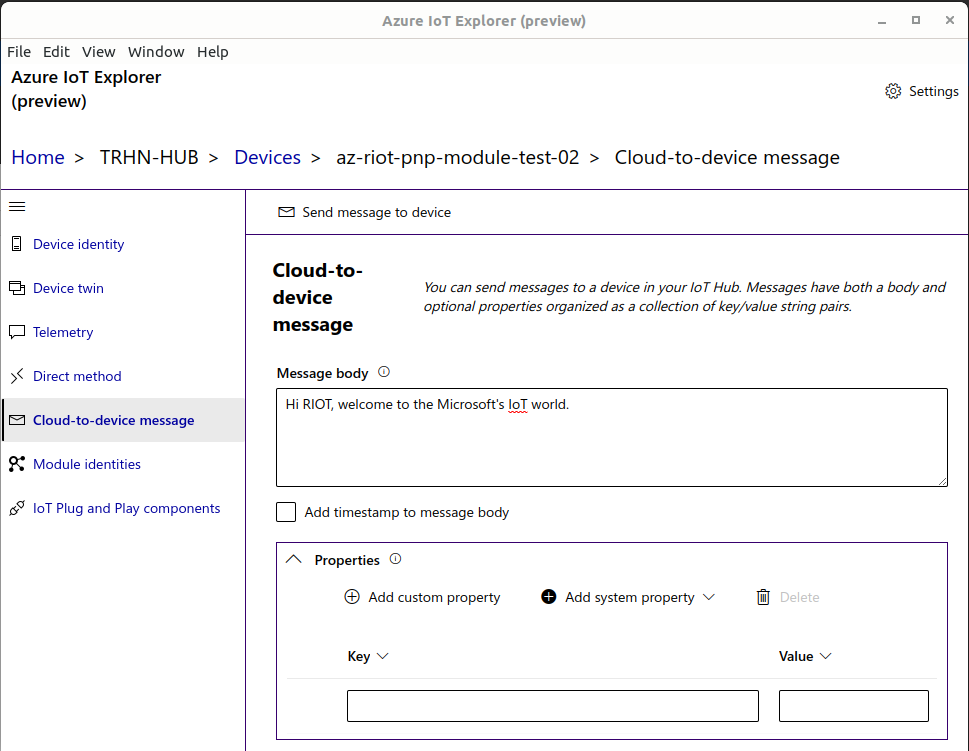
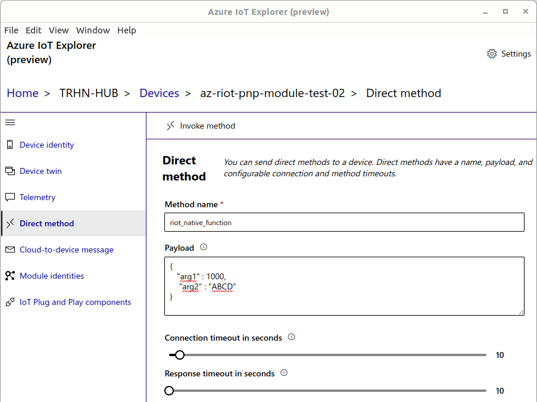
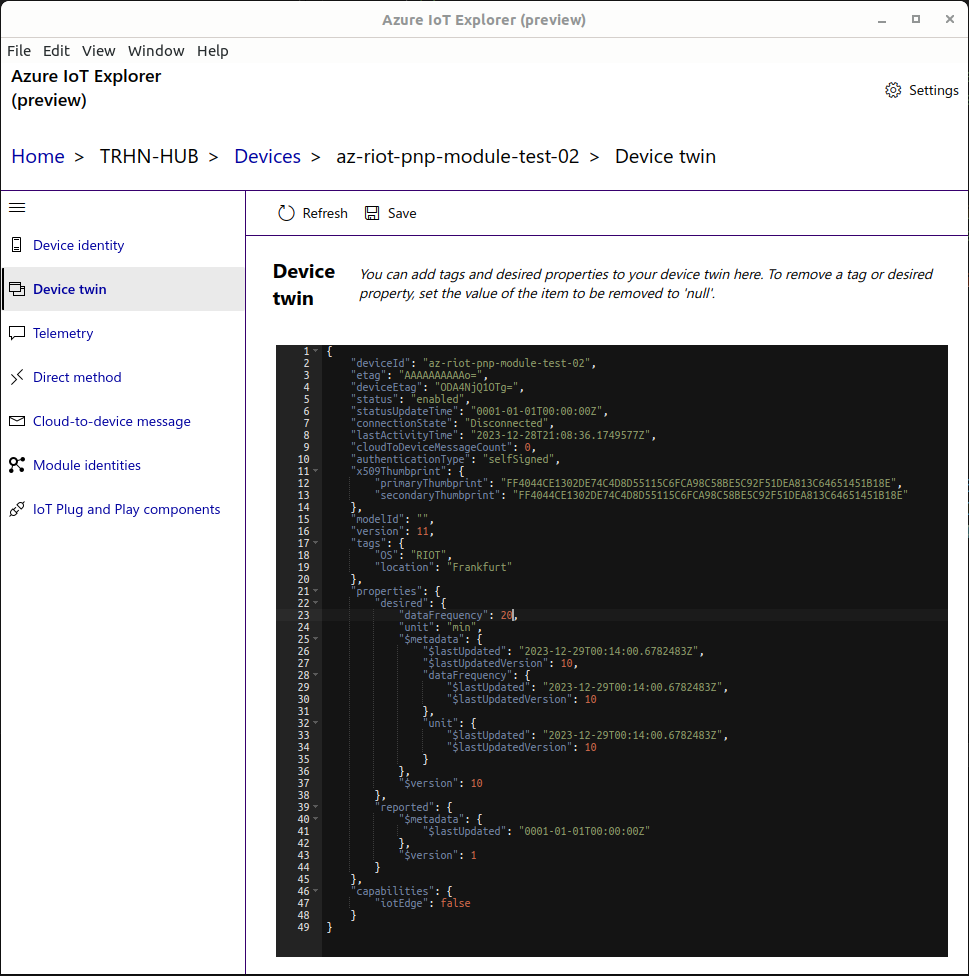
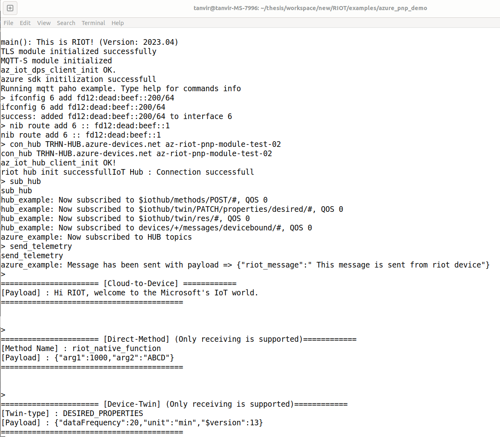

## Software to install
Download and install ``Azure IoT explorer`` to test the IoT Hub part. It is also available for Linux, can be downloaded from [Azure IoT explorer](https://github.com/Azure/azure-iot-explorer/releases). 
Once the ``Azure IoT explorer`` is installed, add a connection to the IoT Hub usign the connection string of the instance in Azure portal. Optionaly, conneting to DPS is also possible. 
Opening ``Azure IoT explorer`` then selecting the IoT hub connection will list all the devices are registered with the IoT Hub.  
Select device when you are trying to send or receive messages for example D2C or C2D.

## Pre-Configuration
### Azure configuration
If Azure portal setup is not done yet, please see the [Azure Portal README](./docs/Readme.md).

### NAT64 and DNS64 configuration
Here is a nice document by Professor Oliver Hahm [NAT64 Configuration](https://teaching.dahahm.de/riot/2023/09/29/RIOT_GNRC_ipv4.html)

### Obtain IP
DNS64 currently is not configured from RIOT. Therefore, NAT64 IP of corresponding service enpoint have to be retrived manually.
Following is the example used in the example

global.azure-devices-provisioning.net    64:ff9b::3374:91ca 
TRHN-HUB.azure-devices.net    64:ff9b::2871:b0b5

#### optional :
    IP can be obtained using ``dig TRHN-HUB.azure-devices.net +short  AAAA @2001:4860:4860::64`` where the IP of the DNS64 has to be specified.

### Generating certificate
This project offers a set of tools to generate certificates. 
1. open the script file ``/tools/certificate_tools/az_gen_cert.sh``, change the ``DeviceID`` to whatever device ID you prefer.
It will generate a root CA, intermediate CA, and a device certificate. It will also generate the device certificate chain which is needed for this demo.
The device certificate chain and the device private key will be stored in the certificate and the private directory.
2. Check the appropiate permissions for the files and move ``device certificate chain`` and the ``device private key`` to the certificates folder of this application.
3. Along with this two files, take the global digi cert CA from the applications certificate directory.
4. see the application make file and add the paths to your certificates.
5. If you need proof-of-possion, use the ``/tools/certificate_tools/verify_az_cert_gen.sh``. Open the file and change the Verification code to that you have got from Azure portal.
    Executing this command will generate a verification certificate in ``/tools/certificate_tools/certificate``. The code will be part of the name of the verification certificate.
    Please check the file permissions of the certificate and the upload it to Azure if you need Proof-of-possesion.

### Modify make file
1. along with the certificates, update ``AZ_RIOT_DPS_REGISTRATION_ID`` to the device ID you have chosen for device certificate.
    ``AZ_RIOT_DPS_IDSCOPE`` to the ID scope of your DPS.
2. Please don't forget to specify certificate location.

# Testing
### Running az_pnp_demo application
1. first run ``/tools/network_config.sh``, it will create one tap interface and set an ip``fec0:affe::1`` to tapbr0.
2. Running the applicaiton with ``sudo PORT=tap0 make all term`` 
                then check the interface number with ``ifconfig`` 
                then set ip with ``ifconfig 6 add fd12:dead:beef::200/64`` please change the interface 6 to the one got from  
                then set ip with ``nib route add 6 :: fd12:dead:beef::1`` according to NAT64 
                now ``ping 64:ff9b::3374:91ca`` test the reachability of NAT64 IP 

## Using Device Provisioning Service (DPS)
 > *Warning:* Since DNS64 is not working now, put the NAT64 IP of DPS in ``($RIOT_BASE)/modules/gnrc_wolfssl_tls/gnrc_wolfssl_tlc.c`` in function ``tcp_connect`` replace remoteIP variable before you run the application. Currently the IP is hard-coded. DNS has to perform here to dynamic retrival of IP in future.
2. Once the application is compiled and running. Use ``con_dps`` command to connect to DPS.
3. Once connected, use ``sub_dps`` command to subscribe DPS topics.
4. Use ``reg_device`` command to provision this device. It will reply with a operation ID when status is assigning.
5. Copy the ``operation_id`` then use ``query`` command with the ``operation_id`` as parameter. It will reply with the detail of the IoT Hub that has been assigned.
    Additionaly, the ``device_id`` that has been assigned to this device.
6. Copy the IoT Hub address and the device ID. In this example, IoT hub address is ``TRHN-HUB.azure-devices.net`` and device id is ``az-riot-pnp-module-test-02``.
7. Check the IoT Hub in the portal in the ``Devices`` section to confirm the device registration.
8. An example from RIOT console. 
      

### state
    ## RIOT device is successfully provisioned using x509 certificate

## Using IoT Hub

 > *Warning:* Again, since DNS64 is not configured, put the NAT64 IP of IoT Hub in ``($RIOT_BASE)/modules/gnrc_wolfssl_tls/gnrc_wolfssl_tlc.c`` in function ``tcp_connect`` replace remoteIP variable. Then run the application again and follow the IP setup.

1. Once the application is compiled and running. Do not forget to set IPs as shown earlier.
2. Use ``con_hub`` command to connect to IoT Hub with the hub address and device ID. For example, ``con_hub TRHN-HUB.azure-devices.net az-riot-pnp-module-test-02``
    Remember regardless of this addres the connection will use the IP in ``($RIOT_BASE)/modules/gnrc_wolfssl_tls/gnrc_wolfssl_tlc.c`` in function ``tcp_connect`` , as DN64 is not working now.
3. Once connected, use ``sub_hub`` command to subscribe IoT Hub topics.
4. Open ``Azure IoT explorer`` to test the IoT Hub part and navigate to the device that the application is working with.
    In the Telemetry section, start receiving the telemetry by pressing the start button. 
      
5. Send telemetry using ``send_telemetry`` command. Check ``Azure IoT explorer``, it should show the message sent from RIOT see the image above.
6. From ``Azure IoT explorer`` send Cloud-to-Device (C2D) message. and check the RIOT terminal for the message arrival. 
      
7. From ``Azure IoT explorer`` Invoke a direct method and check the RIOT terminal for message arrival. 
    
8. From ``Azure IoT explorer`` update the device twin and save it. Check the RIOT terminal for message arrival. 
      
9. The RIOT terminal should show something similiar to the following: 
      

### state
    ## RIOT device fully supports D2C, and C2D messages. And partially supports "Direct method" and "Device Twin" (Only receiving is supported right now)
