# Setting up Azure IoT Hub and DPS

## Creating Resource Group
 
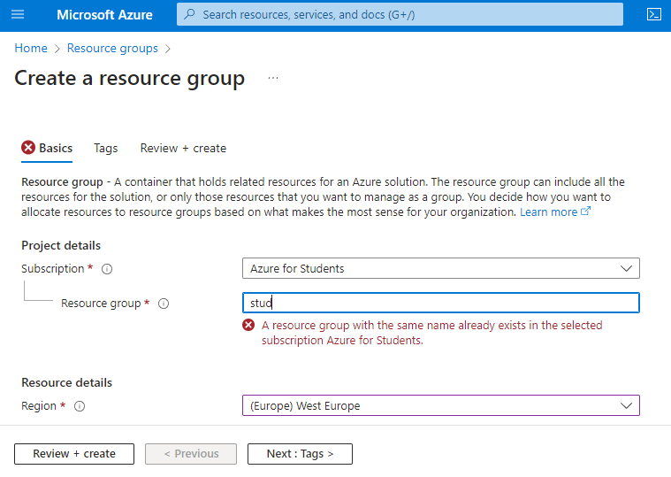  

## Creating IoT Hub
1. Basic setup 
 
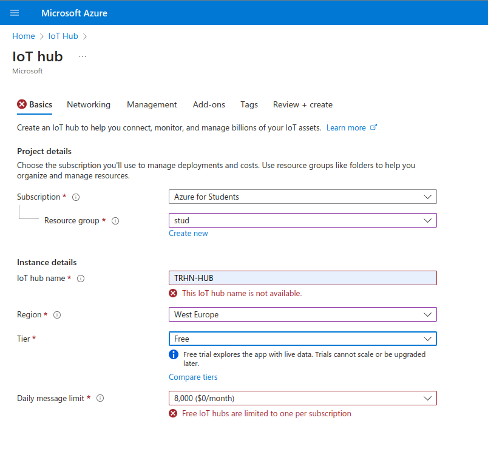  
2. Networking
 
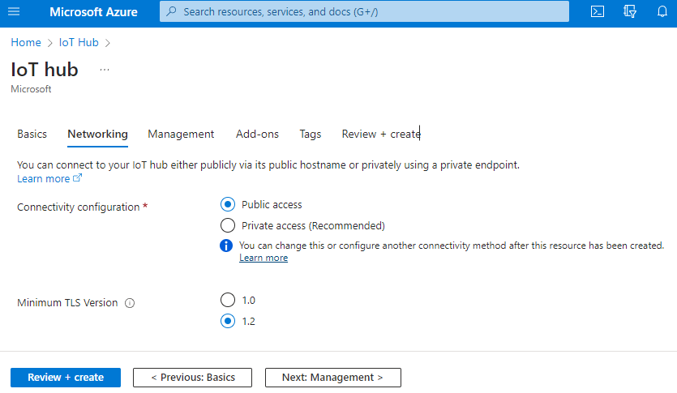  
3. Managements
 
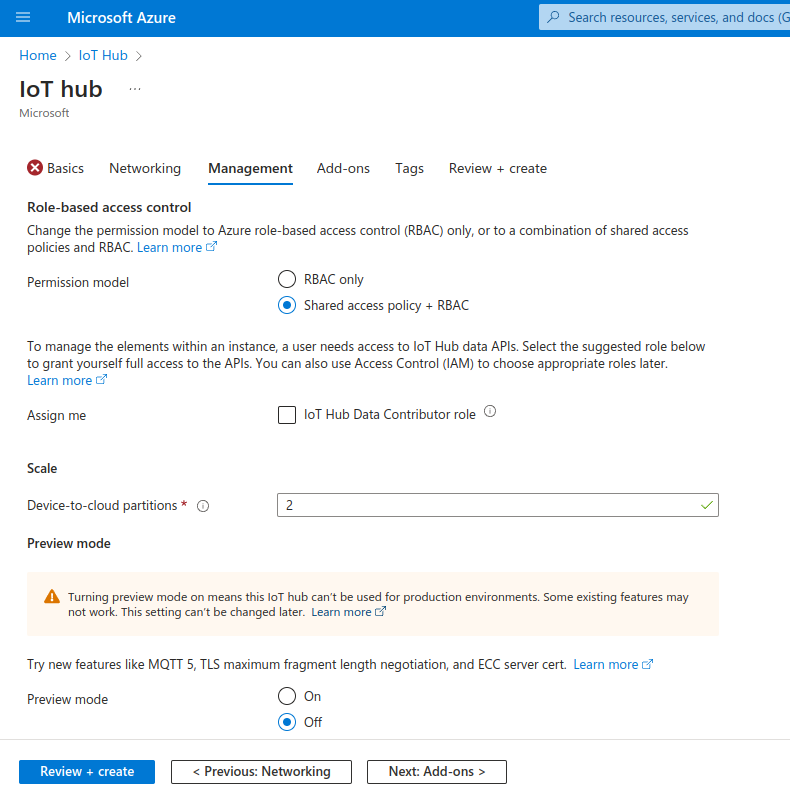  
4. Once successfully created, and overview page will be presented as following
 
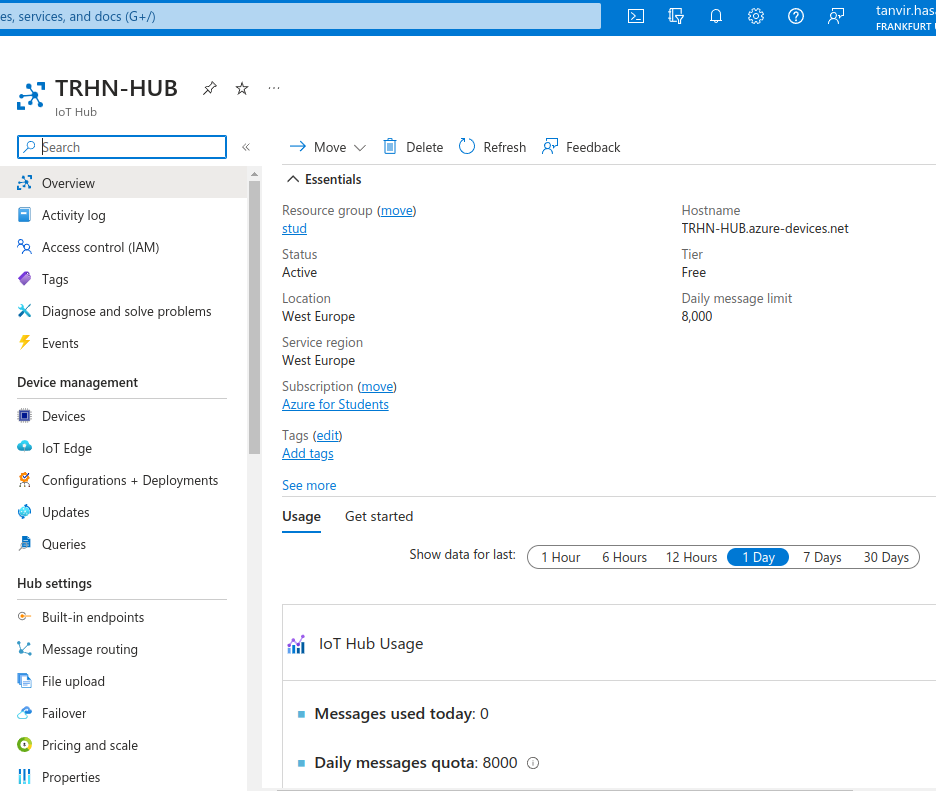  

## Creating DPS

1. Basic setup
 
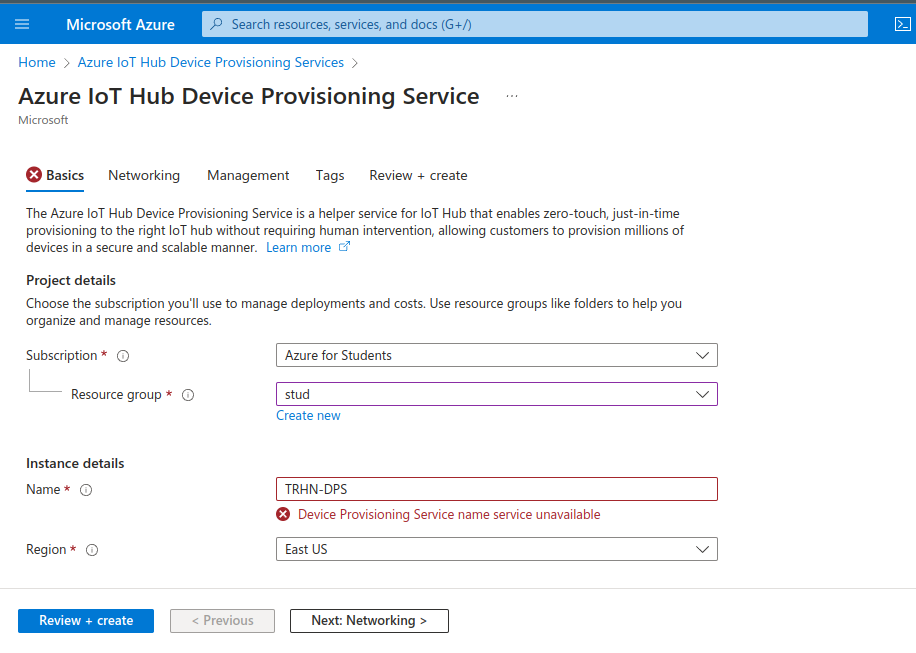  

2. Networking
 
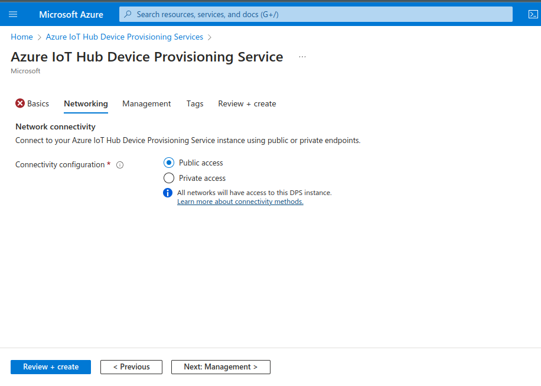  

3. Managements
 
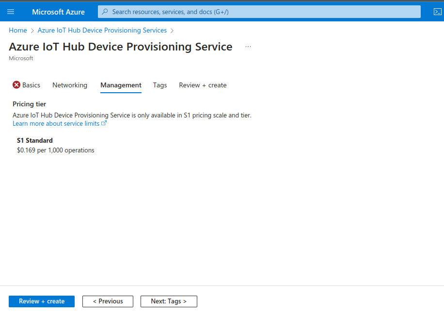  

4. Once successfully created, an overview page will be shown as the following
 
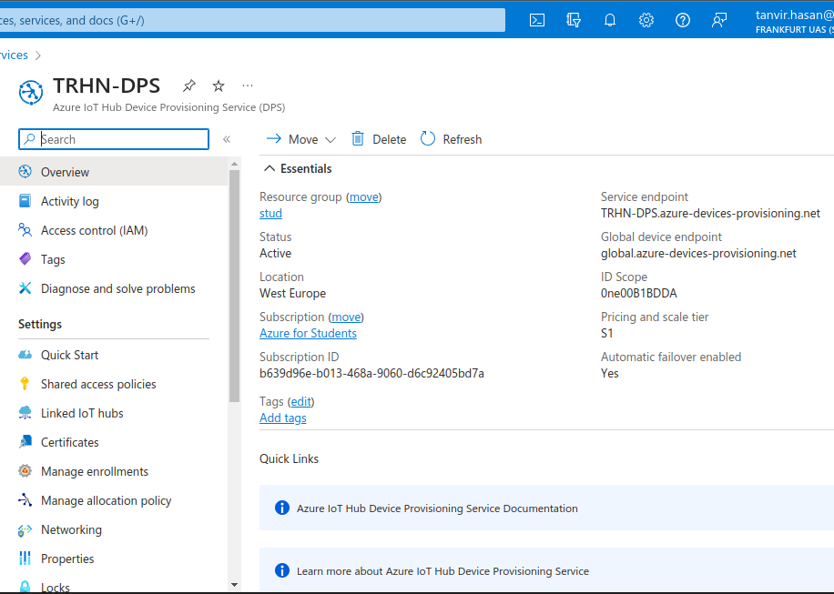  

### Uploading self-signed root CA generated by the script
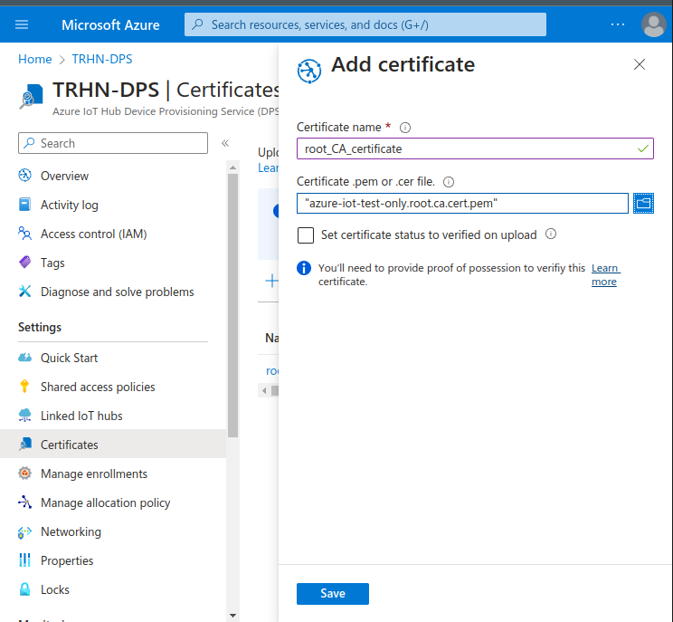  

### Uploading verification certificate for Proof-of-possesion 
Use the verification script with the verification code, it will generate a verification certificate. 
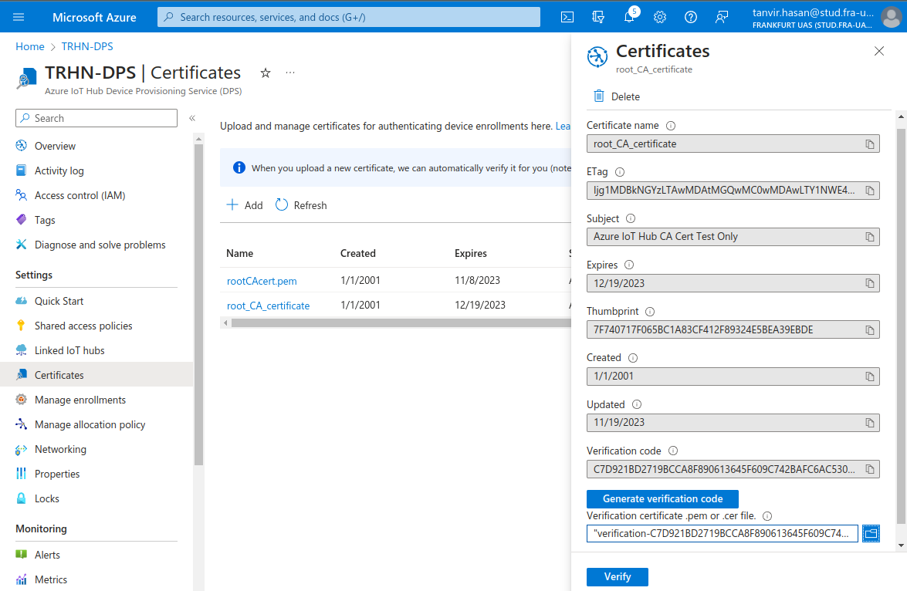  

## Creating enrollment group

1. Adding a new enrollment group
 
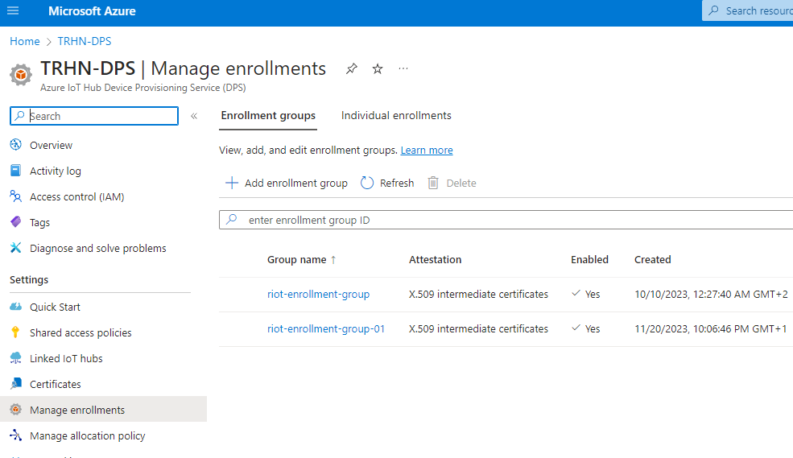  
2. Configuring attestation mechanism, upload the intermediate certificate here
 
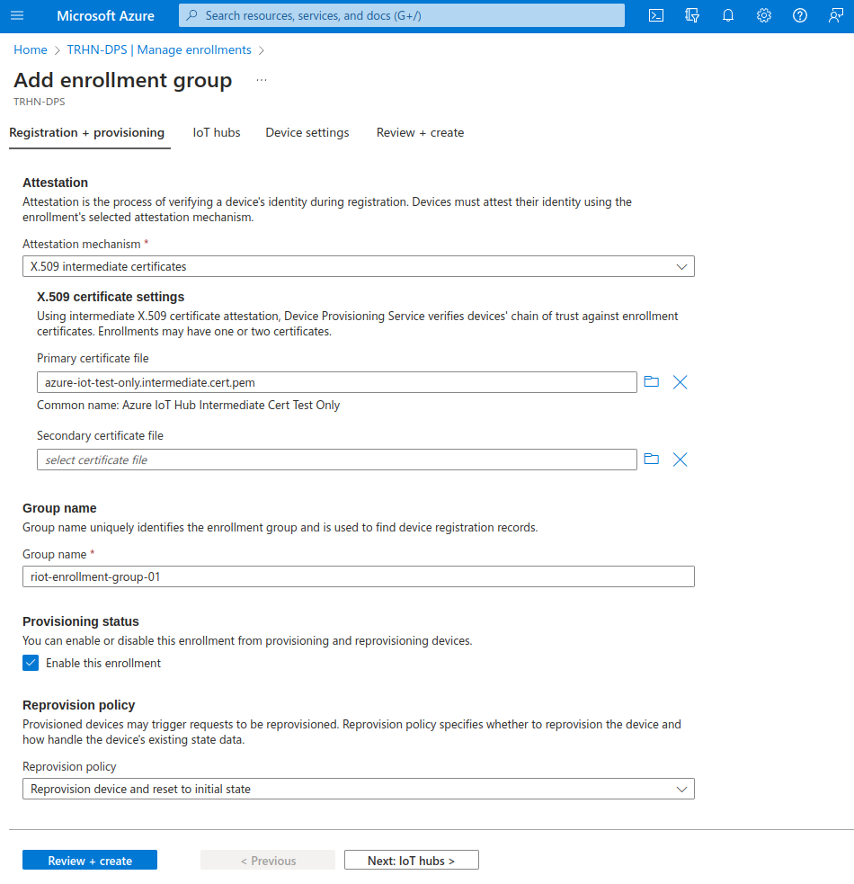  
3. IoT Hub assignment
 
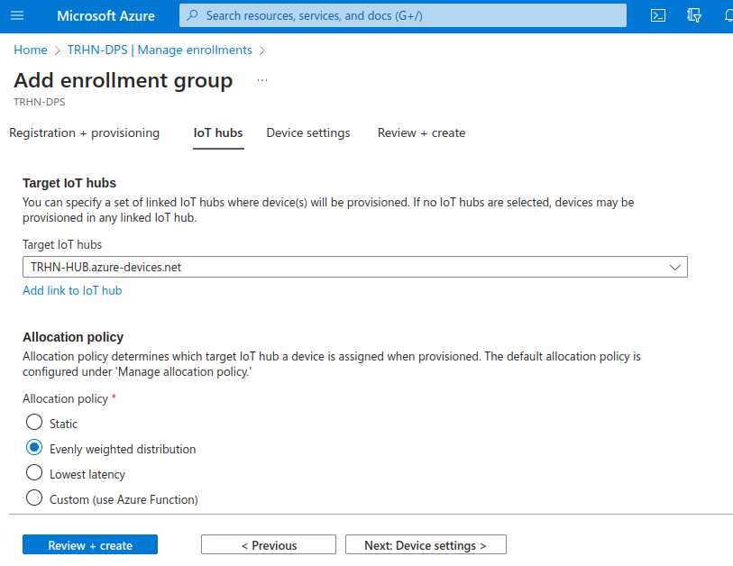  
4. Optional Device Twin (DTw)
 
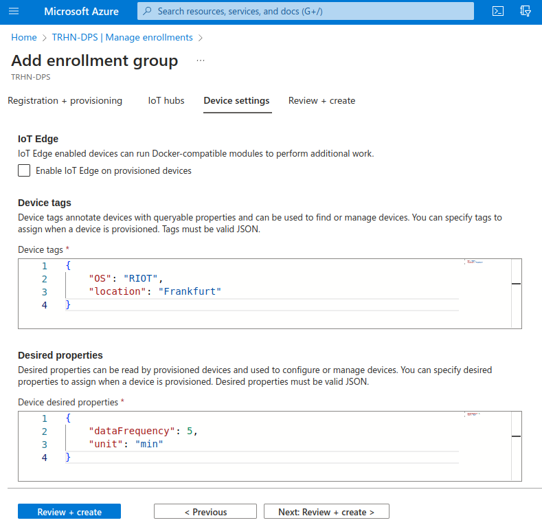  
5. Once successfully created all the enrollments groups will be listed in the `Manage enrollments` section.
