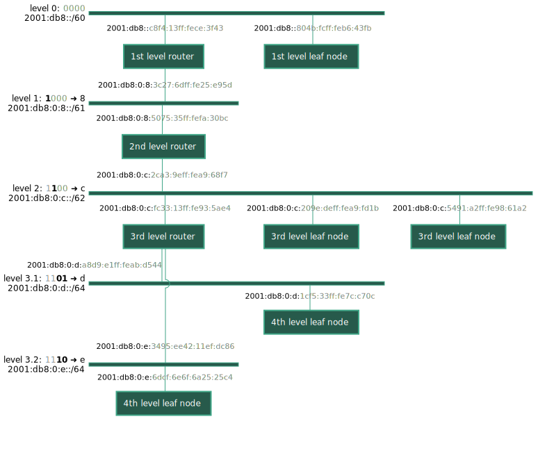

# Auto-configuration for nested subnets on a (simple) tree topology

This example demonstrates IPv6 subnet auto-configuration for networks on a
tree topology.

This allows to connect multiple links with individual subnets and route
between them.
Each link can have an arbitrary number of hosts, but there can be only
a single router on each link.
Routers can have multiple interfaces to connect different downlinks.

## Setup on native

To simulate such a network on `native` a `setup_taps.sh` script is provided that
will create TAP interfaces and bridges.
Each bridge will be it's own subnet and `native` instances will act as routers
to route between them.
The setup script will also start `radvd` to advertise a large prefix that allows
for sub-division by RIOT.

The interfaces that should be created are specified in the `tapology.txt` file.

Each router will have (at least) two interfaces that should be on different
bridges.

To start the first router, run

    make term PORT="tap_a0 tap_b1"

This will route between the `tap_a0` interface on `br0` and the `tap_b1`
interface on `br1`.
Start more `native` instances to simulate a cascading tree network:

    make term PORT="tap_b0 tap_c1"
    make term PORT="tap_c0 tap_d1"
    …

It is also possible to connect non-routing leaf nodes with a single interface:

    make flash term LEAF=1 PORT=tap_b2

## Setup on hardware

On physical hardware the setup will be the same.
Routing nodes need at least two interfaces between which they can route.
For a simple setup, you can use `ethos` or `slipdev` to turn any UART into
a network interface. (If you need to use DHCPv6 IA_PD for obtaining a prefix,
use `slipdev_l2addr` instead of plain `slipdev`)

### Obtaining the prefix

#### Via router advertisements

Usually routers are configured to advertise a /64 prefix that can not be divided
further when using SLAAC.
If you can configure your router to advertise a larger prefix instead, this
will be the easiest solution.

#### Via DHCPv6

If you can't change the configuration of your router, but your router supports
DHCPv6 IA_PD, you can use this to request a larger prefix.

This requires a gateway node that uses the `gnrc_dhcpv6_client_simple_pd`
module *instead* of `gnrc_ipv6_auto_subnets`.

Make sure to set the `CONFIG_GNRC_DHCPV6_CLIENT_6LBR_UPSTREAM` option to the
ID of the upstream interface on the gateway device, e.g.

    CFLAGS += -DCONFIG_GNRC_DHCPV6_CLIENT_6LBR_UPSTREAM=6

As with GNRC the interface ID is based on the PID of the interface thread, this can
change if you add modules / threads and is a common source of errors.
If the configuration is set wrong, you will not get a prefix for the downstream
interface(s).
