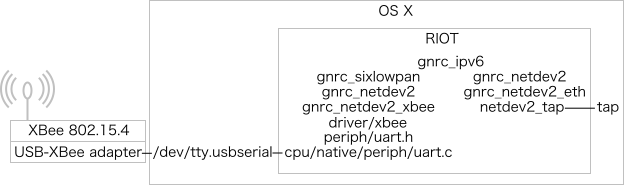
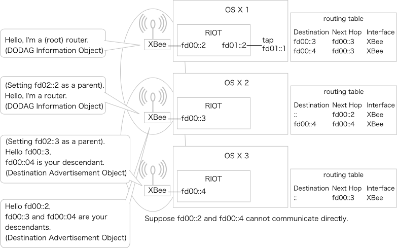

# gnrc_xbee_border_router example

## Requirements

In order to setup a 6LoWPAN border router with XBee 802.15.4 on RIOT, you need a
board that offers an IPv6 capable network interface (e.g. the `encx24j600`
Ethernet chip) in addition to XBee. The example application in this folder
assumes as a default to be run on an native platform using tap interface for
ethernet and serial port (/dev/tty*) for communicating with XBee. However, it is
feasible to run the example on any RIOT supported platform that is be equipped
with an IPv6 capable network device. In this case, specify the target platform
as `make BOARD=myplatform`.

If XBee is connected to a UART port other than 0, change `XBEE_PARAM_UART`
variable in the Makefile. If the baudrate is other than 9600, change
`XBEE_PARAM_BR`.

## Running

### OS X

Tips: You may need GNU binutils to build RIOT on OS X.
You may need to set PATH to binutils installation directory manually.

#### Scenario 1, getting started.

1. Install [TunTap] (http://tuntaposx.sourceforge.net/).
2. `sudo ./bin/native/gnrc_xbee_border_router.elf tap0 -c /dev/tty.usbserial-00000000`,
   where `/dev/tty.usbserial-00000000` is replaced with your device file.
3. In RIOT: `ifconfig`.
   You will see two interfaces: one for wireless (XBee) and one for wired
   (ethernet). If not, check `xbee_params.h` for baudrate.
4. In RIOT: `ifconfig 6 add unicast fd00::2/64`, where 6 is replaced with
   the ID of the wireless interface.
5. In RIOT: `ifconfig 7 add unicast fd01::2/64`, where 7 is replaced with
   the ID of the wired interface.
6. On OS X, `sudo ifconfig tap0 inet6 fd01::1/64 up`.
   Now tap0 has `fd01::1` on OS X, `fd01::2` on RIOT.
7. Optionally, on OS X, `ping6 fd01::2%tap0`.
   You will see responces from RIOT.
8. On OS X, `sudo route -n add -inet6 -prefixlen 64 fd00:: fd01::2`.
9. Optionally, on OS X, `ping6 fd00::3`.
   RIOT searches `fd00::3` over XBee, so you will see LEDs on your USB-serial
   adapter, if present,  blinking.

Note neighbor soliciation for 6LoWPAN violates RFC 6775 (Neighbor Discovery
Optimization for 6LoWPAN) Section 5.1, which prohibits multicasting of neighbor
solicitation, so that this behavior may be fixed on future version of RIOT.

#### Scenario 2, TCP/IPv6 over XBee between two OS Xs

Suppose we have two OS Xs, `OS X 1` and `OS X 2`, with XBees connected.

1. `sudo ./bin/native/gnrc_xbee_border_router.elf tap0 -c /dev/tty.usbserial-00000000` on both OS X.
2. In RIOT 1: `ifconfig 6 add unicast fd00::2/64`, where 6 is replaced with
   the ID of the wireless interface.
3. In RIOT 1: `ifconfig 7 add unicast fd01::2/64`, where 7 is replaced with
   the ID of the wired interface.
4. In RIOT 1: `fibroute add fd01::1 via fd01::1 dev 7`, where 7 is replaced with
   the ID of the wired interface.
5. On OS X 1, `sudo ifconfig tap0 inet6 fd01::1/64 up`.
   Now tap0 has `fd01::1` on OS X 1, `fd01::2` on RIOT 1.
6. On OS X 1, `sudo route -n add -inet6 -prefixlen 64 fd00:: fd01::2`.
7. On OS X 1, `sudo route -n add -inet6 -prefixlen 64 fd02:: fd01::2`.
8. In RIOT 2: `ifconfig 6 add unicast fd00::3/64`, where 6 is replaced with
   the ID of the wireless interface.
9. In RIOT 2: `ifconfig 7 add unicast fd02::2/64`, where 7 is replaced with
   the ID of the wired interface.
10. In RIOT 2: `fibroute add fd02::1 via fd02::1 dev 7`, where 7 is replaced
    with the ID of the wired interface.
11. On OS X 2, `sudo ifconfig tap0 inet6 fd02::1/64 up`.
    Now tap0 has `fd02::1` on OS X 2, `fd02::2` on RIOT 2.
12. On OS X 2, `sudo route -n add -inet6 -prefixlen 64 fd00:: fd02::2`.
13. On OS X 2, `sudo route -n add -inet6 -prefixlen 64 fd01:: fd02::2`.
14. On OS X 2, `nc -6 -l 8888`.
15. On OS X 1, `nc -6 fd02::1 8888`.
16. On OS X 1, type some lines on the terminal. The lines will appear on OS X 2.
17. On OS X 2, type some lines on the terminal. The lines will appear on OS X 1.

#### Scenario 3, routing on DAG network.

Suppose we have three OS Xs, `OS X 1`, `OS X 2`, and `OS X 3`, with XBees
connected. `OS X 1` can communicate with `OS X 2` and `OS X 2` can communicate
with `OS X 3` but `OS X 1` cannot communicate with `OS X 3` directly.  Uncomment
`CFLAGS += "XBEE_DENIED_ADDRESSES={...}` in Makefile to emulate such network.

1. On OS X 1, `sudo ./bin/native/gnrc_xbee_border_router.elf tap0 -c /dev/tty.usbserial-00000000`.
2. On OS X 2 and 3, goto `examples/gnrc_xbee_router` directory, then
   `sudo ./bin/native/gnrc_xbee_router.elf -c /dev/tty.usbserial-00000000`.
3. In RIOT 1: `ifconfig 6 add unicast fd00::2/64`, where 6 is replaced with
   the ID of the wireless interface.
4. In RIOT 1: `ifconfig 7 add unicast fd01::2/64`, where 7 is replaced with
   the ID of the wired interface.
5. In RIOT 1: `rpl init 6`, where 6 is replaced with the ID of the wireless
   interface.
6. In RIOT 1: `rpl root 0 fd00::2`. Now RIOT 1 is the root node.
7. In RIOT 2: `rpl init 6`.
8. In RIOT 2: `rpl`. Wait until `instance table:	[X]`.
9. In RIOT 2: `rpl router 0`. Now RIOT 2 is a router.
10. In RIOT 3: `rpl init 6`.
11. In RIOT 3: `rpl`. Wait until `instance table:	[X]`.
12. In RIOT 3: `rpl leaf 0`. Now RIOT 3 is a leaf.
13. In RIOT 3: `ifconfig`. You should see an address with `fd00::` prefix is
    configured automatically.
14. In RIOT 3: `ping6 fd00::2`.
15. In RIOT 1: `ping6 fd00::4`, where `fd00::4` is replaced with the address of
    RIOT 3.
16. Optionally, see `rpl`, `fibroute`, `ncache`,  and `routers` in each RIOTs.

### Linux

TODO

See also the `gnrc_networking` example for general networking example.
