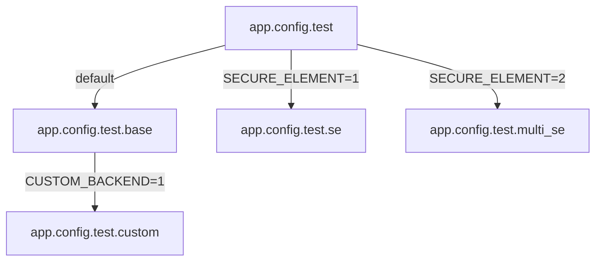

# Example Applications for PSA Crypto
This example application is supposed to show two things:
1. How to use basic functions of the PSA Crypto API
2. How to configure the implementation with Kconfig dependency resolution vs. Make dependency resolution

## Basic usage of PSA Crypto
There are three example operations:
- AES 128 CBC
- HMAC SHA256
- ECDSA with a P256 curve

Each comes in its own sourcefile called `example_<operation>.c`. To see which functions to call to perform each operations, please read the code.

The application measures the processing times of the example operations. The table below shows the expected runtime values
for software and hardware backends as well as secure elements, measured on the nRF52840dk (this is only to show the expected difference, values will differ on other platforms).

| Operations  | Backends       | Runtime \[us\]   |
|-------------|----------------|------------------|
| HMAC SHA256 | CryptoCell 310 | 282              |
|             | RIOT Hashes    | 468              |
|             | ATECC608A      | 56376            |
| AES 128 CBC | CryptoCell 310 | 140              |
|             | RIOT Cipher    | 295              |
|             | ATECC608A      | 68819            |
| ECDSA P256  | CryptoCell 310 | 60931            |
|             | Micro-ECC      | 522424           |
|             | ATECC608A      | 285542           |

## Configuration of the API
There are two ways to configure the API: module selection via Kconfig and module selection
via Makefiles.

To see which modules should be chosen for each configuration, please read the Makefile and
the `app.config.test.*` files.

### Kconfig
> **NOTE:** In this application all the configurations are in separate app.config files
> for demonstration purposes. You can also write all configs into one file or choose them
> via `menuconfig`.
> To access the GUI, run `TEST_KCONFIG=1 BOARD=<your board> make menuconfig`.

When building the application with the `TEST_KCONFIG=1` option, the first config file parsed by the build system is `app.config.test`. This selects the PSA Crypto module and other modules our application needs (e.g. ztimer). If you need cryptographic keys, you can specify the number of key slots needed for key storage (the default is set to 5).
The graph below shows how the `app.config` files in this application are included.
Selections in `app.config.test` are always applied.
The others are only added, if you specify the corresponding build option.

If you build this without specifying anything else, the symbols in `app.config.test.base`
are added and PSA Crypto will automatically choose a default crypto backend depending on the platform you're building for.
For example when your platform is `native`, software implementations are built.
When you specify `BOARD=nrf52840dk`, the hardware accelerator of the board will be built.

If you want to force a custom backend, you can specify that in the Kconfig file. This application already contains the configuration for a custom backend (see `app.config.test.custom`), which will be added to the application build when you define `CUSTOM_BACKEND=1`.

Instead of or in addition to the default and custom implementations you can use a secure element as a backend (see Section [Using Secure Elements](#using-secure-elements]).
Secure elements are independent of the other backends. In this application, when you
choose secure elements, they are built instead of the other backends.

Please note that the build options `CUSTOM_BACKEND` and `SECURE_ELEMENT` only apply to this specific application and have nothing to do with the PSA implementation.

### Make
All the configurations in the Kconfig files can also be applied using Make dependency resolution. The Makefile contains all the modules that must be selected when building the different configurations.
They can all be built as described above, but *without* defining TEST_KCONFIG.

To prevent conflicts when building this application multiple times with different backends, it is best to remove the `bin` directory in between builds.

## Using Secure Elements
> **NOTE:**
> Currently this implementation only supports Microchip ATECCX08A devices. Those devices need to be configured and locked to be able to correctly use them.
> This implementation assumes that you have done that and that you know your device's configuration.

You can build this app either with one secure element or two secure elements (`SECURE_ELEMENT=1` or `SECURE_ELEMENT=2`). To be able to use your device, make sure, you've completed the following procedure.

In the application folder you can find a file called `custom_atca_params.h`, which overwrites the device parameters in `atca_params.h` in the cryptoauthlib package folder.
To use more than one secure element, you need to specify device parameters for both of them.
This application assumes that you connect two devices with different I2C addresses on the same I2C bus.
Alternatively you can connect two devices with the same address on separate buses.
You can modify `custom_atca_params.h` according to your device configurations and requirements.

For PSA Crypto, you also need to define a location value. Here these are defined as `PSA_ATCA_LOCATION_DEV0` and `PSA_ATCA_LOCATION_DEV1`. They can be any value between `PSA_KEY_LOCATION_SE_MIN` and `PSA_KEY_LOCATION_SE_MAX`.
A special value is `PSA_KEY_LOCATION_PRIMARY_SECURE_ELEMENT`, which can be used when only one secure element is needed.

Below the `ATCA_PARAMS` definitions, you can see the slot configurations.
Here you need to specify for each connected secure element what kind of key can be stored in which slot, and whether a slot is already occupied. The structure is declared in `pkg/cryptoauthlib/include/atca.h` and contains the following elements:
1. `key_type_allowed` (takes `psa_key_type_t`)
2. `key_persistent` (is 0, can be ignored for now, since PSA does not yet support persistent storage)
3. `slot_occupied` (should be 0 at start up, PSA will use this to mark slots as occupied)

The list in `custom_atca_params.h` contains an example configuration. If your device configuration is not compatible, you'll need to change the values as necessary.
This is required, so the implementation can allocate free key slots and can generate and import new keys. If the device configuration does not match the values in the list or if your key slots are not writeable, you will get execution errors.

The current implementation does not support the use of keys that are already stored on the device.

## Note
If you need more information about the build options, please refer to the API documentation.
