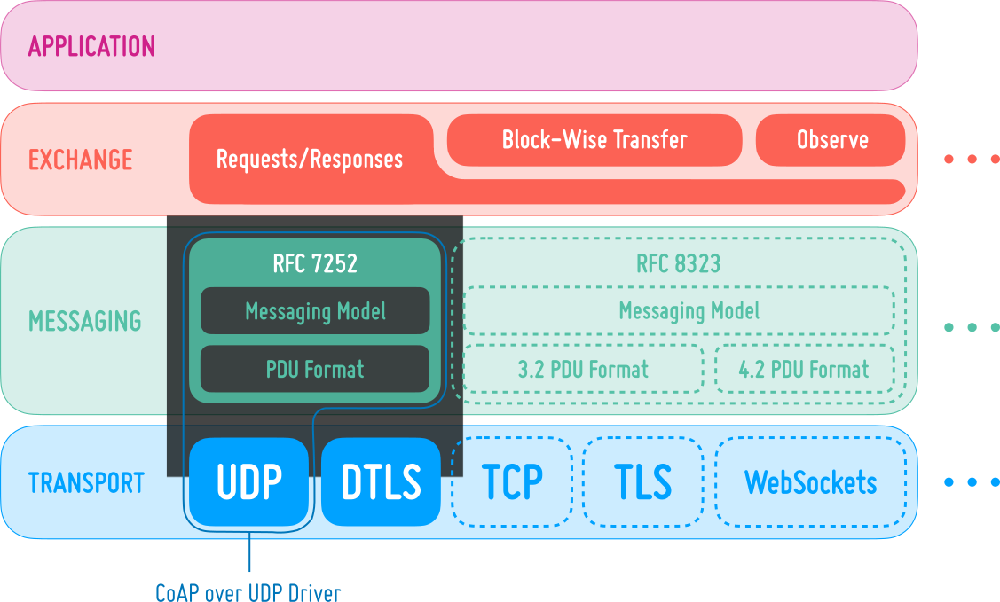
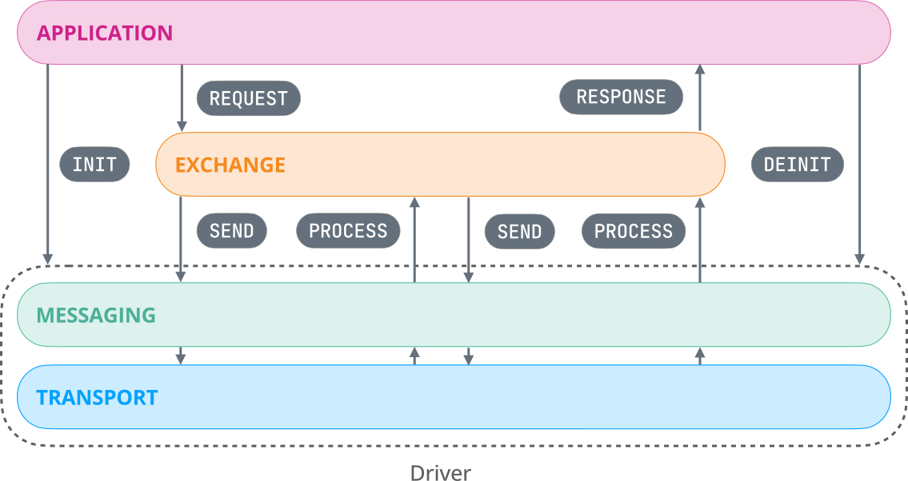
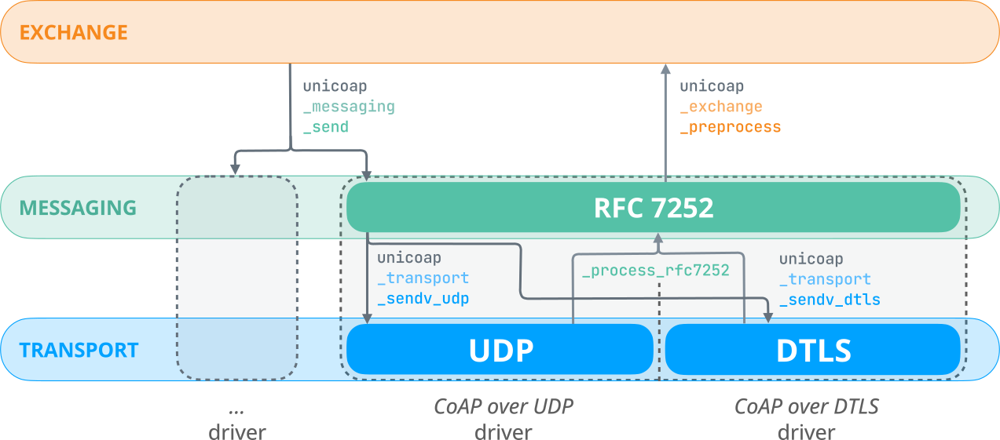

@defgroup net_unicoap_internal Behind The Scenes of unicoap
@ingroup net_unicoap
@{

## CoAP 101
CoAP was originally specified in [RFC 7252](https://datatracker.ietf.org/doc/html/rfc7252)
and could only be used in combination with UDP and DTLS as transport protocols.
[RFC 8223](https://datatracker.ietf.org/doc/html/rfc8323) modified the CoAP format
for sending CoAP messages over TCP, TLS, and WebSockets (including WebSockets over TLS).
There is also an Internet Draft for [CoAP over GATT (BLE)](https://datatracker.ietf.org/doc/draft-amsuess-core-coap-over-gatt).

Each of these standards leverage different messaging models, i.e., what timeouts to apply, how
reliable transmission is implemented, and what messages are allowed to be sent
in response to a certain message type. A custom CoAP PDU header (i.e., another PDU
format) has been specified for CoAP over reliable transports.
For instance, CoAP over UDP and over DTLS share the same PDU format; so do CoAP over TCP and TLS.
The set of protocol characteristics that vary depending on the _transport_ forms a specific version
of CoAP, which is called a _CoAP combination_ in `unicoap`.
For instance, CoAP over UDP is CoAP combination, so is CoAP over DTLS.

## Layered Design

The design of `unicoap` involves three distinct layers that reflect the layered approach of CoAP,
as shown in the figure below. Conceptually, newly received message traverse these layers up to
the application, and data sent by the application travels in the opposite direction.
Located beneath the application, the _exchange_ layer embodies the REST model of CoAP.
It is responsible for handling advanced CoAP features operating above the request-response exchanges,
such as [resource observation](/FIXME-upcoming-pr-net_unicoap_client_resource_observation)
and [block-wise transfer](/FIXME-upcoming-pr-net_unicoap_blockwise).
This layer is shared between CoAP combinations, i.e., the REST semantics remain the same,
regardless of the messaging model and transport beneath.
Since messaging differs between CoAP combinations, a modular design to ease the addition
of new CoAP combinations was necessary: The layer dedicated to _messaging_ covers framing and can
accommodate a custom reliability mechanism, such as the one specified in RFC 7252
(using the four tempers `CON`, `NON`, `ACK`, `RST`). Serializing messages and parsing PDUs received
from the network are also handled by the messaging layer.
The transport layer at the bottom manages different transport protocols.
Here, `unicoap` coordinates with the operating system networking interface.



### Overview of CoAP Combinations
To better illustrate what parts of the CoAP stack differ, have a look
at the following graph, where each node represents a version of a certain layer. Each leaf node stands for
a different CoAP combination ("CoAP over ...") specification.
```
                                  Requests/Responses
                             RFC 7252, RFC 7641, RFC 7959, ...
                (incl. Resource Observation, Block-Wise Transfers)
                             /                          \
                            /                            \
                           /                              \
Specification:          RFC 7252                       RFC 8323
                           |                               |
+-+- Messaging       shared between             largely shared between
| |  Model:            UDP & DTLS                TCP, TLS & WebSockets
| |                        |                       /                \
| |                        |                      /                  \
| +- PDU Format:    shared between         shared between         WebSockets
|                     UDP & DTLS             TCP & TLS             /     \
|                      /       \               /    \             /       \
|                     /         \             /      \           /         \
+-- Transport       UDP        DTLS          TCP     TLS    WebSockets  WebSockets
    Protocol:                                                           over TLS

Figure 2: Differences between CoAP combinations
```

#### CoAP over UDP and CoAP over DTLS (RFC 7252)
CoAP over UDP and DTLS works with messages of different types. A message can be confirmable (a `CON`
message), non-confirmable (`NON`), an acknowledgment message (`ACK`), or a reset message (`RST`).
Confirmable messages elicit an acknowledgement message to be sent by the peer. Hence, RFC 7252
provides optional reliability (i.e., retransmission using an exponential back-of mechanism)
using confirmable and acknowledgement messages.

@see [RFC 7252](https://datatracker.ietf.org/doc/html/rfc7252)

#### CoAP over TCP, CoAP over TLS, and CoAP over WebScokets (RFC 8323)
RFC 8323 eliminates the need for reliability to be implemented on the application layer, as the underlying
transport protocol already provides reliability. While message processing looks the same for both
CoAP over TCP/TLS ([RFC 8323, Section 3](https://datatracker.ietf.org/doc/html/rfc8323#section-3)) and
CoAP over WebSockets ([RFC 8323, Section 4](https://datatracker.ietf.org/doc/html/rfc8323#section-4)),
the PDU format employed *does* vary a little between them.

@see [RFC 8323](https://datatracker.ietf.org/doc/html/rfc8323)

#### CoAP over GATT over Bluetooth Low Energy (BLE) (IETF Draft)
The [CoAP over GATT (BLE)](https://datatracker.ietf.org/doc/draft-amsuess-core-coap-over-gatt)
messaging layer works entirely different from previously specified Constrained Application Protocol variants.
Hence, the PDU format is also custom and optimized to take as little space as possible to reduce airtime.

@see [`draft-amsuess-core-coap-over-gatt`](https://datatracker.ietf.org/doc/draft-amsuess-core-coap-over-gatt)

### Drivers

To integrate new CoAP combinations, functionality for messaging and transport layer must be added.
The `unicoap` design refers to these integrations collectively as a _driver_ that represents
a CoAP combination, such as CoAP over DTLS. Each driver is a RIOT module you can import. For instance,
to use the CoAP over UDP driver, you import the `unicoap_driver_udp` by adding it to the `USEMODULE`
Makefile variable: `USEMODULE += unicoap_driver_udp`.

Drivers themselves can in turn consist of a shared module for messaging and a specific transport
support module. For example, the CoAP over DTLS driver encompasses a transport module for DTLS networking;
and depends on the common RFC 7252 messaging module also employed by the CoAP over UDP driver.
You can see this relationship in `Makefile.dep` in the `unicoap` source directory: The common
messaging module is a shared dependency of both the @ref net_unicoap_drivers_udp and @ref net_unicoap_drivers_dtls.
driver module. We encourage you to follow the same approach for CoAP combinations that share a common
messaging model, such as CoAP over TCP, TLS, and WebSockets when implementing these.

On a high level, each driver interacts with the upper layers on these three occasions:

- **Initialization and deinitialization**:
  Drivers must provide an [initialization](/FIXME-upcoming-pr-unicoap_init) and [teardown](/FIXME-upcoming-pr-unicoap_deinit)
  These may be used for setup work in the transport and messaging layer such as for creating
  sockets or establishing connections to peripherals, alongside allocating objects required for messaging.

- **Sending side / Outbound**:
  A driver must expose a standardized API for [sending from the messaging layer](/FIXME-upcoming-pr-unicoap_messaging_send).
  The exchange layer will call into this functionality, prompting the driver to perform any due
  work in the messaging layer like attempting to retransmit the message. Apart from the message,
  as well as the remote and local endpoint, this function accepts flags that customize transmission
  behavior. The RFC 7252 message type is abstracted into a _reliability_ flag the messaging layer in
  the CoAP over UDP and DTLS drivers interpret as an instruction to send a confirmable message. When
  finished, the messaging layer serializes the message and forwards it to the transport
  implementation.

- **Receiving side / Inbound**:
  Upon receipt of a new message, each driver will need to invoke an [exchange-layer processing function](/FIXME-upcoming-pr-unicoap_exchange_process).

- **Ping**: Due to the variability in ping mechanisms (empty `CON` in CoAP over UDP and `7.03` message in CoAP over reliable transports), each driver can implement a ping function. unicoap bundles these APIs and provides a [single, generic ping function that multiplexes](/FIXME-upcoming-pr-unicoap_ping) between the driver implementations.

### Communication Between Layers

The following figure illustrates communication between layers in a block-wise transfer,
where a client request from the application may result in multiple
[`unicoap_messaging_send`](/FIXME-upcoming-pr-unicoap_messaging_send) and
[`unicoap_exchange_process`](/FIXME-upcoming-pr-unicoap_exchange_process) calls between the
exchange and messaging layer:



The next schematic depicts how these APIs are implemented, based on the CoAP over UDP and
CoAP over DTLS drivers that share the RFC 7252 messaging implementation:



Both the CoAP over UDP and CoAP over DTLS driver support sending vectored data, hence the `sendv`
suffixes in the function names depicted in the figure above.

## Adding a New Driver

In the `unicoap` codebase you will encounter several marks (`MARK: ...`)
that help with extending the suite.

- **MARK: unicoap_driver_extension_point**: Every region of code that would need to be extended to support a new transport protocol or driver is
  annotated with this mark.

@}
