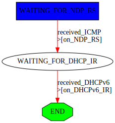

# `gnrc_dhcpv6_client_stateless` test

This test utilizes [scapy] to test the DHCPv6 client configuration for
stateless DHCP.

The protocol procedure is modelled using a scapy [Automaton] by first waiting for an
NDP Router Solicitation (RS) which is replied to with an NDP Router Advertisement (RA).
The RA contains a set O-bit which indicates that additional information can be acquired by sending
a DHCPv6 Information Request (IR). The Automaton now waits for an IR, expects it to contain a
number of options, and sends a DHCPv6 Reply back to the client.
After this procedure is completed, a check for a correctly assigned global IP address (from the RA
using SLAAC) is performed. If this final assertion is correct, the test succeeds.

The procedure is visualized in the following graph:



To test, compile and flash the application to any board of your liking (since
`ethos` is used to communicate with non-native boards it really doesn't matter
as long as the application fits).

```
make flash
```

And run the tests using

```
sudo make test-as-root
```

Note that root privileges are required since `scapy` needs to construct Ethernet
frames to properly communicate over the TAP interface.

The test succeeds if you see the string `SUCCESS`.

If any problems are encountered (i.e. if the test prints the string `FAILED`),
set the echo parameter in the `run()` function at the bottom of the test script
(tests-as-root/01-run.py) to `True`. The test script will then offer a more detailed
output.

[scapy]: https://scapy.readthedocs.io/en/latest/
[Automaton]: https://scapy.readthedocs.io/en/latest/api/scapy.automaton.html
