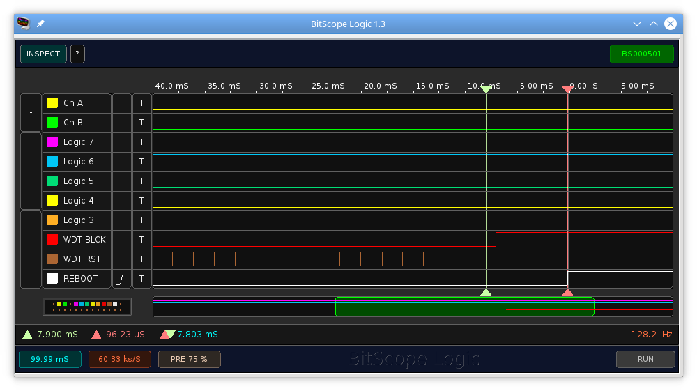

tests/wdt
=========

This application is a test for the watchdog timer (WDT) functionality. It allows
the initialization with custom parameters, enabling and disabling the WDT and
block the WDT reset on the command line.
In addition, the WDT timing can be measured externally (e.g. with an logic
analyzer) on three GPIO pins defined in the makefile.

Usage
=====

WDT Functionality
-----------------
The test program provides the shell command _wdt_ for testing the WDT
functionality with the following sub commands:
1. _[init|init_min|init_max|init_exact] [<t_wdt>] [<t_reset>]_: initializes the
  WDT (without starting)
    * _init*_
      * _init_ and _init_min_: initializes the WDT with an interval of at lease
        _t_wdt_ (or with the maximum possible one)
      * _init_max_: initializes the WDT with an interval of at most
        _t_wdt_ (or with the minimal possible one)
      * _init_max_: initializes the WDT with an interval of exact
        _t_wdt_ (within the bounds of the timer resolution)
    * _t_wdt_: preferred WDT interval in ms (default: 1000)\
      * internally, the WDT implementation choses the best possible interval
        _t_rwdt_ depending on the selected mode
    * _t_reset_: WDT reset interval in ms (default: _t_rwdt_/4)
2. _enable_: enables the WDT
3. _disable_: disables the WDT
4. _block <t_block>_: blocks the WDT reset thread execution for _t_block_ ms

The test program uses an thread which periodically resets the WDT. This thread execution can be blocked with the command _wdt block_ by locking a mutex for the
specified duration. When this prevents the thread from resetting the watchdog
within the applied WDT interval, the system is being resetted.

```
#  wdt init 5
# wdt_time=5
# initialized WDT, interval=7.8 ms, update_interval=1.9 ms

#  wdt enable
# enabled WDT
#

#  wdt block 5
# wdt_cmd: time=5
# wdt_cmd: done.

#  wdt block 10
# wdt_cmd: time=10
# main(): This is RIOT! (Version: 2017.10-devel-67-g665848-geith-ThinkPad-T430s-cc2538-wdt)
```

WDT measuring
-------------
For debugging and measuring the WDT, three GPIO pins can be enabled in the
makefile:
```makefile
ifeq ("$(BOARD)", "remote-revb")
CFLAGS+=-DWDT_GPIO_DEBUG
CFLAGS+=-DREBOOT_GPIO="GPIO_PIN(3,2)"
CFLAGS+=-DWDT_RESET_GPIO="GPIO_PIN(3,0)"
CFLAGS+=-DWDT_BLOCK_GPIO="GPIO_PIN(0,7)"
endif
```
* _REBOOT_GPIO_
  * is set to _low_ after the program initialization is finished
  * is automatically set to _high_ on system reset
    (depends on the CPU, but should normally be the case since the GPIOs are
    usually configured as input on startup)
* _WDT_RESET_GPIO_
  * set to _low_ on startup
  * is toggled each time the WDT is resetted
* _WDT_BLOCK_GPIO_
  * set to _low_ on startup
  * is set to _high_ during the blocking phase

The scrrenshot below shows a trace with an logic analyzer corresponding to the 
previous example (with an blocking duration of 10 ms). The trigger is set on the
reboot pin (_REBOOT_) with sufficient pretrigger. The WDT reset pin (_WDT RST_) 
shows the periodic reset and. This stops after starting the blocking 
(_WDT BLCK_). The time between the last reset and the system reboot (highlighted 
by the cursors) matches exactly the WDT interval of 7.8 ms as returned by the 
initalization command.

